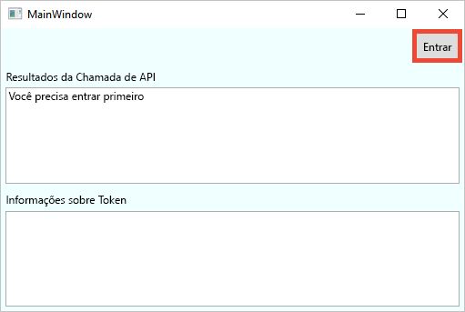
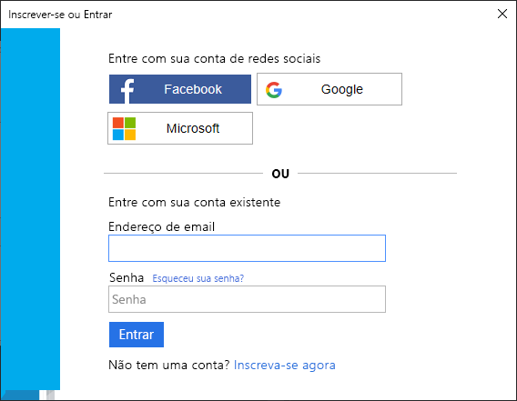
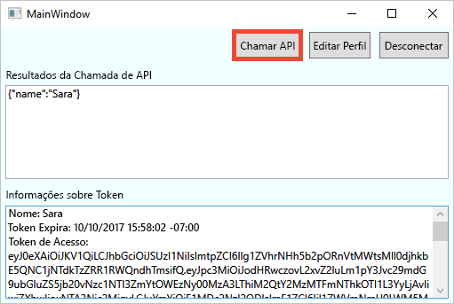

# <a name="quickstart-set-up-sign-in-for-a-desktop-app-using-azure-active-directory-b2c"></a>Início Rápido: configurar a entrada para um aplicativo de área de trabalho usando o Azure Active Directory B2C 

O Azure Active Directory (Azure AD) B2C fornece gerenciamento de identidades de nuvem para manter seu aplicativo, negócios e clientes protegidos. O Azure AD B2C permite que seus aplicativos se autentiquem com contas sociais e corporativas usando protocolos padrão.

Neste início rápido, você pode usar um aplicativo de área de trabalho WPF (Windows Presentation Foundation) de exemplo habilitado para o Azure AD B2C usando um provedor de identidade de redes sociais e chamar uma API Web do Azure AD B2C protegida.

[!INCLUDE [quickstarts-free-trial-note](../../includes/quickstarts-free-trial-note.md)]

## <a name="prerequisites"></a>pré-requisitos

* [Visual Studio 2017](https://www.visualstudio.com/downloads/) com a carga de trabalho **ASP.NET e desenvolvimento para a Web**. 
* Uma conta social do Facebook, Google, Microsoft ou Twitter.

## <a name="download-the-sample"></a>Baixar o exemplo

[Baixe um arquivo zip](https://github.com/Azure-Samples/active-directory-b2c-dotnet-desktop/archive/master.zip) ou clone o aplicativo Web de exemplo do GitHub.

```
git clone https://github.com/Azure-Samples/active-directory-b2c-dotnet-desktop.git
```

## <a name="run-the-app-in-visual-studio"></a>Executar o aplicativo no Visual Studio

Na pasta de projeto do aplicativo de exemplo, abra a solução `active-directory-b2c-wpf.sln` no Visual Studio.

Pressione **F5** para depurar o aplicativo.

## <a name="create-an-account"></a>Criar uma conta

Clique em **Entrar** para iniciar o fluxo de trabalho **criar conta ou entrar** com base em uma política do Azure AD B2C.



O exemplo dá suporte a várias opções de inscrição, incluindo o uso de um provedor de identidade social ou a criação de uma conta local usando um endereço de email. Para este guia de início rápido, use uma conta de provedor de identidade social do Facebook, do Google, da Microsoft ou do Twitter. 

### <a name="sign-up-using-a-social-identity-provider"></a>Inscrever-se usando um provedor de identidade social

O Azure AD B2C apresenta uma página de logon personalizada para uma marca fictícia chamada Wingtip Toys para o aplicativo Web de exemplo. 

1. Para inscrever-se usando um provedor de identidade social, clique no botão do provedor de identidade que você deseja usar. 

    

    Você se autentica (entra) usando as credenciais da conta social e autoriza o aplicativo a ler as informações dessa conta. Ao conceder o acesso, o aplicativo poderá recuperar informações de perfil da conta social, tais como seu nome e cidade. 

2. Conclua o processo de entrada para o provedor de identidade. Por exemplo, se você escolher o Twitter, insira suas credenciais do Twitter e clique em **Entrar**.

    

    Os detalhes do perfil da sua nova conta são populados previamente com as informações da sua conta social. 

3. Modifique os detalhes, se você desejar, e clique em **Continuar**. Os valores inseridos são usados seu perfil de conta de usuário do Azure AD B2C.

    

    Você criou com êxito uma nova conta de usuário do Azure AD B2C que usa um provedor de identidade. Depois de entrar, o token de acesso é exibido na caixa de texto *Informações de token*. O token de acesso é usado para acessar o recurso da API.

## <a name="edit-your-profile"></a>Editar o perfil

O Azure Active Directory B2C fornece funcionalidade para permitir que usuários atualizem seus perfis.  O aplicativo Web de exemplo usa uma política de perfil de edição do Azure AD B2C no fluxo de trabalho. 

1. Clique em **Editar perfil** para editar o perfil que você criou.

    

2. Escolha o provedor de identidade associado à conta que você criou. Por exemplo, se você usou o Twitter como o provedor de identidade quando criou a conta, escolha Twitter para modificar os detalhes do perfil associado.

3. Altere seu **Nome de exibição** ou **Cidade** e clique em **Continuar**.

    Um novo token de acesso é exibido na caixa de texto *Informações de token*. Se você quiser verificar as alterações no seu perfil, copie e cole o token de acesso no decodificador de token https://jwt.ms.

## <a name="access-a-protected-web-api-resource"></a>Acessar um recurso protegido da API Web

Clique em **Chamar API** para fazer uma solicitação para o recurso protegido do B2C do Azure Active Directory https://fabrikamb2chello.azurewebsites.net/hello. 



O aplicativo inclui o token de acesso do Azure AD na solicitação para o recurso da API Web protegida. A API Web retorna o nome de exibição contido no token de acesso.

Você usou com êxito sua conta de usuário do Azure AD B2C para fazer uma chamada autorizada a uma API Web protegida pelo Azure AD B2C.

## <a name="clean-up-resources"></a>Limpar recursos

Você pode usar o locatário do Azure AD B2C se planeja experimentar outros tutoriais ou inícios rápidos do Azure AD B2C. Quando não for mais necessário, você poderá [excluir o locatário do Azure AD B2C](active-directory-b2c-faqs.md#how-do-i-delete-my-azure-ad-b2c-tenant).

## <a name="next-steps"></a>Próximas etapas

A próxima etapa será criar seu próprio locatário do Azure AD B2C e configurar o exemplo para ser executado usando o seu locatário. 

> [!div class="nextstepaction"]
> [Criar um locatário do Azure Active Directory B2C no Portal do Azure](active-directory-b2c-get-started.md)
