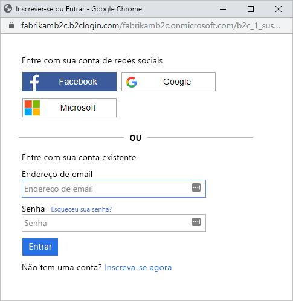

# <a name="quickstart-set-up-sign-in-for-a-single-page-app-using-azure-active-directory-b2c"></a>Início Rápido: configurar a entrada para um aplicativo de página única usando o Azure Active Directory B2C

O Azure Active Directory (Azure AD) B2C fornece gerenciamento de identidades de nuvem para manter seu aplicativo, negócios e clientes protegidos. O Azure AD B2C permite que seus aplicativos se autentiquem com contas sociais e corporativas usando protocolos padrão.

Neste início rápido, você pode usar um aplicativo de página única de exemplo habilitado para o Azure AD B2C usando um provedor de identidade de redes sociais e chamar uma API Web do Azure AD B2C protegido.

[!INCLUDE [quickstarts-free-trial-note](../../includes/quickstarts-free-trial-note.md)]

## <a name="prerequisites"></a>pré-requisitos

* [Visual Studio 2017](https://www.visualstudio.com/downloads/) com a carga de trabalho **ASP.NET e desenvolvimento para a Web**.
* Instale o [Node.js](https://nodejs.org/en/download/)
* Uma conta social do Facebook, Google, Microsoft ou Twitter.

## <a name="download-the-sample"></a>Baixar o exemplo

[Baixe um arquivo zip](https://github.com/Azure-Samples/active-directory-b2c-javascript-msal-singlepageapp/archive/master.zip) ou clone o aplicativo Web de exemplo do GitHub.

```
git clone https://github.com/Azure-Samples/active-directory-b2c-javascript-msal-singlepageapp.git
```

## <a name="run-the-sample-application"></a>Executar o aplicativo de exemplo

Para executar esse exemplo no prompt de comando de Node.js: 

```
cd active-directory-b2c-javascript-msal-singlepageapp
npm install && npm update
node server.js
```

O aplicativo Node.js gera o número da porta que está escutando em localhost.

```
Listening on port 6420...
```

Navegue até a URL do aplicativo `http://localhost:6420` em um navegador da Web.


## <a name="create-an-account"></a>Criar uma conta

Clique no botão **Logon** para iniciar o fluxo de trabalho **Criar conta ou entrar** do Azure AD B2C com base em uma política do Azure AD B2C. 

O exemplo dá suporte a várias opções de inscrição, incluindo o uso de um provedor de identidade social ou a criação de uma conta local usando um endereço de email. Para este guia de início rápido, use uma conta de provedor de identidade social do Facebook, do Google, da Microsoft ou do Twitter. 

### <a name="sign-up-using-a-social-identity-provider"></a>Inscrever-se usando um provedor de identidade social

O Azure AD B2C apresenta uma página de logon personalizada para uma marca fictícia chamada Wingtip Toys para o aplicativo Web de exemplo. 

1. Para inscrever-se usando um provedor de identidade social, clique no botão do provedor de identidade que você deseja usar.

    

    Você se autentica (entra) usando as credenciais da conta social e autoriza o aplicativo a ler as informações dessa conta. Ao conceder o acesso, o aplicativo poderá recuperar informações de perfil da conta social, tais como seu nome e cidade. 

2. Conclua o processo de entrada para o provedor de identidade. Por exemplo, se você escolher o Twitter, insira suas credenciais do Twitter e clique em **Entrar**.

    

    Os detalhes do perfil da sua nova conta são populados previamente com as informações da sua conta social. 

3. Atualize os campos Nome de exibição, Cargo e Cidade e clique em **Continuar**.  Os valores inseridos são usados seu perfil de conta de usuário do Azure AD B2C.

    Você criou com êxito uma nova conta de usuário do Azure AD B2C que usa um provedor de identidade. 

## <a name="access-a-protected-web-api-resource"></a>Acessar um recurso protegido da API Web

Clique no botão **Chamar API Web** para que seu nome de exibição seja retornado na chamada à API Web como um objeto JSON. 


O aplicativo de página única de exemplo inclui um token de acesso do Azure AD na solicitação para o recurso da API Web protegida para executar a operação para retornar o objeto JSON.

## <a name="clean-up-resources"></a>Limpar recursos

Você pode usar o locatário do Azure AD B2C se planeja experimentar outros tutoriais ou inícios rápidos do Azure AD B2C. Quando não for mais necessário, você poderá [excluir o locatário do Azure AD B2C](active-directory-b2c-faqs.md#how-do-i-delete-my-azure-ad-b2c-tenant).

## <a name="next-steps"></a>Próximas etapas

Neste início rápido você usou um aplicativo do ASP.NET de exemplo habilitado para o Azure AD B2C para entrar com uma página de logon personalizada, entrar com um provedor de identidade de redes sociais, criar uma conta do Azure AD B2C e chamar uma API Web protegida pelo Azure AD B2C. 

A próxima etapa será criar seu próprio locatário do Azure AD B2C e configurar o exemplo para ser executado usando o seu locatário. 

> [!div class="nextstepaction"]
> [Criar um locatário do Azure Active Directory B2C no Portal do Azure](active-directory-b2c-get-started.md)