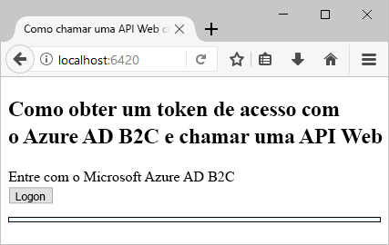

# <a name="quickstart-set-up-sign-in-for-a-single-page-app-using-azure-active-directory-b2c"></a>Início Rápido: configurar a entrada para um aplicativo de página única usando o Azure Active Directory B2C

O Azure Active Directory (Azure AD) B2C fornece gerenciamento de identidades de nuvem para manter seu aplicativo, negócios e clientes protegidos. O Azure AD B2C permite que seus aplicativos se autentiquem com contas sociais e corporativas usando protocolos padrão. Neste início rápido, você usa um aplicativo de página única para se conectar usando um provedor de identidade de redes sociais e chama uma API Web do Azure AD B2C protegida.

[!INCLUDE [quickstarts-free-trial-note](../../includes/quickstarts-free-trial-note.md)]

## <a name="prerequisites"></a>Pré-requisitos

- [Visual Studio 2019](https://www.visualstudio.com/downloads/) com a carga de trabalho de **desenvolvimento Web e do ASP.NET**.
- Instale o [Node.js](https://nodejs.org/en/download/)
- Uma conta social do Facebook, Google, Microsoft ou Twitter.
- [Baixe um arquivo zip](https://github.com/Azure-Samples/active-directory-b2c-javascript-msal-singlepageapp/archive/master.zip) ou clone o aplicativo Web de exemplo do GitHub.

    ```
    git clone https://github.com/Azure-Samples/active-directory-b2c-javascript-msal-singlepageapp.git
    ```

## <a name="run-the-application"></a>Executar o aplicativo

1. Inicie o servidor executando os seguintes comandos no prompt de comando do Node.js: 

    ```
    cd active-directory-b2c-javascript-msal-singlepageapp
    npm install && npm update
    node server.js
    ```

    O Server.js gera como saída o número da porta que está escutando no localhost.

    ```
    Listening on port 6420...
    ```

2. Navegue até a URL do aplicativo. Por exemplo, `http://localhost:6420`.

## <a name="sign-in-using-your-account"></a>Iniciar sessão usando sua conta

1. Clique em **Logon** para iniciar o fluxo de trabalho.

    

    O exemplo dá suporte a várias opções de inscrição, incluindo o uso de um provedor de identidade social ou a criação de uma conta local usando um endereço de email. Para este guia de início rápido, use uma conta de provedor de identidade social do Facebook, do Google, da Microsoft ou do Twitter. 

2. O Azure AD B2C apresenta uma página de logon personalizada para uma marca fictícia chamada Wingtip Toys para o aplicativo Web de exemplo. Para inscrever-se usando um provedor de identidade social, clique no botão do provedor de identidade que você deseja usar.

    

    Você se autentica (entra) usando as credenciais de sua conta social e autoriza o aplicativo a ler as informações da sua conta social. Ao conceder o acesso, o aplicativo poderá recuperar informações de perfil da conta social, tais como seu nome e cidade. 

3. Conclua o processo de entrada para o provedor de identidade.

## <a name="access-a-protected-api-resource"></a>Acessar um recurso de API protegido

Clique em **Chamar API Web** para que seu nome de exibição seja retornado na chamada à API Web como um objeto JSON. 


O aplicativo de página única inclui um token de acesso na solicitação para o recurso da API Web protegida.

## <a name="clean-up-resources"></a>Limpar recursos

Você pode usar o locatário do Azure AD B2C se planeja experimentar outros tutoriais ou inícios rápidos do Azure AD B2C. Quando não for mais necessário, você poderá [excluir o locatário do Azure AD B2C](active-directory-b2c-faqs.md#how-do-i-delete-my-azure-ad-b2c-tenant).

## <a name="next-steps"></a>Próximas etapas

Neste início rápido, você usou um aplicativo de página única de exemplo para:

* Entrar com uma página de logon personalizada
* Entrar com um provedor de identidade social
* Criar uma conta do Azure AD B2C
* Chamar uma API Web protegida pelo Azure AD B2C

Introdução à criação de seu próprio locatário do Azure AD B2C.

> [!div class="nextstepaction"]
> [Criar um locatário do Azure Active Directory B2C no Portal do Azure](tutorial-create-tenant.md)
