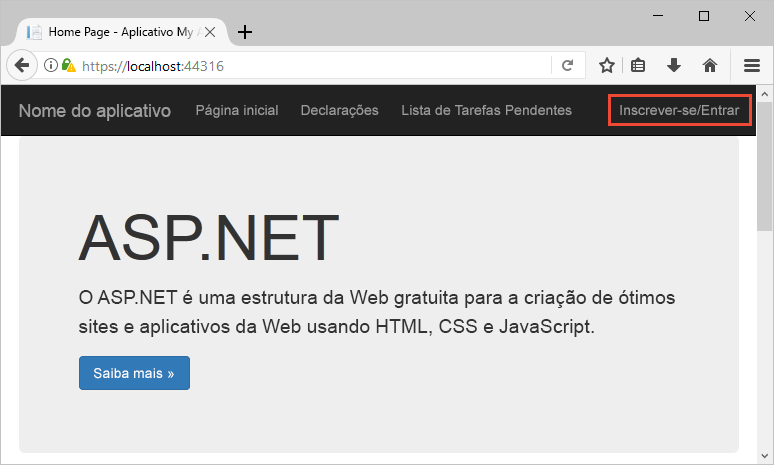
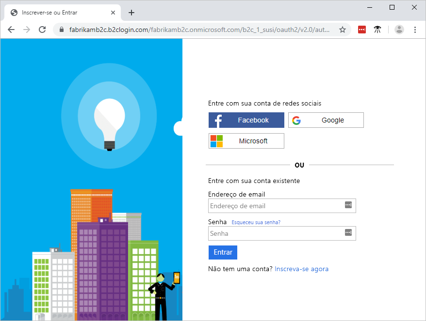
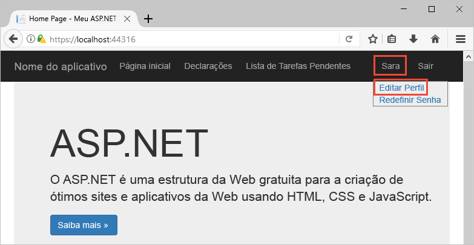
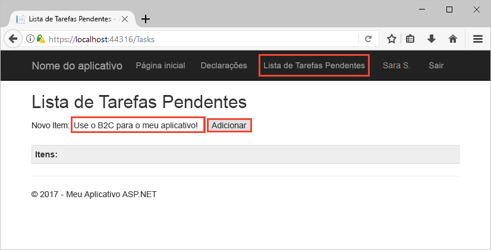

# <a name="quickstart-set-up-sign-in-for-an-aspnet-application-using-azure-active-directory-b2c"></a>Início Rápido: configurar a entrada para um aplicativo ASP.NET usando o Azure Active Directory B2C

O Azure Active Directory (Azure AD) B2C fornece gerenciamento de identidades de nuvem para manter seu aplicativo, negócios e clientes protegidos. O Azure AD B2C permite que seus aplicativos se autentiquem com contas sociais e corporativas usando protocolos padrão.

Neste início rápido, você pode usar um aplicativo ASP.NET de exemplo habilitado para o Azure AD B2C usando um provedor de identidade de redes sociais e chamar uma API Web do Azure AD B2C protegido.

[!INCLUDE [quickstarts-free-trial-note](../../includes/quickstarts-free-trial-note.md)]

## <a name="prerequisites"></a>pré-requisitos

* [Visual Studio 2017](https://www.visualstudio.com/downloads/) com a carga de trabalho **ASP.NET e desenvolvimento para a Web**. 
* Uma conta social do Facebook, Google, Microsoft ou Twitter.

## <a name="download-the-sample"></a>Baixar o exemplo

[Baixe um arquivo zip](https://github.com/Azure-Samples/active-directory-b2c-dotnet-webapp-and-webapi/archive/master.zip) ou clone o aplicativo Web de exemplo do GitHub.

```
git clone https://github.com/Azure-Samples/active-directory-b2c-dotnet-webapp-and-webapi.git
```

## <a name="run-the-app-in-visual-studio"></a>Executar o aplicativo no Visual Studio

Na pasta de projeto do aplicativo de exemplo, abra a solução `B2C-WebAPI-DotNet.sln` no Visual Studio.

Há dois projetos na solução de exemplo:

**Aplicativo Web de exemplo (TaskWebApp):** o aplicativo Web para criar e editar uma lista de tarefas. O aplicativo Web usa a política **criar conta ou entrar** para inscrever ou fazer logon de usuários.

**O aplicativo de API Web de exemplo (TaskService):** API Web que dá suporte às funções criar, ler, atualizar e excluir a lista de tarefas. A API Web é protegida pelo Azure AD B2C e chamada pelo aplicativo Web.

Para este início rápido, execute os projetos `TaskWebApp` e `TaskService` ao mesmo tempo. 

1. Selecione a solução `B2C-WebAPI-DotNet` no Gerenciador de Soluções.
2. No menu do Visual Studio, selecione **Projeto > Definir Projetos de Inicialização...**. 
3. Selecione o botão de opção **Vários projetos de inicialização**.
4. Altere a **Ação** para ambos os projetos para **Iniciar**. Clique em **OK**.

Pressione **F5** para executar os dois aplicativos. Cada aplicativo é aberto em sua própria guia do navegador:

`https://localhost:44316/` – Esta página é o aplicativo Web ASP.NET. Você interage diretamente com este aplicativo no início rápido.
`https://localhost:44332/` – Essa página é a API Web que é chamada pelo aplicativo Web ASP.NET.

## <a name="create-an-account"></a>Criar uma conta

Clique no link **Criar conta / Entrar** no aplicativo Web ASP.NET para iniciar o fluxo de trabalho **Criar conta ou Entrar** com base em uma política do Azure AD B2C.



O exemplo dá suporte a várias opções de inscrição, incluindo o uso de um provedor de identidade social ou a criação de uma conta local usando um endereço de email. Para este guia de início rápido, use uma conta de provedor de identidade social do Facebook, do Google, da Microsoft ou do Twitter. 

### <a name="sign-up-using-a-social-identity-provider"></a>Inscrever-se usando um provedor de identidade social

O Azure AD B2C apresenta uma página de logon personalizada para uma marca fictícia chamada Wingtip Toys para o aplicativo Web de exemplo. 

1. Para inscrever-se usando um provedor de identidade social, clique no botão do provedor de identidade que você deseja usar.

    

    Você se autentica (entra) usando as credenciais da conta social e autoriza o aplicativo a ler as informações dessa conta. Ao conceder o acesso, o aplicativo poderá recuperar informações de perfil da conta social, tais como seu nome e cidade. 

2. Conclua o processo de entrada para o provedor de identidade. Por exemplo, se você escolher o Twitter, insira suas credenciais do Twitter e clique em **Entrar**.

    

    Os detalhes do perfil de sua nova conta do Azure AD B2C são pré-populados com as informações de sua conta social.

3. Atualize os campos Nome de exibição, Cargo e Cidade e clique em **Continuar**.  Os valores inseridos são usados seu perfil de conta de usuário do Azure AD B2C.

    

    Você usou o aplicativo Web de exemplo que usa uma política do Azure AD B2C para autenticar usando um provedor de identidade e criar uma conta de usuário do Azure AD B2C com êxito. 

## <a name="edit-your-profile"></a>Editar o perfil

O Azure Active Directory B2C fornece funcionalidade para permitir que usuários atualizem seus perfis. O aplicativo Web de exemplo usa uma política de perfil de edição do Azure AD B2C no fluxo de trabalho. 

1. Na barra de menus do aplicativo Web, clique no nome do perfil e selecione **Editar perfil** para editar o perfil criado.

    

2. Altere seu **Nome de exibição** e **Cidade**.  
3. Clique em **Continuar** para atualizar seu perfil. O novo nome de exibição é exibido na parte superior direita da home page do aplicativo Web.

## <a name="access-a-protected-web-api-resource"></a>Acessar um recurso protegido da API Web

1. Clique em **Lista de tarefas pendentes** para inserir e modificar os itens da lista de tarefas pendentes. 

2. Insira texto na caixa de texto **Novo Item**. Clique em **Adicionar** para chamar a API Web protegida do Azure AD B2C que adiciona um item de lista de tarefas pendentes.

    

    O aplicativo Web ASP.NET inclui um token de acesso do Azure AD na solicitação para a recurso da API Web protegido para executar operações em itens de lista de tarefas pendentes do usuário.

Você usou com êxito sua conta de usuário do Azure AD B2C para fazer uma chamada autorizada a uma API Web protegida pelo Azure AD B2C.

## <a name="clean-up-resources"></a>Limpar recursos

Você pode usar o locatário do Azure AD B2C se planeja experimentar outros tutoriais ou inícios rápidos do Azure AD B2C. Quando não for mais necessário, você poderá [excluir o locatário do Azure AD B2C](active-directory-b2c-faqs.md#how-do-i-delete-my-azure-ad-b2c-tenant).

## <a name="next-steps"></a>Próximas etapas

Neste início rápido você usou um aplicativo do ASP.NET de exemplo habilitado para o Azure AD B2C para entrar com uma página de logon personalizada, entrar com um provedor de identidade de redes sociais, criar uma conta do Azure AD B2C e chamar uma API Web protegida pelo Azure AD B2C. 

Continue o tutorial para aprender a configurar o ASP.NET de exemplo para usar seu próprio locatário do Azure AD B2C.

> [!div class="nextstepaction"]
> [Tutorial: Autenticar usuários com o Azure Active Directory B2C em um aplicativo Web ASP.NET](active-directory-b2c-tutorials-web-app.md)