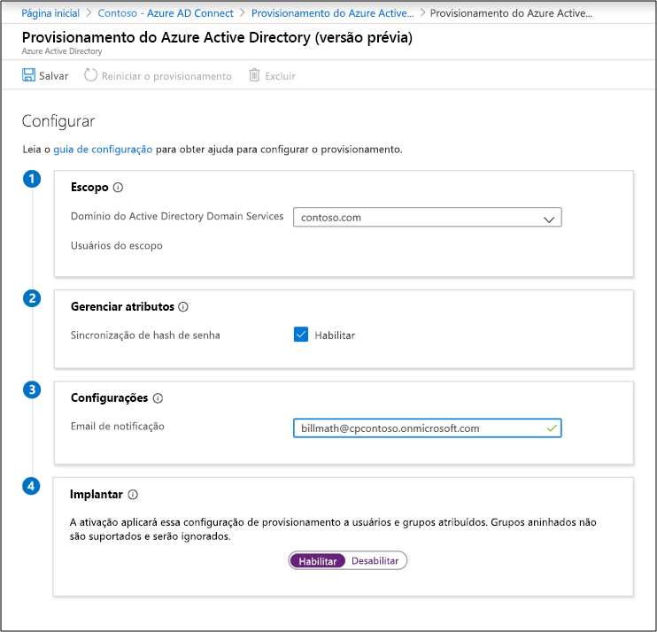
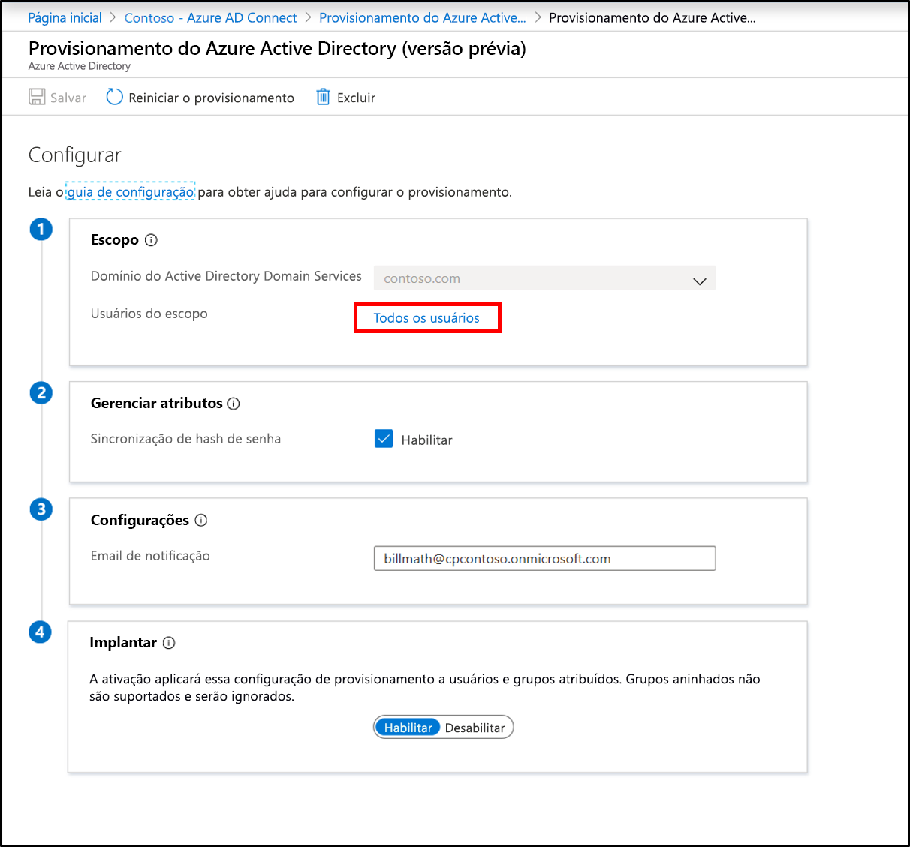

# Azure AD Connect a nova configuração de provisionamento de nuvem

Depois de instalar o agente, você precisará entrar no portal do Azure e configurar o provisionamento.  Use as etapas a seguir para habilitar o agente.

## Configurar provisionamento
Para configurar o provisionamento, use as seguintes etapas:

1.  No portal do AD do Azure, clique em **Azure Active Directory**
2.  Clique em **Azure ad Connect**
3.  Selecione **gerenciar provisionamento (visualização)** 

4.  Clique em **nova configuração**.
5.  Na tela de configuração, o domínio local é preenchido previamente
6. Insira um **email de notificação**. Este email será notificado 
7. Quando o provisionamento não está íntegro.  
8. Mova o seletor para **habilitar** e clique em **salvar**.

## Escopo de provisionamento para usuários e grupos específicos
Se você quiser fazer o escopo do agente para sincronizar apenas usuários e grupos específicos, poderá fazê-lo. Você pode usar o escopo usando grupos do AD locais ou unidades organizacionais. Você não pode configurar grupos e unidades organizacionais em uma configuração. 

1.  No portal do AD do Azure, clique em **Azure Active Directory**
2.  Clique em **Azure ad Connect**
3.  Selecionar **gerenciar provisionamento (visualização)**
4.  Em **configuração** , clique em sua configuração.  

5.  Em **Configurar**, selecione **todos os usuários** para alterar o escopo da regra de configuração.

6. À direita, você pode alterar o escopo para incluir apenas grupos de segurança inserindo o nome distinto do grupo e clicando em **Adicionar**.

7. Ou altere-o para incluir apenas UOs específicas. Clique em **concluído** e em **salvar**.

## Reiniciar o provisionamento 
Se não quiser aguardar a próxima execução agendada, você poderá disparar a execução de provisionamento usando o botão reiniciar provisionamento. 
1.  No portal do AD do Azure, clique em **Azure Active Directory**
2.  Clique em **Azure ad Connect**
3.  Selecionar **gerenciar provisionamento (visualização)**
4.  Em **configuração** , clique em sua configuração.  

5.  Na parte superior, clique em **reiniciar provisionamento**.

## Removendo uma configuração
Se você quiser excluir uma configuração, poderá fazer isso usando as etapas a seguir.

1.  No portal do AD do Azure, clique em **Azure Active Directory**
2.  Clique em **Azure ad Connect**
3.  Selecionar **gerenciar provisionamento (visualização)**
4.  Em **configuração** , clique em sua configuração.  

5.  Na parte superior, clique em **excluir**.

>[!IMPORTANT]
>Não há nenhuma confirmação antes de excluir uma configuração, portanto, certifique-se de que essa é a ação que você deseja executar antes de clicar em **excluir**.

## Próximos passos 

- [O que é provisionamento?](what-is-provisioning.md)
- [O que é Azure AD Connect provisionamento de nuvem?](what-is-cloud-provisioning.md)
