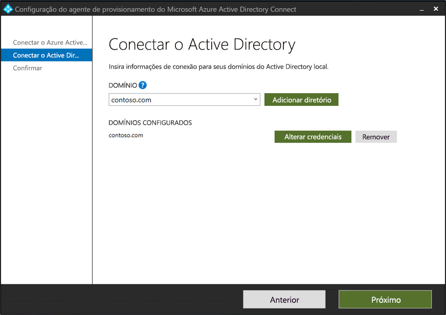
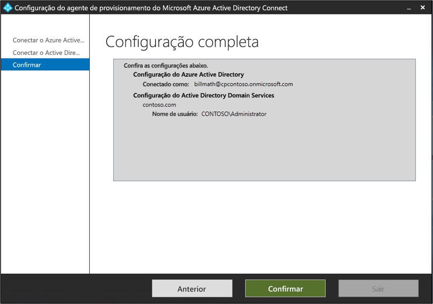
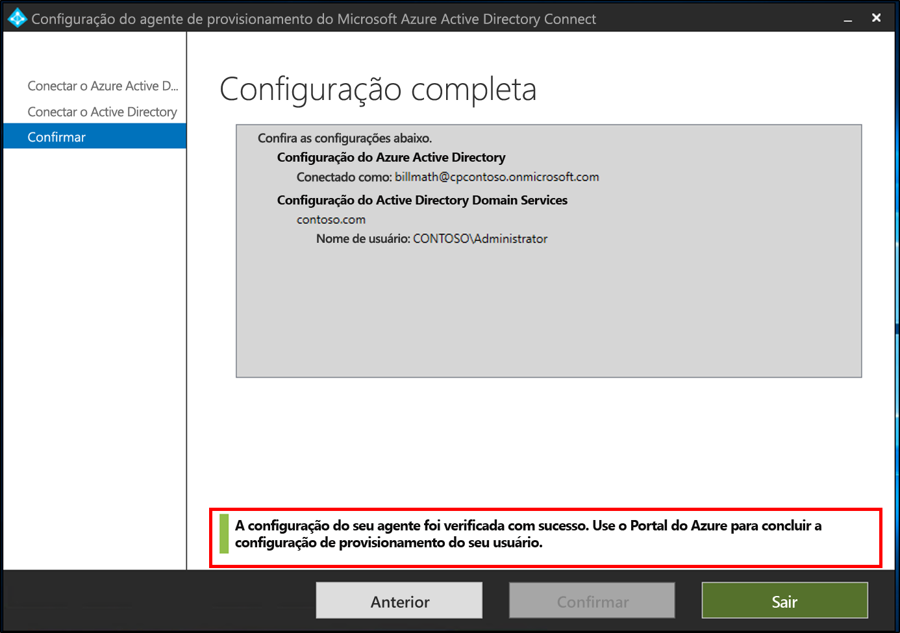
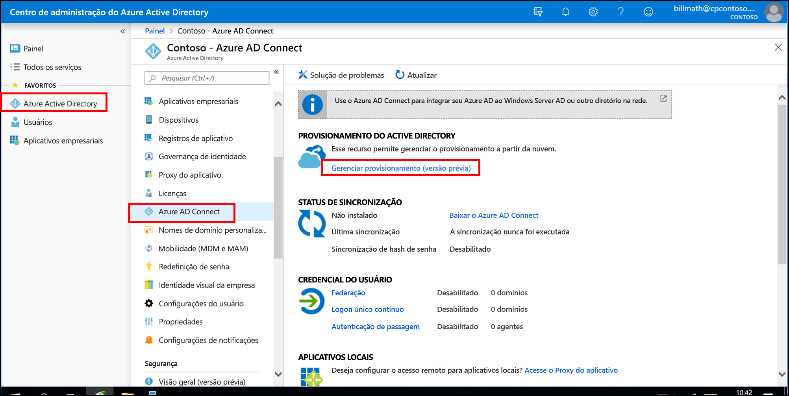
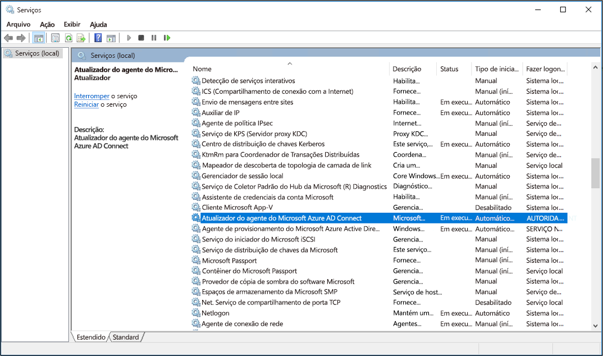

# Instalar Azure AD Connect agente de provisionamento de nuvem
Este documento explicará o processo de instalação do agente de provisionamento do Azure AD Connect e como configurá-lo inicialmente no portal do Azure.

>[!IMPORTANT]
>As instruções de instalação a seguir pressupõem que todos os [pré-requisitos](how-to-prerequisites.md) foram atendidos.

Instalar e configurar Azure AD Connect provisionamento é feito nas seguintes etapas:
    
- [Instalar o agente](#install-the-agent)
- [Verificar a instalação do agente](#verify-agent-installation)

## Instalar o agente

1. Entre no servidor que será usado com as permissões de administrador corporativo.
2. Navegue até a portal do Azure, selecione Azure Active Directory à esquerda.
3. Clique em **gerenciar provisionamento (versão prévia)** e selecione **examinar todos os agentes**.
3. Baixe o agente de provisionamento do Azure AD Connect do portal do Azure.
 
3. Executar o provisionamento de Azure AD Connect (AADConnectProvisioningAgent. Installer)
3. Na tela inicial, **aceite** os termos de licenciamento e clique em **instalar**. 
 

4. Quando essa operação for concluída, o assistente de configuração será iniciado.  Entre com sua conta de administrador global do Azure AD.
5. Na tela **conectar Active Directory** , clique em **Adicionar diretório** e entre com sua conta de administrador do Active Directory.  Esta operação adicionará seu diretório local.  Clique em \\**Próximo**. 
 

6. Na tela **configuração concluída** , clique em **confirmar**.  Esta operação registrará e reiniciará o agente. 
 

7. Após a conclusão dessa operação, você deverá ver um aviso **de que seu foi verificado com êxito.**  Você pode clicar em **sair**. 
 
8. Se você ainda vir a tela de abertura inicial, clique em **fechar**.

## Verificar a instalação do agente
A verificação do agente ocorre na portal do Azure e no servidor local que está executando o agente.

### Verificação do agente de portal do Azure
Para verificar se o agente está sendo visto pelo Azure, siga estas etapas:

1. Entre no Portal do Azure.
2. À esquerda, selecione **Azure Active Directory**, clique em **Azure ad Connect** e, no centro, selecione **gerenciar provisionamento (versão prévia)** . 
 

3.  Na tela **provisionamento do Azure AD (versão prévia)** , clique em **examinar todos os agentes**.
 
 
4. Na **tela agentes de provisionamento locais** , você verá os agentes que você instalou.  Verifique se o agente em questão está selecionado e se está marcado como **ativo**.
 

### Verificar a porta
Para verificar se o Azure está escutando na porta 443 e se o agente pode se comunicar com ele, você pode usar o seguinte:

https://aadap-portcheck.connectorporttest.msappproxy.net/ 

Esse teste verificará se os agentes podem se comunicar com o Azure pela porta 443.  Abra um navegador e navegue até a URL acima do servidor em que o agente está instalado.

### No servidor local
Para verificar se o agente está em execução, siga estas etapas:

1.  Faça logon no servidor com uma conta de administrador
2.  Abra os **Serviços** navegando até ele ou acessando iniciar/executar/Services. msc.
3.  Em **Serviços** , verifique se **Microsoft Azure ad atualizador do agente** e o **agente de provisionamento do Microsoft Azure ad Connect** estão lá e se o status está **em execução**.

>[!IMPORTANT]
>O agente foi instalado, mas deve ser configurado e habilitado antes de iniciar a sincronização de usuários.  Para configurar um novo agente, consulte [Azure ad Connect provisionamento de nova configuração de agente](how-to-configure.md).

## Próximos passos 

- [O que é provisionamento?](what-is-provisioning.md)
- [O que é Azure AD Connect provisionamento de nuvem?](what-is-cloud-provisioning.md)
 
