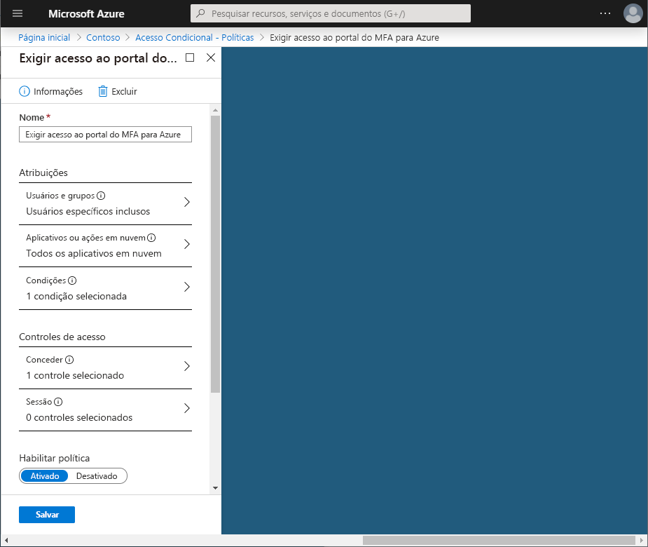
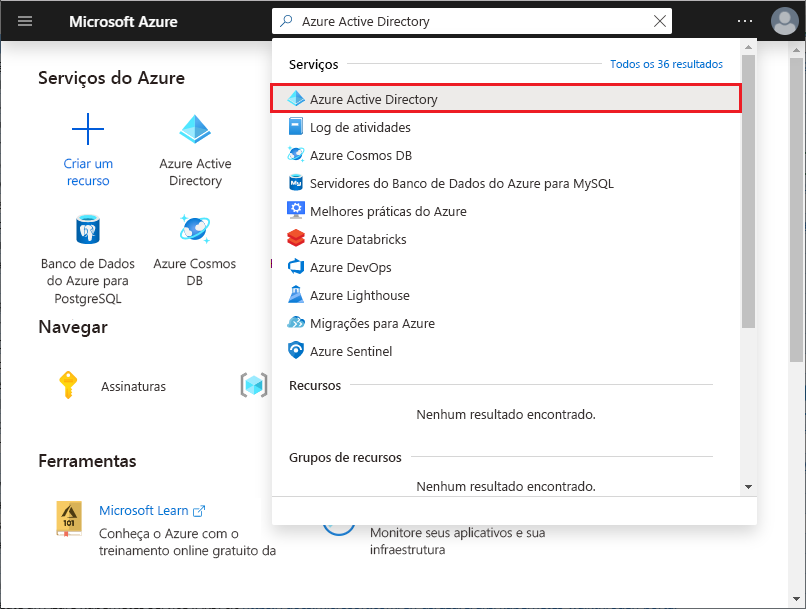

# Início Rápido: Exigir MFA para aplicativos específicos com acesso condicional do Azure Active Directory

Para simplificar a experiência de entrada dos usuários, talvez você deva permitir que eles entrem nos aplicativos de nuvem usando um nome de usuário e uma senha. Contudo, muitos ambientes têm pelo menos alguns aplicativos para os quais é aconselhável exigir uma forma mais forte de verificação de conta, como MFA (autenticação multifator). Isso pode ser verdadeiro, por exemplo, para acessar o sistema de email da sua organização ou seus aplicativos de RH. No Azure Active Directory (Azure AD), você pode atingir essa meta com uma política de acesso condicional.

Este início rápido mostra como configurar uma [política de acesso condicional do Azure AD](../active-directory-conditional-access-azure-portal.md) que requer autenticação multifator para um aplicativo de nuvem selecionado em seu ambiente.

Se você não tiver uma assinatura do Azure, crie uma [conta gratuita](https://azure.microsoft.com/free/?WT.mc_id=A261C142F) antes de começar.

## Pré-requisitos

Para concluir o cenário deste início rápido, você precisa de:

- **Acesso a uma edição do Azure AD Premium** – o acesso condicional ao Azure AD é um recurso do Azure AD Premium.

- **Uma conta de teste chamada Isabella Simonsen** – caso não saiba como criar uma conta de teste, consulte [Adicionar usuários baseados em nuvem](../fundamentals/add-users-azure-active-directory.md#add-a-new-user).

O cenário neste início rápido requer que MFA por usuário não esteja habilitado para sua conta de teste. Para obter mais informações, confira [Como exigir verificação em duas etapas para um usuário](../authentication/howto-mfa-userstates.md).

## Teste seu logon

O objetivo desta etapa é obter uma impressão da experiência de logon sem uma política de acesso condicional.

**Para inicializar seu ambiente:**

1. Entre no Portal do Azure como Isabella Simonsen.
1. Saia.

## Criar sua política de acesso condicional

Esta seção mostra como criar a política de acesso condicional necessária. O cenário deste início rápido usa:

- O portal do Azure como espaço reservado para um aplicativo de nuvem que requer MFA. 
- Seu usuário de exemplo para testar a política de acesso condicional.  

Em sua política, defina:

| Configuração | Valor |
| --- | --- |
| Usuários e grupos | Isabella Simonsen |
| Aplicativos na nuvem | Gerenciamento do Microsoft Azure |
| Conceder acesso | Exigir autenticação multifator |

**Para configurar sua política de acesso condicional:**

1. Faça login no [portal do Azure](https://portal.azure.com) como administrador global, administrador de segurança ou administrador de acesso condicional.

1. No portal do Azure, na barra de navegação à esquerda, clique em **Azure Active Directory**.

   

1. Na página **Azure Active Directory**, na seção **Segurança**, clique em **Acesso Condicional**.

   

1. Na página **Acesso Condicional**, na barra de ferramentas na parte superior, clique em **Nova política**.

   

1. Na página **Novo**, na caixa de texto **Nome**, digite **Exigir MFA para acesso ao portal do Azure**.

   

1. Na seção **Atribuição**, clique em **Usuários e Grupos**.

   

1. Na página **Usuários e grupos**, execute as seguintes etapas:

   

   1. Clique em **Selecionar usuários e grupos** e selecione **Usuários e grupos**.

   1. Clique em **Selecionar**.

   1. Na página **Selecionar**, selecione **Isabella Simonsen** e depois clique em **Selecionar**.

   1. Na página **Usuários e grupos**, clique em **Concluído**.

1. Clique em **Aplicativos de nuvem**.

   

1. Na página **Aplicativos de nuvem**, execute as seguintes etapas:

   

   1. Clique em **Selecionar aplicativos**.

   1. Clique em **Selecionar**.

   1. Na página **Selecionar**, selecione **Microsoft Azure** e clique em **Selecionar**.

   1. Na página **Aplicativos de nuvem**, clique em **Concluído**.

1. Na seção **Controles de acesso**, clique em **Conceder**.

   

1. Na página **Conceder**, execute as seguintes etapas:

   

   1. Selecione **Conceder acesso**.

   1. Selecione **Exigir autenticação multifator**.

   1. Clique em **Selecionar**.

1. Na seção **Habilitar política**, clique em **Ativar**.

   

1. Clique em **Criar**.

## Avaliar uma entrada simulada

Agora que você configurou a política de acesso condicional, provavelmente deseja saber se ela funciona conforme o esperado. Como uma primeira etapa, use a ferramenta de política “What If” do acesso condicional para simular uma entrada de seu usuário de teste. A simulação calcula o impacto que esse logon tem em suas políticas e gera um relatório de simulação.  

Para inicializar a ferramenta de avaliação de política “What If”, defina:

- **Isabella Simonsen** como usuário
- **Gerenciamento do Microsoft Azure** como aplicativo de nuvem

Ao clicar em **What If**, é criado um relatório de simulação que mostra:

- **Exigir MFA para o acesso ao portal do Azure** em **Políticas que serão aplicadas**
- **Exigir autenticação multifator** como **Controles de concessão**.

**Para avaliar sua política de acesso condicional:**

1. Na página [Acesso condicional – Políticas](https://portal.azure.com/#blade/Microsoft_AAD_IAM/ConditionalAccessBlade/Policies), no menu superior, clique em **What If**.  

   

1. Clique **Usuários**, selecione **Isabella Simonsen** e depois clique em **Selecionar**.

   

1. Para selecionar um aplicativo de nuvem, execute as seguintes etapas:

   

   1. Clique em **Aplicativos de nuvem**.

   1. Na **Página de aplicativos de nuvem**, clique em **Selecionar aplicativos**.

   1. Clique em **Selecionar**.

   1. Na página **Selecionar**, selecione **Microsoft Azure** e clique em **Selecionar**.

   1. Na página de aplicativos de nuvem, clique em **Concluído**.

1. Clique em **What If**.

## Testar sua política de acesso condicional

Na seção anterior, você aprendeu como avaliar uma entrada simulada. Além de uma simulação, você também deve testar sua política de acesso condicional para garantir que ela funcione conforme o esperado.

Para testar sua política, tente entrar no seu [portal do Azure](https://portal.azure.com) usando sua conta de teste **Isabella Simonsen**. Você deverá ver uma caixa de diálogo exigindo que você defina sua conta para verificação de segurança adicional.

## Limpar recursos

Quando não for mais necessário, exclua o usuário de teste e a política de acesso condicional:

- Caso não saiba como excluir um usuário do Azure AD, consulte [Excluir usuários do Azure AD](../fundamentals/add-users-azure-active-directory.md#delete-a-user).
- Para excluir sua política, selecione-a e clique em **Excluir** na barra de ferramentas de acesso rápido.

    

## Próximas etapas

> [!div class="nextstepaction"]
> [Exigir termos de uso para serem aceitos](require-tou.md)
> [bloquear o acesso quando é detectado um risco de sessão](app-sign-in-risk.md)
