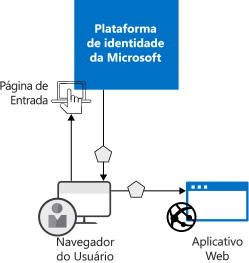
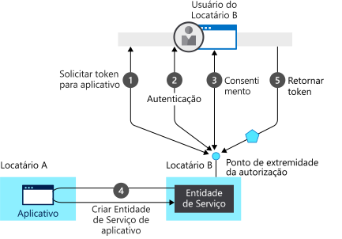

# O que é a autenticação?

*Autenticação* é o ato de desafiar uma parte para o fornecimento de credenciais legítimas, fornecendo a base para a criação de uma entidade de segurança a ser usada para controle de identidade e acesso. Em termos mais simples, é o processo de provar que você é quem diz ser. Às vezes, a autenticação é abreviada para AuthN.

*Autorização* é o ato de conceder a uma entidade de segurança autenticada a permissão para fazer algo. Ela especifica quais dados você tem permissão para acessar e o que você pode fazer com eles. Às vezes, a autorização é abreviada para AuthZ.

A plataforma de identidade da Microsoft simplifica a autenticação para os desenvolvedores de aplicativos, fornecendo a identidade como serviço, com suporte para protocolos padrão do setor, como OAuth 2.0 e OpenID Connect, bem como bibliotecas de software livre para diferentes plataformas para ajudá-lo a começar a codificação rapidamente.

Há dois casos de uso principais no modelo de programação da plataforma de identidade da Microsoft:

* Durante um fluxo de concessão de autorização do OAuth 2.0 – quando o proprietário do recurso concede autorização para o aplicativo cliente, permitindo que o cliente acesse os recursos do proprietário do recurso.
* Durante o acesso a recursos pelo cliente – conforme implementado pelo servidor de recursos, usando os valores de declaração presentes no token de acesso para tomar decisões de controle de acesso com base neles.

## Noções básicas de autenticação na plataforma de identidade da Microsoft

Considere o cenário mais básico em que a identidade é necessária: um usuário em um navegador da Web precisa se autenticar em um aplicativo Web. O seguinte diagrama mostra esse cenário:

Isto é o que você precisa saber sobre os vários componentes mostrados no diagrama:

* A plataforma de identidade da Microsoft é o provedor de identidade. O provedor de identidade é responsável por verificar a identidade dos usuários e dos aplicativos existentes no diretório de uma organização e emite tokens de segurança após a autenticação bem-sucedida desses usuários e aplicativos.
* Um aplicativo que deseja terceirizar a autenticação para a plataforma de identidade da Microsoft precisa ser registrado no Azure AD (Azure Active Directory). O Azure AD registra e identifica exclusivamente o aplicativo no diretório.
* Os desenvolvedores podem usar as bibliotecas de autenticação da plataforma de identidade da Microsoft de software livre para facilitar a autenticação manipulando os detalhes de protocolo para você. Para obter mais informações, confira as [bibliotecas de autenticação v2.0](reference-v2-libraries.md) e as [bibliotecas de autenticação v1.0](active-directory-authentication-libraries.md) da plataforma de identidade da Microsoft.
* Depois de autenticar um usuário, o aplicativo deverá validar o token de segurança do usuário para garantir que a autenticação foi bem-sucedida. Encontre inícios rápidos, tutoriais e exemplos de código em uma variedade de linguagens e estruturas que mostram o que o aplicativo precisa fazer.
  * Para criar rapidamente um aplicativo e adicionar funcionalidades como obtenção de tokens, atualização de tokens, conexão do usuário, exibição de algumas informações do usuário e muito mais, confira a seção **Inícios Rápidos** da documentação.
  * Para obter procedimentos detalhados baseados em cenário para as principais tarefas do desenvolvedor de autenticação, como obtenção de tokens de acesso e seu uso em chamadas à API do Microsoft Graph e a outras APIs, implementação da entrada com a Microsoft com um aplicativo baseado em navegador da Web tradicional usando o OpenID Connect e muito mais, confira a seção **Tutoriais** da documentação.
  * Para baixar exemplos de código, acesse o [GitHub](https://github.com/Azure-Samples?q=active-directory).
* O fluxo de solicitações e respostas do processo de autenticação é determinado pelo protocolo de autenticação que foi usado, como OAuth 2.0, OpenID Connect, Web Services Federation ou SAML 2.0. Para obter mais informações sobre protocolos, consulte a seção **conceitos > Protocolo de autenticação** da documentação do.

No cenário de exemplo acima, você pode classificar os aplicativos de acordo com estas duas funções:

* Aplicativos que precisam acessar os recursos com segurança
* Aplicativos que desempenham a função do recurso em si

Agora que você tem uma visão geral dos conceitos básicos, continue lendo para entender a API e o modelo de aplicativo de identidade, como funciona o provisionamento na plataforma de identidade da Microsoft e obter links para informações detalhadas sobre os cenários comuns aos quais a plataforma de identidade da Microsoft dá suporte.

## Modelo de aplicativo

A plataforma de identidade da Microsoft representa aplicativos que seguem um modelo específico projetado para cumprir duas funções principais:

* **Identificar o aplicativo de acordo com os protocolos de autenticação aos quais ele dá suporte** – isso envolve a enumeração de todos os identificadores, as URLs, os segredos e as informações relacionadas que são necessárias no momento da autenticação. Aqui, a plataforma de identidade da Microsoft:

    * Armazena todos os dados necessários para dar suporte à autenticação em tempo de execução.
    * Armazena todos os dados para decidir quais recursos um aplicativo pode precisar acessar e se determinada solicitação deve ser atendida e em quais circunstâncias.
    * Fornece a infraestrutura para implementação do provisionamento de aplicativos dentro do locatário do desenvolvedor do aplicativo e em qualquer outro locatário do Azure AD.

* **Manipula o consentimento do usuário durante o tempo de solicitação do token e facilita o provisionamento dinâmico de aplicativos entre locatários** – aqui, a plataforma de identidade da Microsoft:

    * Permite aos usuários e administradores conceder ou negar de forma dinâmica o consentimento ao aplicativo para o acesso de recursos em seu nome.
    * Permite aos administradores decidir, em última análise, o que os aplicativos têm permissão para fazer, quais usuários podem usar aplicativos específicos e como os recursos do diretório são acessados.

Na plataforma de identidade da Microsoft, um **objeto de aplicativo** descreve um aplicativo como uma entidade abstrata. Os desenvolvedores trabalham com aplicativos. No momento da implantação, a plataforma de identidade da Microsoft usa um objeto de aplicativo específico como um blueprint para criar uma **entidade de serviço**, que representa uma instância concreta de um aplicativo em um diretório ou um locatário. É a entidade de serviço que define o que o aplicativo pode realmente fazer em um diretório de destino específico, quem pode usá-lo, a quais recursos ele tem acesso e assim por diante. A plataforma de identidade da Microsoft cria uma entidade de serviço com base em um objeto de aplicativo por meio do **consentimento**.

O diagrama a seguir mostra um fluxo de provisionamento simplificado da plataforma de identidade da Microsoft orientado por consentimento.  Nele, há dois locatários (A e B), em que o locatário A possui o aplicativo e o locatário B está instanciando o aplicativo por meio de uma entidade de serviço.  

Neste fluxo de provisionamento:

1. Um usuário do locatário B tenta entrar com o aplicativo; o ponto de extremidade da autorização solicita um token para o aplicativo.
1. As credenciais do usuário são adquiridas e verificadas quanto à autenticação
1. O usuário deve fornecer consentimento ao aplicativo para obter acesso ao locatário B
1. A plataforma de identidade da Microsoft usa o objeto de aplicativo no locatário A como um blueprint para criar uma entidade de serviço no locatário B
1. O usuário recebe o token solicitado

Você pode repetir esse processo quantas vezes desejar para outros locatários (C, D e assim por diante). O locatário A mantém o blueprint para o aplicativo (objeto de aplicativo). Os usuários e os administradores de todos os outros locatários nos quais o aplicativo recebe consentimento retêm o controle sobre o que o aplicativo pode fazer por meio do objeto de entidade de serviço correspondente em cada locatário. Para obter mais informações, confira [Objetos de entidade de serviço e aplicativo na plataforma de identidade da Microsoft](app-objects-and-service-principals.md).

## Declarações em tokens de segurança da plataforma de identidade da Microsoft

Os tokens de segurança (tokens de acesso e ID) emitidos pela plataforma de identidade da Microsoft contêm declarações de informações sobre a entidade autenticada. Os aplicativos podem usar declarações para diversas tarefas, incluindo:

* Validar o token
* Identificar o locatário de diretório da entidade
* Exibir informações do usuário
* Determinar a autorização da entidade

As declarações presentes em qualquer token de segurança variam de acordo com o tipo de token, o tipo de credencial usada para autenticar o usuário e a configuração do aplicativo.

Uma breve descrição de cada tipo de declaração emitida pela plataforma de identidade da Microsoft é fornecida na tabela abaixo. Para obter informações mais detalhadas, confira os [tokens de acesso](access-tokens.md) e os [tokens de ID](id-tokens.md) emitidos pela plataforma de identidade da Microsoft.

| Declaração | Descrição |
| --- | --- |
| ID do Aplicativo | Identifica o aplicativo que está usando o token. |
| Audiência | Identifica o recurso de destinatário ao qual o token é destinado. |
| Referência de classe de contexto de autenticação de aplicativo | Indica como o cliente foi autenticado (cliente público versus cliente confidencial). |
| Instante da autenticação | Registra a data e o horário em que ocorreu a autenticação. |
| Método de Autenticação | Indica como a entidade do token foi autenticada (senha, certificado, etc.). |
| Nome | Apresenta o nome fornecido do usuário conforme definido no Azure AD. |
| Grupos | Contém as IDs de objeto dos grupos do Azure AD em que o usuário é membro. |
| Provedor de Identidade | Registra o provedor de identidade que autenticou a entidade do token. |
| Emitido em | Registra o horário em que o token foi emitido, geralmente usado para atualização de token. |
| Emissor | Identifica o STS que emitiu o token, bem como o locatário do Azure AD. |
| Sobrenome | Apresenta o sobrenome fornecido do usuário conforme definido no Azure AD. |
| Nome | Fornece um valor legível que identifica a entidade do token. |
| ID de objeto | Contém um identificador exclusivo e imutável da entidade no Azure AD. |
| Funções | Contém os nomes amigáveis de funções de aplicativo do Azure AD que o usuário recebeu. |
| Escopo | Indica as permissões concedidas ao aplicativo cliente. |
| Subject | Indica a entidade de segurança sobre a qual o token declara informações. |
| ID do locatário | Contém um identificador exclusivo e imutável do locatário do diretório que emitiu o token. |
| Vida útil do token | Define o intervalo de tempo no qual um token é válido. |
| Nome principal do usuário | Contém o nome principal de usuário da entidade. |
| Version | Contém o número de versão do token. |

## Próximas etapas

* Saiba mais sobre os [tipos de aplicativos e os cenários aos quais a plataforma de identidade da Microsoft dá suporte](app-types.md)
