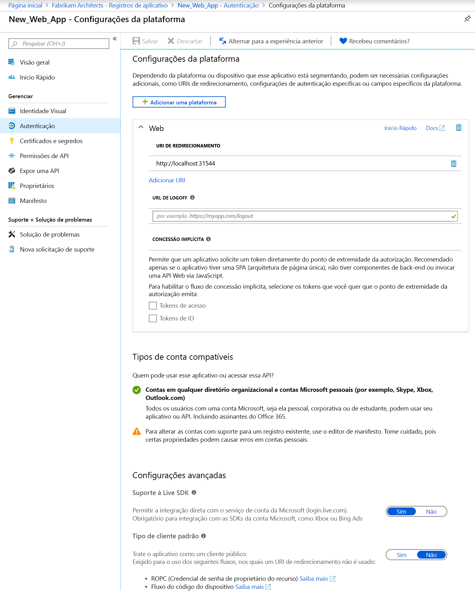
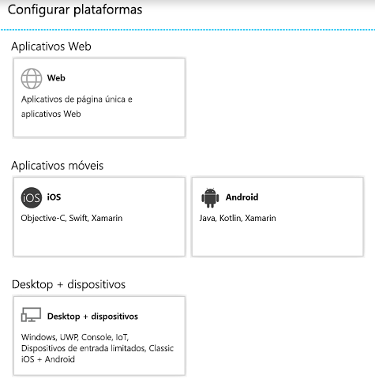

# Início Rápido: Configure um aplicativo cliente para acessar APIs Web

Para que um aplicativo cliente Web/confidencial possa participar de um fluxo de concessão de autorização que requer autenticação (e obter um token de acesso), ele deverá estabelecer credenciais seguras. O método de autenticação padrão com suporte no portal do Azure é a ID do Cliente + chave secreta.

Além disso, antes que um cliente possa acessar uma API Web exposta por um aplicativo de recurso (como a API do Microsoft Graph), a estrutura de autorização garante que o cliente obtenha a concessão de permissão necessária com base nas permissões solicitadas. Por padrão, todos os aplicativos podem escolher permissões da API do Microsoft Graph. A [permissão "Entrar e ler perfil do usuário" da API do Graph](https://developer.microsoft.com/graph/docs/concepts/permissions_reference#user-permissions) está selecionada por padrão. Você pode selecionar entre [dois tipos de permissões](developer-glossary.md#permissions) para cada API Web desejada:

* **Permissões de aplicativo**: o aplicativo cliente precisa acessar a API Web diretamente por si só (sem contexto de usuário). Esse tipo de permissão requer o consentimento do administrador e também não está disponível para aplicativos clientes públicos (área de trabalho e móveis).
* **Permissões delegadas**: o aplicativo cliente precisa acessar a API Web como o usuário conectado, mas com acesso limitado pela permissão selecionada. Esse tipo de permissão pode ser concedido por um usuário, a menos que a permissão exija consentimento do administrador.

  > [!NOTE]
  > Adicionar uma permissão delegada a um aplicativo não dá automaticamente consentimento aos usuários no locatário. Os usuários devem consentir manualmente para as permissões delegadas adicionadas em tempo de execução, a menos que o administrador dê consentimento em nome de todos os usuários.

Neste início rápido, mostraremos como configurar seu aplicativo para:

* [Adicionar URIs de redirecionamento ao aplicativo](#add-redirect-uris-to-your-application)
* [Definir configurações avançadas para seu aplicativo](#configure-advanced-settings-for-your-application)
* [Modificar tipos de conta com suporte](#modify-supported-account-types)
* [Adicionar credenciais ao aplicativo Web](#add-credentials-to-your-web-application)
* [Adicionar permissões para acessar APIs Web](#add-permissions-to-access-web-apis)

## Pré-requisitos

Para começar, atenda aos seguintes pré-requisitos:

* Leia sobre [permissões e consentimentos](v2-permissions-and-consent.md), o que é importante saber na hora de criar aplicativos que precisam ser usados por outros usuários ou aplicativos.
* Obtenha um locatário com aplicativos registrados.
  * Se você não tiver aplicativos registrados, [saiba como registrar aplicativos com a Microsoft Identity Platform](quickstart-register-app.md).

## Entrar no portal do Azure e selecionar o aplicativo

Antes de configurar o aplicativo, siga estas etapas:

1. Entre no [portal do Azure](https://portal.azure.com) usando uma conta corporativa ou de estudante ou uma conta pessoal da Microsoft.
1. Se sua conta fornecer acesso a mais de um locatário, selecione sua conta no canto superior direito e defina sua sessão do portal para o locatário desejado do Azure AD.
1. No painel de navegação à esquerda, selecione o serviço **Azure Active Directory** e, em seguida, **Registros de aplicativo**.
1. Encontre e selecione o aplicativo que você deseja configurar. Depois de selecionar o aplicativo, você verá a página **Visão Geral** ou a página de registro principal.
1. Siga as etapas para configurar seu aplicativo e acessar APIs Web:
    * [Adicionar URIs de redirecionamento ao aplicativo](#add-redirect-uris-to-your-application)
    * [Definir configurações avançadas para seu aplicativo](#configure-advanced-settings-for-your-application)
    * [Modificar tipos de conta com suporte](#modify-supported-account-types)
    * [Adicionar credenciais ao aplicativo Web](#add-credentials-to-your-web-application)
    * [Adicionar permissões para acessar APIs Web](#add-permissions-to-access-web-apis)

## Adicionar URIs de redirecionamento ao aplicativo

Para adicionar um URI de redirecionamento ao seu aplicativo:

1. Na página **Visão Geral** do aplicativo, selecione a seção **Autenticação**.
1. Para adicionar um URI de redirecionamento personalizado para aplicativos clientes públicos e Web, siga estas etapas:
   1. Localize a seção **URI de redirecionamento**.
   1. Selecione o tipo de aplicativo que você está criando, **Web** ou **Cliente público (móvel e área de trabalho)** .
   1. Insira o URI de redirecionamento para seu aplicativo.
      * Para aplicativos Web, informe a URL base do aplicativo. Por exemplo, `http://localhost:31544` pode ser uma URL para um aplicativo Web em execução no seu computador local. Os usuários usarão essa URL para entrar em um aplicativo cliente Web.
      * Para aplicativos públicos, informe o URI usado pelo Azure AD para retornar respostas de token. Insira um valor específico para o aplicativo, por exemplo: `https://MyFirstApp`.

1. Para escolher os URIs de redirecionamento sugeridos para clientes públicos (móvel, área de trabalho), siga estas etapas:
    1. Encontre a seção **URIs de redirecionamento sugeridos para clientes públicos (móvel, área de trabalho)** sugerida.
    1. Selecione os URIs de redirecionamento apropriados para seu aplicativo usando as caixas de seleção.

> [!NOTE]
> Experimente a nova experiência de configurações de **Autenticação**, na qual você pode definir configurações para seu aplicativo com base na plataforma ou no dispositivo que você deseja ter como destino.
>
> Para ver essa exibição, selecione **Experimentar a nova experiência** na exibição de página de **Autenticação** padrão.
>
> 
>
> Isso levará você para a [nova página de **Configurações de plataforma**](#configure-platform-settings-for-your-application).

### Definir configurações avançadas para seu aplicativo

Dependendo do aplicativo que você está registrando, há algumas configurações adicionais que talvez você precise configurar, como:

* **URL de logoff**
* Para aplicativos de página única, você pode habilitar a **Concessão implícita** e selecionar os tokens que você deseja que o ponto de extremidade da autorização emita.
* Para aplicativos de desktop que estão adquirindo tokens com autenticação integrada do Windows, fluxo de código de dispositivo ou nome de usuário/senha na seção **Tipo de cliente padrão**, defina a configuração **Tratar aplicativo como cliente público** como **Sim**.
* Para aplicativos herdados que estavam usando o Live SDK para integração com o serviço de conta Microsoft, configure o **suporte ao Live SDK**. Novos aplicativos não precisam dessa configuração.
* **Tipo de cliente padrão**

### Modificar tipos de conta com suporte

Os **Tipos de conta com suporte** especificam quem pode usar o aplicativo ou acessar a API.

Depois de [configurar os tipos de conta com suporte](quickstart-register-app.md) ao registrar inicialmente o aplicativo, você só poderá alterar essa configuração usando o editor de manifesto do aplicativo se:

* Você altera os tipos de conta de **AzureADMyOrg** ou **AzureADMultipleOrgs** para **AzureADandPersonalMicrosoftAccount**, ou vice-versa.
* Você altera os tipos de conta de **AzureADMyOrg** para **AzureADMultipleOrgs**, ou vice-versa.

Para alterar os tipos de conta com suporte para um registro de aplicativo existente:

* Confira [Configurar o manifesto do aplicativo](reference-app-manifest.md) e atualizar a chave `signInAudience`.

## Definir configurações de plataforma para seu aplicativo

Para definir as configurações do aplicativo com base na plataforma ou no dispositivo que você está direcionando:

1. Na página **Configurações da plataforma**, selecione **Adicionar uma plataforma** e escolha entre as opções disponíveis.

   

1. Insira as informações de configurações com base na plataforma selecionada.

   | Plataforma                | Opções              | Definições de configuração            |
   |-------------------------|----------------------|-----------------------------------|
   | **Aplicativos Web**    | **Web**              | Insira o **URI de redirecionamento** para seu aplicativo. |
   | **Aplicativos móveis** | **iOS**              | Insira a **ID do Pacote** do aplicativo, que pode ser encontrada no XCode em Info.plist ou nas Configurações de Build. Adicionar a ID do pacote cria automaticamente um URI de redirecionamento para o aplicativo. |
   |                         | **Android**          | * Forneça o **Nome do pacote** do aplicativo, que pode ser encontrado no arquivo AndroidManifest.xml. * Gerar e inserir o **Hash de assinatura**. Adicionar o hash de assinatura cria automaticamente um URI de redirecionamento para o aplicativo.  |
   | **Desktop + dispositivos**   | **Desktop + dispositivos** | * Opcional. Selecione um dos **URIs de redirecionamento sugeridos** se você estiver criando aplicativos para desktop e dispositivos. * Opcional. Insira um **URI de redirecionamento personalizado**, que é usado como o local para o qual o Azure AD redirecionará os usuários em resposta às solicitações de autenticação. Por exemplo, para aplicativos .NET Core em que você deseja interação, use `https://localhost`. |

   > [!IMPORTANT]
   > Para aplicativos móveis que não estão usando a biblioteca MSAL mais recente ou não estão usando um agente, você deve configurar os URIs de redirecionamento para esses aplicativos em **Desktop + dispositivos**.

1. Dependendo da plataforma escolhida, poderá haver configurações adicionais a serem configuradas. Para aplicativos **Web**, você pode:
    * Adicionar mais URIs de redirecionamento
    * Configure a **concessão implícita** para selecionar os tokens que você deseja que sejam emitidos pelo ponto de extremidade da autorização:
        * Para aplicativos de página única, selecione **Tokens de acesso** e **Tokens de ID**
        * Para aplicativos Web, selecione **Tokens de ID**

## Adicionar credenciais ao aplicativo Web

Para adicionar uma credencial ao aplicativo Web:

1. Na página **Visão Geral**, selecione a seção **Certificados e segredos**.

1. Para adicionar um certificado, siga estas etapas:

    1. Selecione **Carregar certificado**.
    1. Selecione o arquivo que você gostaria de carregar. Ele deve ser um dos seguintes tipos de arquivo: .cer, .pem, .crt.
    1. Selecione **Adicionar**.

1. Para adicionar um segredo do cliente, siga estas etapas:

    1. Selecione **Novo segredo do cliente**.
    1. Adicione uma descrição para o segredo do cliente.
    1. Selecione uma duração.
    1. Selecione **Adicionar**.

> [!NOTE]
> Depois que você salvar as alterações de configuração, a coluna mais à direita conterá o valor do segredo do cliente. **Copie o valor** para uso no código do aplicativo cliente, já que ele não ficará acessível depois que você sair da página.

## Adicionar permissões para acessar APIs Web

Para adicionar permissões de acesso às APIs do recurso no cliente:

1. Na página **Visão Geral** do aplicativo, selecione **Permissões de API**.
1. Selecione o botão **Adicionar uma permissão**.
1. Por padrão, o modo de exibição permite que você selecione das **APIs da Microsoft**. Selecione a seção de APIs desejada:
    * **APIs da Microsoft**: permite que você selecione permissões para APIs da Microsoft, como o Microsoft Graph.
    * **APIs que minha organização usa**: permite que você selecione as permissões para as APIs que foram expostas pela sua organização, ou para APIs com que sua organização esteja integrada.
    * **Minhas APIs**: permite que você selecione as permissões para as APIs expostas.
1. Depois de selecionar as APIs, você verá a página **Solicitar Permissões de API**. Se a API expõe permissões delegadas e de aplicativo, selecione o tipo de permissão de que seu aplicativo precisa.
1. Quando terminar, selecione **Adicionar permissões**. Você voltará para a página **Permissões de API**, onde as permissões foram salvas e adicionadas à tabela.

## Próximas etapas

Saiba mais sobre esses outros inícios rápidos de gerenciamento de aplicativos relacionados para aplicativos:

* [Registrar um aplicativo com a Microsoft Identity Platform](quickstart-register-app.md)
* [Configurar um aplicativo para expor APIs Web](quickstart-configure-app-expose-web-apis.md)
* [Modificar as contas que têm suporte por um aplicativo](quickstart-modify-supported-accounts.md)
* [Remover um aplicativo registrado na Microsoft Identity Platform](quickstart-remove-app.md)

Saiba mais sobre os dois objetos do Azure AD que representam um aplicativo registrado e a relação entre eles, confira [Objetos de aplicativo e objetos de entidade de serviço](app-objects-and-service-principals.md).

Para saber mais sobre as diretrizes de identidade visual que você deve usar ao desenvolver aplicativos com o Azure Active Directory, confira [Diretrizes de identidade visual para aplicativos](howto-add-branding-in-azure-ad-apps.md).
