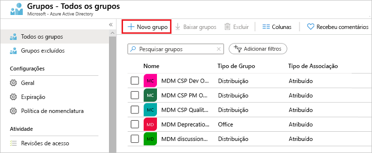

# Criar um grupo básico e adicionar membros usando o Azure Active Directory
Você pode criar um grupo básico usando o portal do Azure AD (Azure Active Directory). Para os fins deste artigo, um grupo básico é adicionado a um único recurso pelo proprietário do recurso (administrador) e inclui membros específicos (funcionários) que precisam acessar o recurso. Para cenários mais complexos, incluindo associações dinâmicas e criação de regra, confira a [documentação de gerenciamento de usuário do Azure Active Directory](../users-groups-roles/index.yml).

## Criar um grupo básico e adicionar membros
Você pode criar um grupo básico e adicionar seus membros ao mesmo tempo.

### Para criar um grupo básico e adicionar membros
1. Entre no [portal do Azure](https://portal.azure.com) usando uma conta de administrador global para o diretório.

2. Selecione **Azure Active Directory**, **Grupos** e selecione **Novo grupo**.

    

3. Na página **Grupo**, preencha as informações necessárias.

    

    - **Tipo de grupo (obrigatório).** Selecione um tipo de grupo predefinido. Isso inclui:
        
        - **Segurança**. Usado para gerenciar o acesso de membros e computadores a recursos compartilhados para um grupo de usuários. Por exemplo, você pode criar um grupo de segurança para uma política de segurança específica. Com isso, você pode dar um conjunto de permissões a todos os membros ao mesmo tempo, em vez de precisar adicionar permissões a cada membro individualmente. Para obter mais informações sobre como gerenciar o acesso aos recursos, confira [Gerenciar o acesso a recursos com grupos do Azure Active Directory](active-directory-manage-groups.md).
        
        - **Office 365**. Fornece oportunidades de colaboração, oferecendo acesso de membros a uma caixa de correio compartilhada, calendário, arquivos, site do SharePoint e muito mais. Essa opção também permite dar acesso ao grupo a pessoas fora da sua organização. Para obter mais informações sobre grupos do Office 365, confira [Saiba mais sobre grupos do Office 365](https://support.office.com/article/learn-about-office-365-groups-b565caa1-5c40-40ef-9915-60fdb2d97fa2).

    - **Nome do grupo (obrigatório).** Adicione um nome para o grupo, algo fácil de lembrar e que faça sentido.

    - **Descrição do grupo.** Adicione uma descrição opcional para seu grupo.

    - **Tipo de associação (obrigatório).** Selecione um tipo de associação predefinido. Isso inclui:

        - **Atribuído.** Permite adicionar usuários específicos para que sejam membros desse grupo e tenham permissões exclusivas. Para os fins deste artigo, estamos usando essa opção.

        - **Usuário dinâmico.** Permite o uso de regras de grupo dinâmico para adicionar e remover membros automaticamente. Se os atributos de um membro mudarem, o sistema examinará suas regras de grupo dinâmico para que o diretório verifique se o membro atende aos requisitos da regra (é adicionado) ou não mais atende aos requisitos de regras (é removido).

        - **Dispositivo dinâmico.** Permite o uso de regras de grupo dinâmico para adicionar e remover dispositivos automaticamente. Se os atributos de um dispositivo mudarem, o sistema examinará suas regras de grupo dinâmico para que o diretório verifique se o dispositivo atende aos requisitos da regra (é adicionado) ou não mais atende aos requisitos de regras (é removido).

        >[!Important]
        >Você pode criar um grupo dinâmico para dispositivos ou usuários, mas não para ambos. Você também não pode criar um grupo de dispositivos com base em atributos dos proprietários do dispositivo. Regras de associação de dispositivo só podem fazer referência a atributos do dispositivo. Para obter mais informações sobre como criar um grupo dinâmico para usuários e dispositivos, confira [Criar um grupo dinâmico e verificar o status](../users-groups-roles/groups-create-rule.md).

4. Selecione **Criar**.

    O grupo é criado e está pronto para que você adicione membros.

5. Selecione a área **Membros** da página **Grupo** e, em seguida, comece a procurar os membros a serem adicionados ao seu grupo da página **Selecionar membros**.

    

6. Quando você terminar de adicionar membros, escolha **Selecionar**.

    A página **Visão geral do grupo** é atualizada para mostrar o número de membros que agora são adicionados ao grupo.

    

## Próximas etapas
Agora que você já adicionou um grupo e pelo menos um usuário, você pode:

- [Exibir grupos e membros](active-directory-groups-view-azure-portal.md)

- [Gerenciar associação ao grupo](active-directory-groups-membership-azure-portal.md)

- [Gerenciar regras dinâmicas para usuários em um grupo](../users-groups-roles/groups-create-rule.md)

- [Editar as configurações de grupo](active-directory-groups-settings-azure-portal.md)

- [Gerenciar acesso a recursos usando grupos](active-directory-manage-groups.md)

- [Gerenciar acesso a aplicativos SaaS usando grupos](../users-groups-roles/groups-saasapps.md)

- [Gerenciar grupos usando comandos do PowerShell](../users-groups-roles/groups-settings-v2-cmdlets.md)

- [Associar ou adicionar uma assinatura do Azure ao Azure Active Directory](active-directory-how-subscriptions-associated-directory.md)
