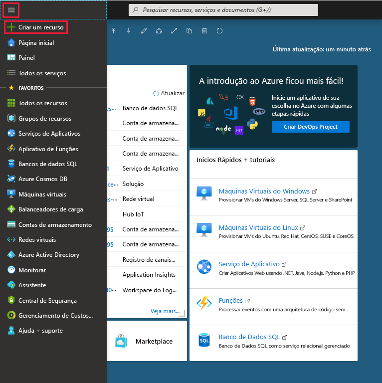
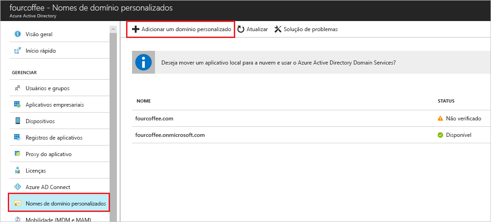

# Adicionar um nome de domínio personalizado usando o portal do Azure Active Directory
Todo novo locatário do Azure AD vem com um nome de domínio inicial: *domainname*.onmicrosoft.com. Você não pode alterar ou excluir o nome de domínio inicial, mas pode adicionar nomes da sua organização à lista. Adicionar nomes de domínio personalizados ajuda a criar nomes de usuário que são familiares para seus usuários, como *Alain\@contoso.com*.

## Antes de começar
Antes de poder adicionar um nome de domínio personalizado, é necessário criar seu nome de domínio com um registrador de domínios. Para um registrador de domínios reconhecido, consulte [Registradores reconhecidos pelo ICANN](https://www.icann.org/registrar-reports/accredited-list.html).

## Criar seu diretório no Azure AD
Depois de obter seu nome de domínio, é possível criar seu primeiro diretório do Azure AD.

1. Entre no [Portal do Azure](https://portal.azure.com/) do seu diretório, usando uma conta com a função **Proprietário** para a assinatura e, em seguida, selecione **Azure Active Directory**. Para saber mais sobre funções de assinatura, consulte [Funções de administrador da assinatura clássica, funções RBAC do Azure e funções de administrador do Azure AD](../../role-based-access-control/rbac-and-directory-admin-roles.md#azure-rbac-roles).

    

    >[!TIP]
    > Se você planeja federar seu AD do Windows Server local com o Azure AD, você precisa selecionar a caixa de seleção **Pretendo configurar esse domínio para logon único com meu Active Directory local** quando você executa a ferramenta Azure AD Connect para sincronizar seus diretórios. Você também precisa registrar o mesmo nome de domínio selecionado para federação com seu diretório local na etapa **domínio do Azure AD** no assistente. Você pode ver como é essa etapa do assistente [nessas instruções](../hybrid/how-to-connect-install-custom.md#verify-the-azure-ad-domain-selected-for-federation). Se você não tiver a ferramenta Azure AD Connect, poderá [baixá-la aqui](https://go.microsoft.com/fwlink/?LinkId=615771).

2. Para criar seu novo diretório, siga as etapas em [Criar um novo locatário para sua organização](active-directory-access-create-new-tenant.md#create-a-new-tenant-for-your-organization).

    >[!Important]
    >A pessoa que cria o locatário torna-se automaticamente o administrador global desse locatário. O administrador global pode adicionar mais administradores ao locatário.

## Adicionar seu nome de domínio personalizado ao Azure AD
Depois de criar seu diretório, você pode adicionar seu nome de domínio personalizado.

1. Selecione **Nomes de domínio personalizado** e, em seguida, selecione **Adicionar domínio personalizado**.

    

2. Digite o novo nome de domínio da sua organização na caixa **Nome de domínio personalizado** (por exemplo, _contoso.com_) e, em seguida, selecione **Adicionar domínio**.

    O domínio não verificado será adicionado e a página **Contoso** será exibida, mostrando suas informações de DNS.

    >[!Important]
    >É necessário incluir .com, .net ou qualquer outra extensão de nível superior para isso funcionar adequadamente.

    

4. Copie as informações de DNS da página da **Contoso**. Por exemplo, MS=ms64983159.

    

## Adicionar suas informações de DNS ao registrador de domínios
Depois de adicionar seu nome de domínio personalizado ao Azure AD, você deve retornar ao seu registrador de domínios e adicionar as informações de DNS do Azure AD do seu arquivo TXT copiado. A criação desse registro TXT para seu domínio "verifica" a propriedade do nome do domínio.

-  Volte para seu registrador de domínios, crie um registro TXT para seu domínio com base nas informações de DNS copiadas, defina a **TTL** (vida útil) como 3600 segundos (60 minutos) e, em seguida, salve as informações.

    >[!Important]
    >Você pode registrar quantos nomes de domínio desejar. No entanto, cada domínio obtém seu próprio registro TXT do Azure AD. Tenha cuidado ao inserir suas informações de arquivo TXT no registrador de domínios. Se inserir informações erradas ou duplicadas por engano, precisará esperar até a TTL atingir o tempo limite (60 minutos) para poder tentar novamente.

## Verificar seu nome de domínio personalizado
Depois de registrar seu nome de domínio personalizado, precisa certificar-se de que ele é válido no Azure AD. A propagação de seu registrador de domínios ao Azure AD pode ser instantânea ou pode demorar alguns dias, dependendo do seu registrador de domínios.

### Como verificar seu nome de domínio personalizado
1. Entre no [portal do Azure](https://portal.azure.com/) usando uma conta de administrador global para o diretório.

2. Selecione **Azure Active Directory** e, depois, selecione **Nomes de domínio personalizado**.

3. Na página **Fabrikam – Nomes de domínio personalizado**, selecione o nome de domínio personalizado, **Contoso**.

    

4. Na página **Contoso**, selecione **Verificar** para garantir que seu domínio personalizado foi devidamente registrado e é válido para o Azure AD.

    

Depois de verificar seu nome de domínio personalizado, você pode excluir seu arquivo TXT ou MX de verificação.

## Problemas comuns de verificação
- Se o Azure AD não puder verificar um nome de domínio personalizado, tente as sugestões a seguir:
  - **Aguarde pelo menos uma hora e tente novamente**. Os registros DNS precisam ser propagados para que o Azure AD possa verificar o domínio; esse processo pode demorar uma hora ou mais.

  - **Verifique se o registro DNS está correto.** Volte para o site do registrador de nomes de domínio e verifique se a entrada está lá e se corresponde às informações de entrada de DNS fornecidas pelo Azure AD.

    Se você não conseguir atualizar o registro no site do registrador, deverá compartilhar a entrada com alguém que tenha as permissões corretas para adicioná-la e verificar se ela está correta.

- **Verifique se o nome de domínio não está em uso em outro diretório.** Um nome de domínio só pode ser verificado em um diretório, o que significa que, se seu nome de domínio está verificado em outro diretório no momento, não pode ser verificado também no novo diretório. Para corrigir esse problema de duplicação, você deve excluir o nome de domínio do diretório antigo. Para obter mais informações sobre a exclusão de nomes de domínio, consulte [Gerenciar nomes de domínio personalizado](../users-groups-roles/domains-manage.md).

- **Confira se você não tem nenhum locatário do Power BI não gerenciado.** Se os usuários tiverem ativado o Power BI por meio de inscrição de autoatendimento e criado um locatário não gerenciado para sua organização, você deverá assumir o gerenciamento como administrador interno ou externo, usando o PowerShell. Para saber mais sobre como assumir um diretório não gerenciado, confira [Assumir um diretório não gerenciado como administrador no Azure Active Directory](../users-groups-roles/domains-admin-takeover.md).

## Próximas etapas

- Adicione outro administrador global ao seu diretório. Para obter mais informações, consulte [Como atribuir funções e administradores](active-directory-users-assign-role-azure-portal.md).

- Para adicionar usuários ao seu domínio, consulte [Como adicionar ou excluir usuários](add-users-azure-active-directory.md).

- Gerencie suas informações de nome de domínio no Azure AD. Para obter mais informações, confira [Gerenciamento de nomes de domínio personalizado](../users-groups-roles/domains-manage.md).

- Se você tiver versões locais do Windows Server que deseja usar junto com o Azure Active Directory, consulte [Integrar seus diretórios locais ao Azure Active Directory](../connect/active-directory-aadconnect.md).
