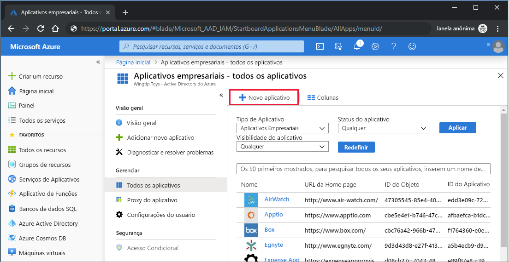
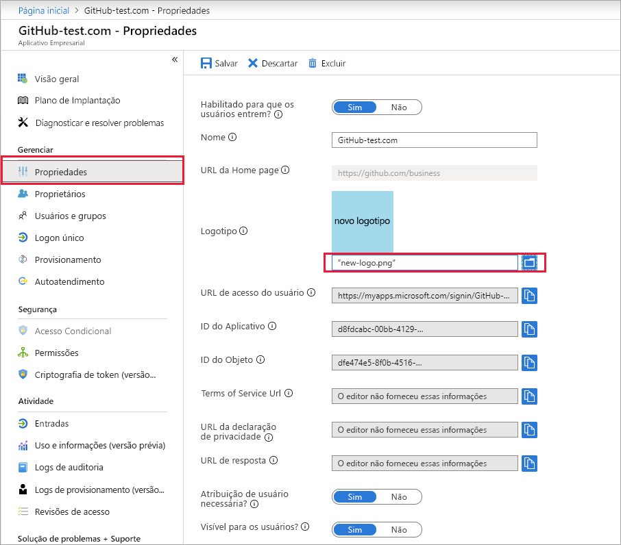

# Início Rápido: Adicionar um aplicativo ao locatário do Azure Active Directory

O Azure AD (Azure Active Directory) tem uma galeria que contém milhares de aplicativos pré-integrados. Alguns dos aplicativos que sua organização usa provavelmente estão na galeria. Este início rápido usa o portal do Azure para adicionar um aplicativo de galeria ao locatário do Azure AD (Azure Active Directory). 
 
Depois que um aplicativo é adicionado ao locatário do Azure AD, você pode:

- Gerenciar o acesso de usuário ao aplicativo com uma política de acesso condicional.
- Configurar usuários para logon único no aplicativo com suas contas do Azure AD.

## Antes de começar

Para adicionar um aplicativo ao locatário, você precisará de:

- Uma assinatura do AD do Azure
- Uma assinatura habilitada com logon único para seu aplicativo

Entre no [portal do Azure](https://portal.azure.com) como administrador global do locatário do Azure AD, administrador do aplicativo de nuvem ou administrador do aplicativo.

Para testar as etapas deste tutorial, recomendamos o uso de um ambiente que não seja de produção. Se não tiver um ambiente do Azure AD que não seja de produção, você poderá [obter uma versão de avaliação de um mês](https://azure.microsoft.com/pricing/free-trial/).

## Adicionar um aplicativo ao locatário do Azure AD

Para adicionar um aplicativo de galeria ao locatário do Azure AD:

1. No [portal do Azure](https://portal.azure.com), no painel navegação à esquerda, clique em **Azure Active Directory**. 

2. Na folha do **Azure Active Directory**, clique em **Aplicativos empresariais**. 

    

3. A folha **Todos os aplicativos** é aberta para mostrar uma amostra aleatória dos aplicativos em seu locatário do Azure AD. 

    

4. Clique em **Novo aplicativo** na parte superior da folha **Todos os aplicativos**.

    

5. Para ver uma lista de aplicativos na galeria, é mais fácil usar as **Categorias**, já que os ícones embaixo de **Aplicativos em destaque** são uma amostra aleatória de aplicativos da galeria. 

    

    Para ver mais aplicativos, clique em **Mostrar mais**. Não recomendamos a pesquisa dessa forma, pois há milhares de aplicativos na galeria.

6. Para procurar um aplicativo, em **Adicionar da galeria**, insira o nome do aplicativo que você deseja adicionar. Selecione o aplicativo nos resultados e clique em **Adicionar**. O exemplo a seguir mostra o formulário **Adicionar aplicativo** que aparece depois da pesquisa de GitHub.com.

    

6. No formulário específico do aplicativo, você pode alterar as informações de propriedade. Por exemplo, você pode editar o nome do aplicativo para atender às necessidades de sua organização. Este exemplo usa o nome **GitHub-test**.

8. Quando você terminar de fazer alterações às propriedades, clique em **Adicionar**.

9. Uma página de introdução é exibida com as opções para configurar o aplicativo para a organização. 

    

Você terminou de adicionar o aplicativo. Fique à vontade para fazer um intervalo.  As seções a seguir mostram como alterar o logotipo e editar outras propriedades do aplicativo.

## Localizar seu aplicativo de locatário do Azure AD

Vamos supor que você teve que sair e agora você está retornando para continuar a configurar o aplicativo. A primeira coisa a fazer é encontrar o aplicativo.

1. No **[portal do Azure](https://portal.azure.com)**, no painel de navegação à esquerda, clique em **Azure Active Directory**. 

2. Na folha do Azure Active Directory, clique em **Aplicativos empresariais**. 

3. No menu suspenso **Tipo de Aplicativo**, selecione **Todos os Aplicativos**e clique em **Aplicar**. Para saber mais sobre as opções de exibição, consulte [Exibir aplicativos de locatário](view-applications-portal.md).

4. Agora você pode ver uma lista de todos os aplicativos em seu locatário do Azure AD.  A lista é uma amostra aleatória. Para ver mais aplicativos, clique em **Mostrar mais** uma ou mais vezes. 

5. Para localizar rapidamente um aplicativo no locatário, insira o nome do aplicativo na caixa de pesquisa e clique em **Aplicar**. Este exemplo localiza o aplicativo de teste do GitHub que adicionamos anteriormente.

    

## Configurar propriedades de logon do usuário

Agora que você localizou o aplicativo, pode abri-lo e configurar suas propriedades.

Para editar as propriedades do aplicativo

1. Clique no aplicativo para abri-lo.
2. Clique em **Propriedades** para abrir a folha de propriedades para edição.

    

3. Reserve um tempo para entender as opções de entrada. As regras **Habilitado para usuários entrarem**, **Atribuição de usuário obrigatória** e **Visível para usuário** são combinadas para determinar se os usuários atribuídos ou não atribuídos para o aplicativo podem entrar.  Elas também determinam se o usuário pode ver o aplicativo no painel de acesso. 

    - **Habilitado para que os usuários entrem** determina se os usuários atribuídos ao aplicativo podem entrar nele.
    - **Atribuição de usuário obrigatória** determina se os usuários não atribuídos ao aplicativo podem entrar nele.
    - **Visível para usuário** determina se os usuários atribuídos a um aplicativo podem vê-lo no painel de acesso e no inicializador do O365. 

4. Use as tabelas a seguir para ajudá-lo a escolher as opções mais adequadas para suas necessidades. 

     - Comportamento de usuários **atribuídos**:

       | Configurações de propriedade do aplicativo | | | Experiência do usuário atribuído | |
       |---|---|---|---|---|
       | Habilitado para os usuários entrarem? | Atribuição de usuário obrigatória? | Visível para os usuários? | Os usuários atribuídos podem entrar? | Os usuários atribuídos podem ver o aplicativo?* |
       | Sim | Sim | Sim | Sim | Sim  |
       | Sim | Sim | não  | Sim | não   |
       | Sim | não  | Sim | Sim | Sim  |
       | Sim | não  | não  | Sim | não   |
       | não  | Sim | Sim | não  | não   |
       | não  | Sim | não  | não  | não   |
       | não  | não  | Sim | não  | não   |
       | não  | não  | não  | não  | não   |

     - Comportamento de usuários **não atribuídos**:
  
       | Configurações de propriedade do aplicativo | | | Experiência de usuário não atribuído | |
       |---|---|---|---|---|
       | Habilitado para os usuários entrarem? | Atribuição de usuário obrigatória? | Visível para os usuários? | Os usuários não atribuídos podem entrar? | Os usuários não atribuídos podem ver o aplicativo?* |
       | Sim | Sim | Sim | não  | não   |
       | Sim | Sim | não  | não  | não   |
       | Sim | não  | Sim | Sim | não   |
       | Sim | não  | não  | Sim | não   |
       | não  | Sim | Sim | não  | não   |
       | não  | Sim | não  | não  | não   |
       | não  | não  | Sim | não  | não   |
       | não  | não  | não  | não  | não   |

    *O usuário pode ver o aplicativo no painel de acesso e no iniciador de aplicativos do Office 365?

## Usar um logotipo personalizado

Para usar um logotipo personalizado:

1. Crie um logotipo de 215 x 215 pixels e salve-o no formato PNG.
2. Já que você encontrou seu aplicativo, clique nele.
2. Na folha à esquerda, clique em **Propriedades**.
4. Carregue o logotipo.
5. Quando tiver terminado, clique em **Salvar**.

    

## Próximas etapas

Neste início rápido, você aprendeu a adicionar um aplicativo de galeria ao locatário do Azure AD. Você aprendeu a editar as propriedades de um aplicativo. 

Agora, você está pronto para configurar o aplicativo para logon único. 

> [!div class="nextstepaction"]
> [Configurar Logon Único](configure-single-sign-on-portal.md)

