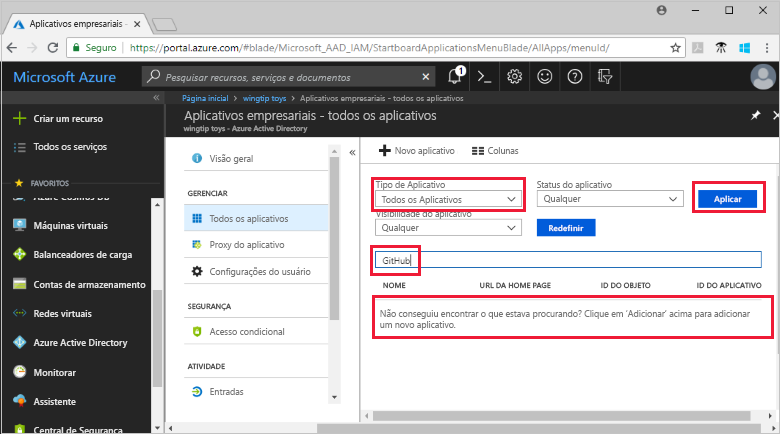
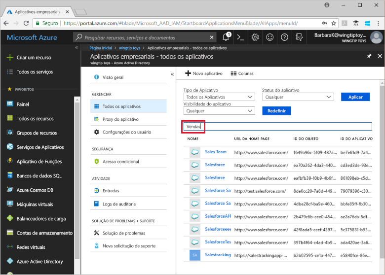

# Exibir seus aplicativos de locatário do Azure Active Directory

Este início rápido usa o portal do Azure para exibir os aplicativos em seu locatário do Azure AD (Azure Active Directory).

## Antes de começar

Para ver os resultados, você precisa ter pelo menos um aplicativo em seu locatário do Azure AD. Para adicionar um aplicativo, consulte o início rápido [Adicionar um aplicativo](add-application-portal.md).

Entre no [portal do Azure](https://portal.azure.com) como administrador global do locatário do Azure AD, administrador do aplicativo de nuvem ou administrador do aplicativo.

## Encontrar a lista de aplicativos de locatário

Seus aplicativos de locatário do Azure AD ficam visíveis na seção **Aplicativos empresariais** do portal do Azure.

Para localizar seus aplicativos de locatário:

1. No **[portal do Azure](https://portal.azure.com)**, no painel de navegação esquerdo, selecione **Azure Active Directory**. 

1. No painel do **Azure Active Directory**, selecione **Aplicativos empresariais**. 

1. No menu suspenso **Tipo de Aplicativo**, selecione **Todos os Aplicativos** e escolha **Aplicar**. Uma amostra aleatória de seus aplicativos de locatário é exibida.
   
1. Para exibir mais aplicativos, selecione **Carregar mais** na parte inferior da lista. Dependendo do número de aplicativos em seu locatário, poderá ser mais fácil [pesquisar determinado aplicativo](#search-for-a-tenant-application) em vez de percorrer a lista.

## Selecionar opções de exibição

Selecionar as opções de acordo com o que você está procurando.

1. É possível exibir os aplicativos por **Tipo de Aplicativo**, **Status do Aplicativo** e **Visibilidade do Aplicativo**. 

1. Em **Tipo de Aplicativo**, escolha uma destas opções:

    - **Aplicativos Empresariais** mostra os aplicativos que não são da Microsoft.
    - **Aplicativos da Microsoft** mostra aplicativos da Microsoft.
    - **Todos os aplicativos** mostra aplicativos da Microsoft e de outros.

1. Em **Status do Aplicativo**, escolha **Qualquer um**, **Desabilitado** ou **Habilitado**. A opção **Qualquer um** inclui aplicativos habilitados e desabilitados.

1. Em **Visibilidade do Aplicativo**, escolha **Qualquer um** ou **Oculto**. A opção **Oculto** mostra os aplicativos que estão no locatário, mas não estão visíveis para os usuários.

1. Depois de escolher as opções desejadas, selecione **Aplicar**.
 

## Pesquisar um aplicativo de locatário

Para pesquisar aplicativo específico:

1. No menu **Tipo de Aplicativo**, selecione **Todos os aplicativos** e escolha **Aplicar**.

1. Insira o nome do aplicativo que você deseja encontrar. Se o aplicativo tiver sido adicionado ao locatário do Azure AD, ele será exibido nos resultados da pesquisa. Este exemplo mostra que o GitHub não foi adicionado aos aplicativos de locatário.

    

1. Tente inserir as primeiras letras do nome de um aplicativo. Este exemplo mostra todos os aplicativos que começam com **Vendas**.

    

## Próximas etapas

Neste início rápido, você aprendeu como exibir os aplicativos no locatário do Azure AD. Você aprendeu como filtrar a lista de aplicativos por tipo de aplicativo, status e visibilidade. Você também aprendeu a procurar determinado aplicativo.

Agora você que localizou o aplicativo que está procurando, é possível passar para [Adicionar mais aplicativos ao seu locatário](add-application-portal.md). Ou é possível selecionar o aplicativo para exibir ou editar as opções de propriedades e de configuração. Por exemplo, você pode configurar o logon único. 

> [!div class="nextstepaction"]
> [Configurar Logon Único](configure-single-sign-on-portal.md)

