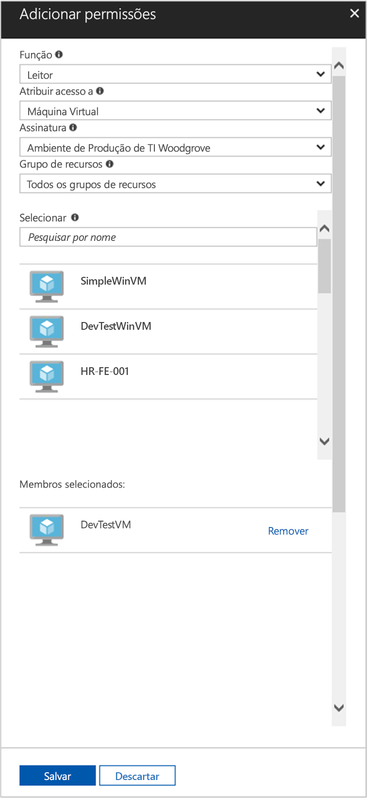

# <a name="use-a-linux-vm-system-assigned-managed-identity-to-access-azure-resource-manager"></a>Usar uma identidade gerenciada atribuída pelo sistema da VM do Linux para acessar o Azure Resource Manager

[!INCLUDE [preview-notice](../../../includes/active-directory-msi-preview-notice.md)]

Este tutorial mostra como usar uma identidade atribuída pelo sistema para uma VM (máquina virtual) do Linux para acessar a API do Azure Resource Manager. As identidades gerenciadas para recursos do Azure são gerenciadas automaticamente pelo Azure e permitem a você autenticar os serviços que dão suporte à autenticação do Azure AD sem necessidade de inserir as credenciais em seu código. Você aprenderá como:

> [!div class="checklist"]
> * Conceder o acesso da VM a um Grupo de Recursos no Azure Resource Manager 
> * Obter um token de acesso usando a identidade da máquina virtual e usá-la para chamar o Azure Resource Manager 

## <a name="prerequisites"></a>Pré-requisitos

[!INCLUDE [msi-qs-configure-prereqs](../../../includes/active-directory-msi-qs-configure-prereqs.md)]

[!INCLUDE [msi-tut-prereqs](../../../includes/active-directory-msi-tut-prereqs.md)]

- [Entrar no portal do Azure](https://portal.azure.com)

- [Criar uma máquina virtual do Linux](/azure/virtual-machines/linux/quick-create-portal)

- [Habilitar identidade gerenciada atribuída pelo sistema em sua máquina virtual](/azure/active-directory/managed-service-identity/qs-configure-portal-windows-vm#enable-system-assigned-identity-on-an-existing-vm)

## <a name="grant-your-vm-access-to-a-resource-group-in-azure-resource-manager"></a>Conceder o acesso da VM a um Grupo de Recursos no Azure Resource Manager 

Usando a identidades gerenciadas para recursos do Azure, seu código pode obter tokens de acesso para autenticar para recursos que oferecem suporte à autenticação do Azure AD. A API do Azure Resource Manager oferece suporte à autenticação do Azure AD. Primeiro, é preciso conceder acesso de identidade desta VM a um recurso no Azure Resource Manager, neste caso, o Grupo de Recursos no qual a VM está contida.  

1. Navegue até a guia para **Grupo de Recursos**.
2. Selecione o **Grupo de Recursos** específico criado anteriormente.
3. Vá para **Controle de acesso (IAM)** no painel esquerdo.
4. Clique para **Adicionar** uma nova atribuição de função para sua VM. Escolha **Função** como **Leitor**.
5. No menu suspenso seguinte, **Atribuir acesso a** ao recurso **Máquina Virtual**.
6. Em seguida, certifique-se de que a assinatura correta está listada na lista suspensa **Assinatura**. E para **Grupo de Recursos**, selecione **Todos os grupos de recursos**.
7. Por fim, em **Selecionar** escolha sua Máquina Virtual do Linux na lista suspensa e clique em **Salvar**.

    

## <a name="get-an-access-token-using-the-vms-system-assigned-managed-identity-and-use-it-to-call-resource-manager"></a>Obter um token de acesso usando a identidade gerenciada atribuída pelo sistema da VM e usá-lo para chamar o Resource Manager 

Para concluir essas etapas, você precisará de cliente SSH. Se você estiver usando o Windows, poderá usar o cliente SSH no [Subsistema do Windows para Linux](https://msdn.microsoft.com/commandline/wsl/about). Se precisar de ajuda para configurar as chaves do cliente SSH, confira [Como usar chaves SSH com o Windows no Azure](../../virtual-machines/linux/ssh-from-windows.md), ou [Como criar e usar um par de chaves SSH pública e privada para VMs Linux no Azure](../../virtual-machines/linux/mac-create-ssh-keys.md).

1. No portal, navegue até a VM do Linux e em **Visão geral**, clique em **Conectar**.  
2. **Conecte-se** à VM com um cliente SSH de sua escolha. 
3. Na janela de terminal, usando CURL, faça uma solicitação para as identidades gerenciadas locais para o ponto de extremidade de recursos do Azure para obter um token de acesso para o Azure Resource Manager.  
 
    A solicitação CURL para o token de acesso está abaixo.  
    
    ```bash
    curl 'http://169.254.169.254/metadata/identity/oauth2/token?api-version=2018-02-01&resource=https%3A%2F%2Fmanagement.azure.com%2F' -H Metadata:true   
    ```
    
    > [!NOTE]
    > O valor do parâmetro "resource" deve ser uma correspondência exata para o que é esperado pelo Azure AD.  No caso da ID de recurso do Gerenciador de Recursos, você deve incluir a barra à direita no URI. 
    
    A resposta inclui o token de acesso que você precisa para acessar o Azure Resource Manager. 
    
    Resposta:  

    ```bash
    {"access_token":"eyJ0eXAiOi...",
    "refresh_token":"",
    "expires_in":"3599",
    "expires_on":"1504130527",
    "not_before":"1504126627",
    "resource":"https://management.azure.com",
    "token_type":"Bearer"} 
    ```
    
    Você pode usar esse token de acesso para acessar o Azure Resource Manager, por exemplo, para ler os detalhes do Grupo de Recursos ao qual você concedeu acesso anteriormente para essa VM. Substitua os valores de \<ID DA ASSINATURA\>, \<GRUPO DE RECURSOS\> e \<TOKEN DE ACESSO\> por aqueles que você criou anteriormente. 
    
    > [!NOTE]
    > A URL diferencia maiúsculas de minúsculas, portanto, verifique se você está usando letras maiúsculas e minúsculas exatamente da mesma forma que você usou anteriormente ao nomear o Grupo de Recursos e a letra maiúscula “G” em “resourceGroup”.  
    
    ```bash 
    curl https://management.azure.com/subscriptions/<SUBSCRIPTION ID>/resourceGroups/<RESOURCE GROUP>?api-version=2016-09-01 -H "Authorization: Bearer <ACCESS TOKEN>" 
    ```
    
    A resposta de volta com as informações do Grupo de Recursos específicas: 
     
    ```bash
    {"id":"/subscriptions/98f51385-2edc-4b79-bed9-7718de4cb861/resourceGroups/DevTest","name":"DevTest","location":"westus","properties":{"provisioningState":"Succeeded"}} 
    ```     

## <a name="next-steps"></a>Próximas etapas

Neste início rápido, você aprendeu a usar uma identidade gerenciada atribuída pelo sistema para acessar a API do Azure Resource Manager.  Para saber mais sobre o Azure Resource Manager, confira:

> [!div class="nextstepaction"]
>[Azure Resource Manager](/azure/azure-resource-manager/resource-group-overview)