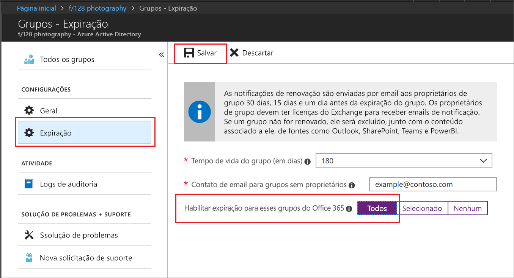

# Início Rápido: Configurar os grupos do Office 365 para expirar no Azure Active Directory

Neste início rápido, você pode definir a política de expiração para os grupos do Office 365. Quando os usuários podem configurar seus próprios grupos, os grupos não utilizados podem multiplicar-se. Uma maneira de gerenciar os grupos não utilizados é definir esses grupos para expirar, para reduzir o trabalho de ter que exclui-los manualmente.

A política de expiração é simples:

* Os proprietários do grupo serão notificados para renovar um grupo prestes a expirar
* Um grupo que não é renovado será excluído
* Um grupo excluído do Office 365 pode ser restaurado em 30 dias, por um proprietário de grupo ou por um administrador do Azure AD

Se você não tiver uma assinatura do Azure, [crie uma conta gratuita](https://azure.microsoft.com/free/) antes de começar.

## Pré-requisito

Você deve ser um Administrador Global ou Administrador de Conta de Usuário no locatário para configurar a expiração do grupo.

## Ativar a criação de usuário para grupos

1. Entre no [Portal do Azure](https://portal.azure.com) com uma conta que seja de Administrador Global ou de Administrador de Conta de Usuário para o diretório.

2. Selecione **Grupos**e, em seguida, selecione **Geral**.
  
  

3. Defina **Usuários podem criar grupos do Office 365** para **Sim**.

4. Selecione **Salvar** para salvar as configurações de grupos quando você terminar.

## Definir a expiração de grupo

1. Entre no [portal do Azure](https://portal.azure.com), selecione **Azure Active Directory** > **Grupos** > **Expiração** para abrir as configurações de expiração.
  
  

2. Defina o intervalo de expiração. Selecione um valor predefinido ou insira um valor personalizado superior a 31 dias. 

3. Forneça um endereço de email para o qual as notificações de expiração e renovação devem ser enviadas quando um grupo não tem nenhum proprietário.

4. Para este início rápido, defina **Habilitar expiração para esses grupos do Office 365** para **Todos**.

5. Selecione **Salvar** para salvar as configurações de expiração quando você terminar.

É isso! Neste início rápido, você definiu com sucesso a política de expiração para os grupos do Office 365 selecionados.

## Limpar recursos

**Para remover a política de expiração**

1. Certifique-se de que você está conectado no [portal do Azure](https://portal.azure.com) com uma conta que seja de Administrador Global para o seu locatário.
2. Selecione **Azure Active Directory** > **Grupos** > **Expiração**.
3. Definir **Habilitar expiração para esses grupos do Office 365** para **Nenhum**.

**Para desativar a criação de usuário para grupos**

1. Selecione **Azure Active Directory** > **Grupos** > **Geral**. 
2. Definir **Usuários podem criar grupos do Office 365 nos portais do Azure** para **Não**.

## Próximas etapas

Para obter mais informações sobre a expiração, incluindo restrições técnicas, adicionando uma lista de palavras bloqueadas personalizadas e experiências de usuário final entre aplicativos do Office 365, consulte o artigo a seguir que contém os detalhes da política de expiração:

> [!div class="nextstepaction"]
> [Política de expiração e todos os seus detalhes](groups-lifecycle.md)
