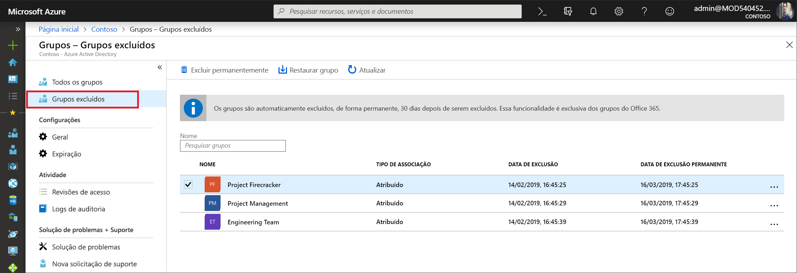

# <a name="restore-a-deleted-office-365-group-in-azure-active-directory"></a>Restaurar um grupo do Office 365 excluído na visualização do Azure Active Directory

Quando você exclui um grupo do Office 365 no Azure AD (Azure Active Directory), o grupo excluído é mantido, mas não fica visível por 30 dias a partir da data de exclusão. Esse comportamento é para que o grupo e seu conteúdo possam ser restaurados, se necessário. Essa funcionalidade é restrita exclusivamente a grupos do Office 365 no Azure AD. Ele não fica disponível para grupos de segurança e de distribuição. Observe que o período de restauração de grupo de 30 dias não é personalizável.

> [!NOTE]
> Não use `Remove-MsolGroup`, pois ele limpa o grupo permanentemente. Sempre use `Remove-AzureADMSGroup` para excluir um grupo do Office 365.

As permissões necessárias para restaurar um grupo podem ser qualquer uma das seguintes:

Função | Permissões
--------- | ---------
Administrador global, Administrador de grupo, suporte de Camada 2 do Parceiro e Administrador do Intune | Pode restaurar qualquer grupo do Office 365 excluído
Administrador de Usuário e suporte de Camada 1 do Parceiro | Pode restaurar qualquer grupo do Office 365 excluído, exceto aqueles atribuídos à função de Administrador de Empresa
Usuário | Pode restaurar qualquer grupo do Office 365 excluído que era propriedade dele

## <a name="view-and-manage-the-deleted-office-365-groups-that-are-available-to-restore"></a>Exibir e gerenciar os grupos do Office 365 excluídos que estão disponíveis para restauração

1. Entre no [Centro de administração do Azure Active Directory](https://aad.portal.azure.com) com uma conta de administrador.

2. Selecione **Grupos** e, em seguida, selecione **Grupos excluídos** para exibir os grupos excluídos que estão disponíveis para restauração.

    

3. Na folha **Grupos excluídos**, você pode:

   - Restaurar o grupo excluído e seu conteúdo, selecionando **Restaurar grupo**.
   - Remover permanentemente o grupo excluído, selecionando **Excluir permanentemente**. Para remover permanentemente um grupo, você deve ser um administrador.

## <a name="view-the-deleted-office-365-groups-that-are-available-to-restore-using-powershell"></a>Exibir os grupos do Office 365 excluídos que estão disponíveis para restauração usando o PowerShell

Os cmdlets a seguir podem ser usados para exibir os grupos excluídos para verificar que aqueles em que você está interessado ainda não foram permanentemente removidos. Esses cmdlets são parte do módulo do [PowerShell do Azure AD](https://www.powershellgallery.com/packages/AzureAD/). Mais informações sobre esse módulo podem ser encontradas no artigo [Azure Active Directory PowerShell Versão 2](/powershell/azure/install-adv2?view=azureadps-2.0).

1.  Execute o cmdlet a seguir para exibir todos os grupos do Office 365 excluídos em seu locatário que ainda estão disponíveis para restauração.
   

    ```powershell
    Get-AzureADMSDeletedGroup
    ```

2.  Como alternativa, se você souber a objectID de um grupo específico (e você pode obtê-la do cmdlet na etapa 1), execute o cmdlet a seguir para verificar se o grupo excluído específico não ainda foi permanentemente removido.

    ```
    Get-AzureADMSDeletedGroup –Id <objectId>
    ```

## <a name="how-to-restore-your-deleted-office-365-group-using-powershell"></a>Como restaurar seu grupo do Office 365 excluído usa o Powershell

Após ter verificado que o grupo ainda está disponível para restauração, restaure o grupo excluído com uma das etapas a seguir. Se o grupo contém documentos, sites de SP ou outros objetos persistentes, pode levar até 24 horas para restaurar completamente um grupo e seu conteúdo.

1. Execute o cmdlet a seguir para restaurar o grupo e seu conteúdo.
 

   ```
    Restore-AzureADMSDeletedDirectoryObject –Id <objectId>
    ``` 

2. Como alternativa, o cmdlet a seguir pode ser executado para remover permanentemente o grupo excluído.
    

    ```
    Remove-AzureADMSDeletedDirectoryObject –Id <objectId>
    ```

## <a name="how-do-you-know-this-worked"></a>Como saber se isso funcionou?

Para verificar se você restaurou com êxito um grupo do Office 365, execute o cmdlet `Get-AzureADGroup –ObjectId <objectId>` para exibir informações sobre o grupo. Após a solicitação de restauração ser concluída:

- O grupo aparece na barra de navegação Esquerda no Exchange
- O plano para o grupo será exibido no Planner
- Os sites do SharePoint e todo o conteúdo deles estarão disponíveis
- O grupo pode ser acessado de qualquer um dos pontos de extremidade do Exchange e outras cargas de trabalho do Office 365 que dão suporte a grupos do Office 365

## <a name="next-steps"></a>Próximas etapas

Esses artigos fornecem mais informações sobre grupos do Azure Active Directory.

* [Consultar grupos existentes](../fundamentals/active-directory-groups-view-azure-portal.md)
* [Gerenciar configurações de um grupo](../fundamentals/active-directory-groups-settings-azure-portal.md)
* [Gerenciar membros de um grupo](../fundamentals/active-directory-groups-members-azure-portal.md)
* [Gerenciar associações de um grupo](../fundamentals/active-directory-groups-membership-azure-portal.md)
* [Gerenciar regras dinâmicas para usuários em um grupo](groups-dynamic-membership.md)
