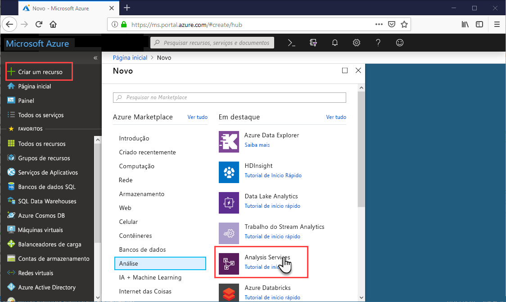

# Criar um servidor do Analysis Services no portal do Azure
Este artigo orienta você pela criação de um recurso de servidor do Analysis Services em sua assinatura do Azure.

Antes de começar, você precisa de: 

* **Assinatura do Azure**: visite a [Avaliação Gratuita do Azure](https://azure.microsoft.com/offers/ms-azr-0044p/) para criar uma conta.
* **Azure Active Directory**: sua assinatura deve estar associada a um locatário do Azure Active Directory. Também é preciso estar conectado ao Azure com uma conta no Azure Active Directory em questão. Para obter mais informações, confira [Autenticação e permissões de usuário](analysis-services-manage-users.md).

## Faça logon no Portal do Azure 

Faça logon no [Portal do Azure](https://portal.azure.com)

## Criar um servidor

1. Clique em **+ Criar um recurso** > **Dados + Análise** > **Analysis Services**.

    

2. Em **Analysis Services**, preencha os campos obrigatórios e pressione **Criar**.
   
    
   
   * **Nome do servidor**: digite um nome exclusivo usado para fazer referência ao servidor.
   * **Assinatura**: selecione a assinatura a qual o servidor será associado.
   * **Grupo de recursos**: crie um novo grupo de recursos ou selecione um que você já tenha. Os grupo de recursos são projetados para ajudar você a gerenciar uma coleção de recursos do Azure. Para saber mais, veja [grupos de recursos](../azure-resource-manager/resource-group-overview.md).
   * **Local**: local do datacenter do Azure que hospeda o servidor. Escolha um local mais próximo da sua maior base de usuários.
   * **Tipo de preço**: selecione um tipo de preço. Se você estiver testando e pretende instalar o banco de dados do modelo de exemplo, selecione a camada gratuita **D1**. Para saber mais, veja [Preços do Azure Analysis Services](https://azure.microsoft.com/pricing/details/analysis-services/). 
    * **Administrador**: por padrão, essa será a conta com a qual você entrou. Você pode escolher uma conta diferente no Microsoft Azure Active Directory.
    * **Configuração de armazenamento de backup**: opcional. Se você já tiver uma [conta de armazenamento](../storage/common/storage-introduction.md), você pode especificá-la como o padrão para o backup do banco de dados de modelo. Você também pode especificar a configuração de [backup e restauração](analysis-services-backup.md) mais tarde.
    * **Expiração da chave de armazenamento**: opcional. Especifique um período de expiração para a chave de armazenamento.
3. Clique em **Criar**.

Criar geralmente leva menos de um minuto. Se você tiver selecionado **Adicionar ao Portal**, navegue até o portal para ver o novo servidor. Ou navegue até **Todos os serviços** > **Analysis Services** para ver se o servidor está pronto.

## Limpar recursos
Quando não for mais necessário, exclua o seu servidor. Em **Visão geral**, clique em **Excluir**. 

 

## Próximas etapas

[Adicionar um modelo de dados de exemplo](analysis-services-create-sample-model.md) ao seu servidor.  
[Instalar um gateway de dados local](analysis-services-gateway-install.md) se seu modelo de dados se conecta a fontes de dados local.  
[Implantar um projeto de modelo de tabela](analysis-services-deploy.md) do Visual Studio.   

