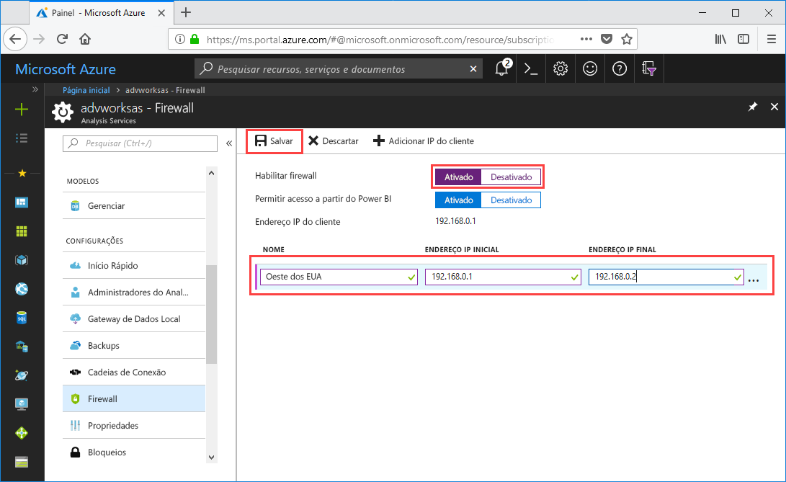

# Início Rápido: Configurar firewall do servidor - Portal

Este guia de início rápido ajuda você a configurar um firewall para o servidor Azure Analysis Services. Habilitar um firewall e configurar intervalos de endereços IP para somente os computadores que acessam o servidor são uma parte importante para proteger o servidor e os dados.

## Pré-requisitos

- Um servidor do Analysis Services na sua assinatura. Para obter mais informações, consulte [Início Rápido: Criar um servidor - Portal](analysis-services-create-server.md) ou [Início Rápido: Criar um servidor - PowerShell](analysis-services-create-powershell.md)
- Um ou mais intervalos de endereços IP para computadores cliente (se necessário).

## Faça logon no Portal do Azure 

[Faça logon no portal](https://portal.azure.com)

## Configure um firewall

1. Clique no seu servidor para abrir a página de Visão geral. 
2. Em **CONFIGURAÇÕES** > **Firewall** > **Habilitar firewall**, clique em **Ativar**.
3. Para permitir o acesso do DirectQuery do serviço do Power BI, em **Permitir o acesso do Power BI**, clique em **Ativar**.  
4. (Opcional) Especifique um ou mais intervalos de endereços IP. Insira um nome, um endereço IP inicial e um final para cada intervalo. 
5. Clique em **Salvar**.

     

## Limpar recursos

Quando não for mais necessário, exclua os intervalos de endereços IP ou desabilite o firewall.

## Próximas etapas
Neste guia de início rápido você aprendeu a configurar um firewall para o seu servidor. Agora que você tem o servidor, e ele está protegido com um firewall, você pode adicionar um modelo de dados de exemplo básico a ele a partir do portal. Ter um modelo de exemplo é útil para saber mais sobre como configurar funções do modelo de banco de dados e testar conexões de cliente. Para saber mais, continue para o tutorial para adicionar um modelo de exemplo.

> [!div class="nextstepaction"]
> [Tutorial: Adicionar um modelo de exemplo ao seu servidor](analysis-services-create-sample-model.md)
