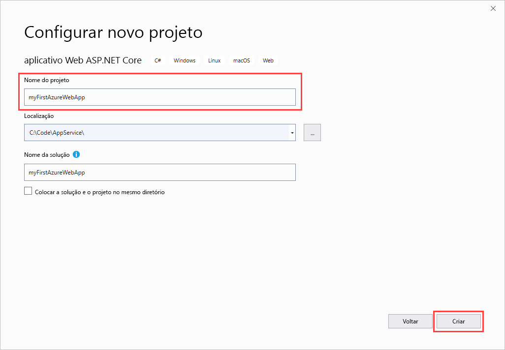
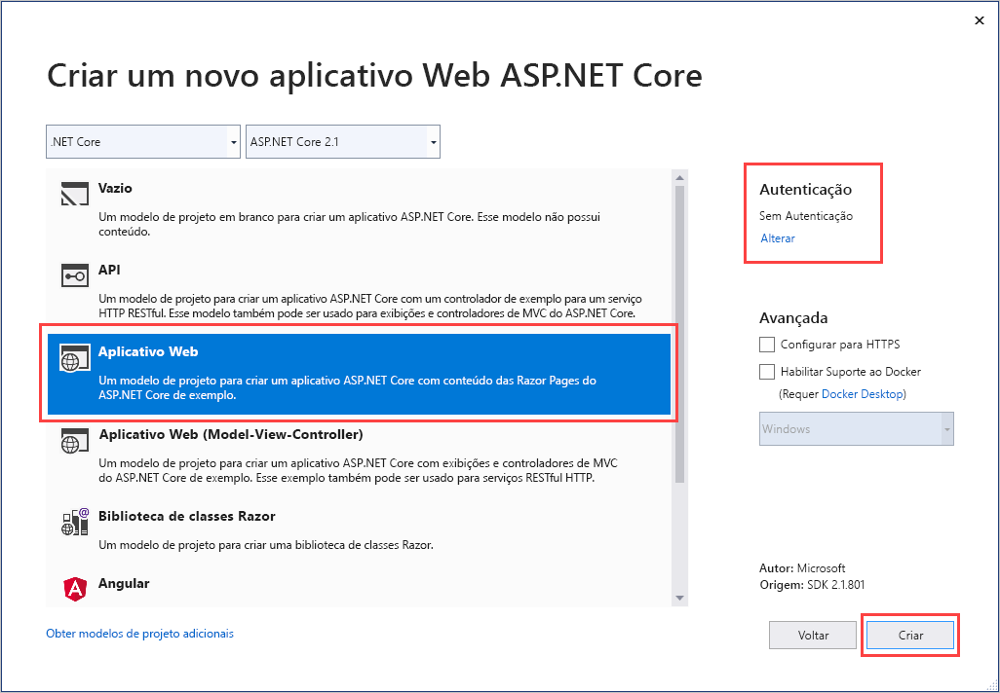
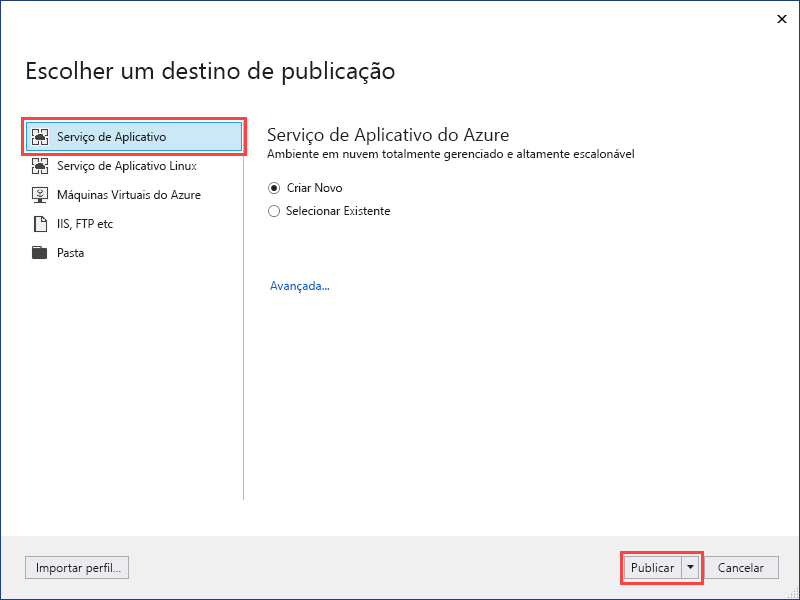
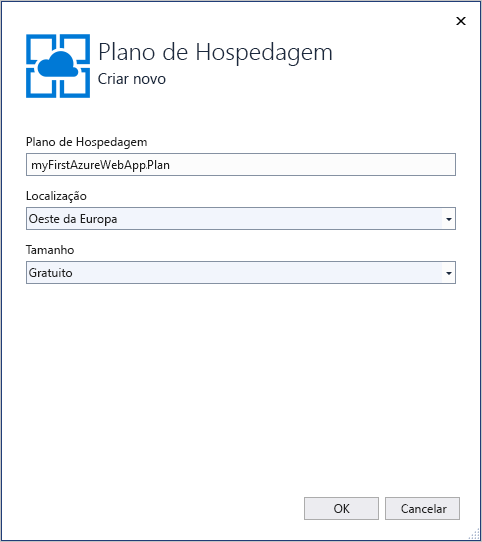
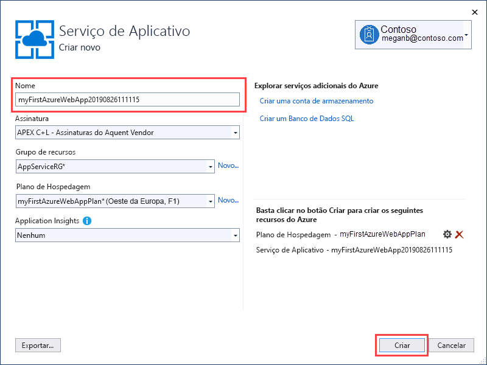
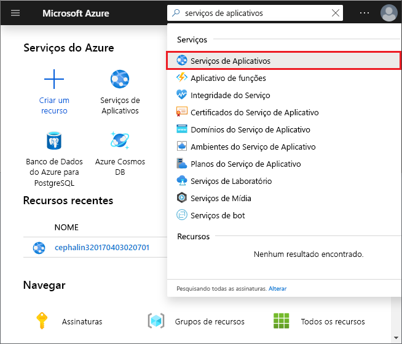
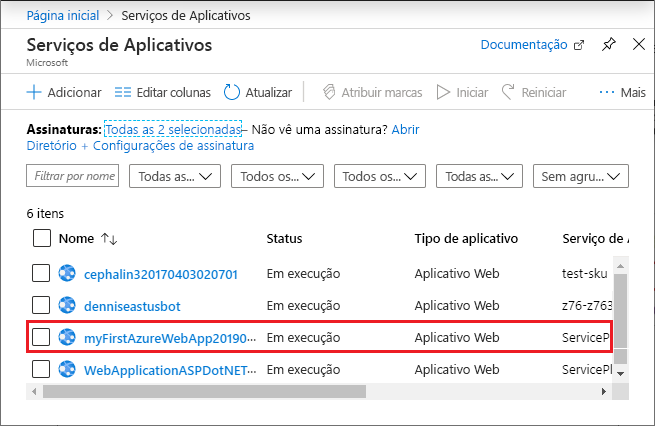
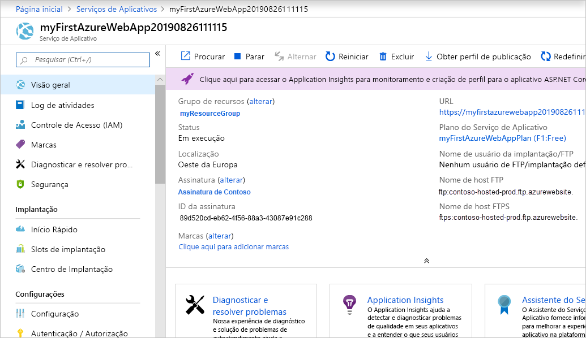

# <a name="create-an-aspnet-core-web-app-in-azure"></a>Criar um aplicativo Web ASP.NET Core no Azure

> [!NOTE]
> Este artigo implanta um aplicativo no Serviço de Aplicativo no Windows. Para implantar o Serviço de Aplicativo em _Linux_, consulte [Criar um aplicativo Web .NET Core no Serviço de Aplicativo em Linux](./containers/quickstart-dotnetcore.md).
>

O [Serviço de Aplicativo do Azure](overview.md) fornece um serviço de hospedagem na Web altamente escalonável e com aplicação automática de patches.

Este guia de início rápido mostra como implantar seu primeiro aplicativo Web ASP.NET Core no Serviço de Aplicativo do Azure. Quando terminar, você terá um grupo de recursos que consiste em um plano do Serviço de Aplicativo e um aplicativo do Serviço de Aplicativo com um aplicativo Web implantado.

[!INCLUDE [quickstarts-free-trial-note](../../includes/quickstarts-free-trial-note.md)]

## <a name="prerequisites"></a>Pré-requisitos

Para concluir este tutorial, instale o <a href="https://www.visualstudio.com/downloads/" target="_blank">Visual Studio 2019</a> com a carga de trabalho do **ASP.NET e de desenvolvimento para a Web**.

Se você já instalou o Visual Studio 2019:

- Instale as atualizações mais recentes no Visual Studio selecionando **Ajuda** > **Verificar Atualizações**.
- Adicione a carga de trabalho selecionando **Ferramentas** > **Obter Ferramentas e Recursos**.

## <a name="create-an-aspnet-core-web-app"></a>Criar um aplicativo Web ASP.NET Core

Crie um aplicativo Web ASP.NET Core seguindo estas etapas:

1. Abra o Visual Studio e selecione **Criar novo projeto**.

1. Em **Criar novo projeto**, localize e escolha **Aplicativo Web ASP.NET Core** para C# e, em seguida, selecione **Avançar**.

1. Em **Configurar seu novo projeto**, dê ao aplicativo o nome _myFirstAzureWebApp_ e, em seguida, selecione, **Criar**.

   

1. Para este início rápido, escolha o modelo **Aplicativo Web**. Verifique se a autenticação está definida como **Sem Autenticação** e se nenhuma outra opção está selecionada. Selecione **Criar**.

   

    Você pode implantar qualquer tipo de aplicativo Web ASP.NET Core no Azure.

1. No menu do Visual Studio, selecione **Depurar** > **Iniciar sem Depuração** para executar o aplicativo Web localmente.

   

## <a name="publish-your-web-app"></a>Publicar seu aplicativo Web

1. No **Gerenciador de Soluções**, clique com o botão direito do mouse no projeto **myFirstAzureWebApp** e selecione **Publicar**.

1. Escolha **Serviço de Aplicativo** e selecione **Publicar**.

   

1. Em **Criar Novo Serviço de Aplicativo**, suas opções dependem de você já ter entrado no Azure e de ter uma conta do Visual Studio vinculada a uma conta do Azure. Selecione **Adicionar uma conta** ou **Entrar** para entrar em sua assinatura do Azure. Se você já estiver conectado, selecione a conta que deseja.

   > [!NOTE]
   > Se você já estiver conectado, não selecione **Criar** ainda.
   >

   

   [!INCLUDE [resource group intro text](../../includes/resource-group.md)]

1. Para **Grupo de recursos**, selecione **Novo**.

1. Em **Nome do novo grupo de recursos**, insira *myResourceGroup* e selecione **OK**.

   [!INCLUDE [app-service-plan](../../includes/app-service-plan.md)]

1. Para o **Plano de Hospedagem**, selecione **Novo**.

1. Na caixa de diálogo **Configurar Plano de Hospedagem**, insira os valores da tabela a seguir e selecione **OK**.

   | Configuração | Valor sugerido | DESCRIÇÃO |
   |-|-|-|
   |Plano do Serviço de Aplicativo| myAppServicePlan | O nome do plano do Serviço de Aplicativo. |
   | Location | Europa Ocidental | O datacenter onde o aplicativo Web está hospedado. |
   | Tamanho | Grátis | O [Tipo de preço](https://azure.microsoft.com/pricing/details/app-service/?ref=microsoft.com&utm_source=microsoft.com&utm_medium=docs&utm_campaign=visualstudio) determina os recursos de hospedagem. |

   

1. Em **Nome**, insira um nome de aplicativo exclusivo que inclua somente os caracteres válidos `a-z`, `A-Z`, `0-9` e `-`. Você pode aceitar o nome exclusivo gerado automaticamente. A URL do aplicativo Web é `http://<app_name>.azurewebsites.net`, em que `<app_name>` é o nome do aplicativo.

   

1. Clique em **Criar** para começar a criar os recursos do Azure.

Após a conclusão do assistente, ele publicará o aplicativo Web ASP.NET Core no Azure e, em seguida, iniciará o aplicativo no navegador padrão.


O nome do aplicativo especificado na página **Criar Novo Serviço de Aplicativo** é usado como o prefixo da URL no formato `http://<app_name>.azurewebsites.net`.

**Parabéns!** Seu aplicativo Web ASP.NET Core está em execução no Serviço de Aplicativo do Azure.

## <a name="update-the-app-and-redeploy"></a>Atualizar o aplicativo e reimplantar

1. No **Gerenciador de Soluções**, em seu projeto, abra **Páginas** > **Index.cshtml**.

1. Substitua as duas marcas `<div>` pelo código a seguir:

   ```HTML
   <div class="jumbotron">
       <h1>ASP.NET in Azure!</h1>
       <p class="lead">This is a simple app that we’ve built that demonstrates how to deploy a .NET app to Azure App Service.</p>
   </div>
   ```

1. Para implantar novamente no Azure, clique com o botão direito do mouse no projeto **myFirstAzureWebApp**, no **Gerenciador de Soluções** e selecione **Publicar**.

1. Na página de resumo **Publicar**, selecione **Publicar**.

   

Quando a publicação está concluída, o Visual Studio inicia um navegador para a URL do aplicativo Web.


## <a name="manage-the-azure-app"></a>Gerenciar o aplicativo do Azure

Para gerenciar o aplicativo Web, vá para o [portal do Azure](https://portal.azure.com) e procure e selecione **Serviços de Aplicativo**.



Na página **Serviços de Aplicativo**, selecione o nome do seu aplicativo Web.



A página Visão Geral do seu aplicativo Web é exibida. Aqui, você pode executar tarefas básicas de gerenciamento como procurar, parar, iniciar, reiniciar e excluir.



O menu à esquerda fornece páginas diferentes para configurar seu aplicativo.

[!INCLUDE [Clean-up section](../../includes/clean-up-section-portal.md)]

## <a name="next-steps"></a>Próximas etapas

> [!div class="nextstepaction"]
> [ASP.NET Core com o Banco de Dados SQL](app-service-web-tutorial-dotnetcore-sqldb.md)
