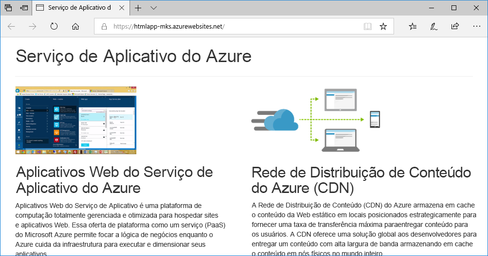
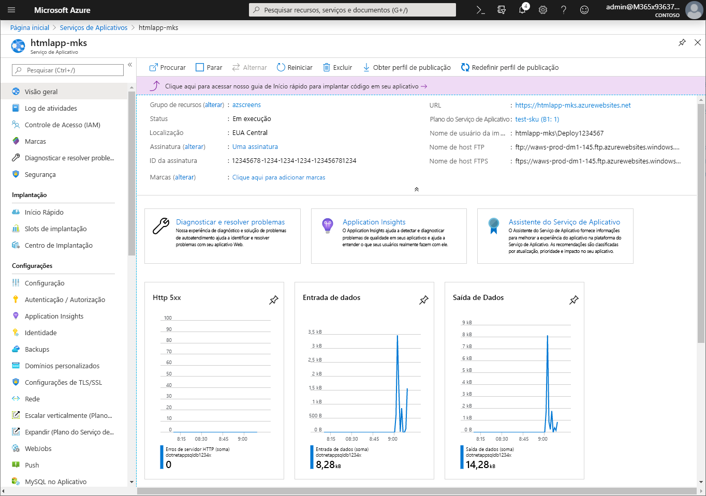

# <a name="create-a-static-html-web-app-in-azure"></a>Criar um aplicativo Web HTML estático no Azure

Os [aplicativos Web do Azure](app-service-web-overview.md) fornecem um serviço de hospedagem na Web altamente escalonável,com aplicação automática de patches.  Este guia de início rápido mostra como implantar um site HTML+CSS básico para Aplicativos Web do Azure. Você concluirá este início rápido no [Cloud Shell](https://docs.microsoft.com/en-us/azure/cloud-shell/overview), mas também pode executar esses comandos localmente com a [CLI do Azure](/cli/azure/install-azure-cli).


[!INCLUDE [quickstarts-free-trial-note](../../includes/quickstarts-free-trial-note.md)]

[!INCLUDE [cloud-shell-try-it.md](../../includes/cloud-shell-try-it.md)]

## <a name="install-web-app-extension-for-cloud-shell"></a>Instalar a extensão do aplicativo Web para o Cloud Shell

Para concluir este início rápido, você precisa adicionar a [az web app extension](https://docs.microsoft.com/en-us/cli/azure/extension?view=azure-cli-latest#az-extension-add). Se a extensão já estiver instalada, você deve atualizá-la para a versão mais recente. Para atualizar a extensão do aplicativo Web, digite `az extension update -n webapp`.

Para instalar a extensão webapp, execute o seguinte comando:

```bash
az extension add -n webapp
```

Quando a extensão tiver sido instalada, o Cloud Shell mostra as informações para o exemplo a seguir:

```bash
The installed extension 'webapp' is in preview.
```

## <a name="download-the-sample"></a>Baixar o exemplo

No Cloud Shell, crie um diretório de início rápido e depois altere-o.

```bash
mkdir quickstart

cd quickstart
```

Em seguida, execute o comando a seguir para clonar o repositório de aplicativos de exemplo ao seu diretório de início rápido.

```bash
git clone https://github.com/Azure-Samples/html-docs-hello-world.git
```

## <a name="create-a-web-app"></a>Criar um aplicativo Web

Altere para o diretório que contém o código de exemplo e execute o comando `az webapp up`.

No exemplo a seguir, substitua <app_name> por um nome de aplicativo exclusivo.

```bash
cd html-docs-hello-world

az webapp up -n <app_name>
```

O comando `az webapp up` realiza as seguintes ações:

- Criar um grupo de recursos padrão.

- Criar um plano de serviço de aplicativo padrão.

- Criar um aplicativo com o nome especificado.

- Arquivos [de implantação zip](https://docs.microsoft.com/en-us/azure/app-service/app-service-deploy-zip) do diretório de trabalho atual para o aplicativo Web.

Esse comando pode demorar um pouco para ser executado. Na execução, ele exibe informações semelhantes ao seguinte exemplo:

```json
{
  "app_url": "https://<app_name>.azurewebsites.net",
  "location": "Central US",
  "name": "<app_name>",
  "os": "Windows",
  "resourcegroup": "appsvc_rg_Windows_CentralUS ",
  "serverfarm": "appsvc_asp_Windows_CentralUS",
  "sku": "FREE",
  "src_path": "/home/username/quickstart/html-docs-hello-world ",
  < JSON data removed for brevity. >
}
```

Anote o valor `resourceGroup`. Você precisa dele para a seção [limpar recursos](#clean-up-resources).

## <a name="browse-to-the-app"></a>Navegar até o aplicativo

Em um navegador, acesse a URL do aplicativo Web do Azure: `http://<app_name>.azurewebsites.net`.

A página está sendo executada como um aplicativo Web do Serviço de Aplicativo do Azure.


**Parabéns!** Você implantou seu primeiro aplicativo HTML no Serviço de Aplicativo.

## <a name="update-and-redeploy-the-app"></a>Atualizar o aplicativo e reimplantar

No Cloud Shell, digite `nano index.html` para abrir o editor de texto nano. No cabeçalho H1, altere “Serviço de Aplicativo do Azure – Site HTML estático de exemplo” para “Serviço de Aplicativo do Azure”, como mostrado abaixo.


Salve suas alterações e saia do nano. Use o comando `^O` para salvar e `^X` para sair.

Agora você vai reimplantar o aplicativo com o mesmo comando `az webapp up`.

```bash
az webapp up -n <app_name>
```

Depois que a implantação for concluída, troque para a janela do navegador aberta na etapa **Navegar até o aplicativo** e atualize a página.



## <a name="manage-your-new-azure-web-app"></a>Gerenciar seu novo aplicativo Web do Azure

Vá para o <a href="https://portal.azure.com" target="_blank">portal do Azure</a> para gerenciar o aplicativo Web que você criou.

No menu à esquerda, clique em **Serviços de Aplicativos** e então clique no nome do seu aplicativo Web do Azure.


A página Visão Geral do seu aplicativo Web é exibida. Aqui você pode executar tarefas básicas de gerenciamento como procurar, parar, iniciar, reiniciar e excluir.



O menu à esquerda fornece páginas diferentes para configurar seu aplicativo.

## <a name="clean-up-resources"></a>Limpar recursos

Nas etapas anteriores, você criou os recursos do Azure em um grupo de recursos. Se você acha que não precisará desses recursos no futuro, exclua o grupo de recursos executando o seguinte comando no Cloud Shell. Lembre-se de que o nome do grupo de recursos foi gerado automaticamente para você na etapa [criar um aplicativo Web](#create-a-web-app).

```bash
az group delete --name appsvc_rg_Windows_CentralUS
```

Esse comando pode demorar um pouco para ser executado.

## <a name="next-steps"></a>Próximas etapas

> [!div class="nextstepaction"]
> [Mapear domínio personalizado](app-service-web-tutorial-custom-domain.md)
