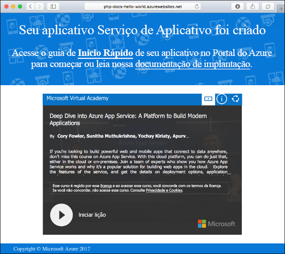

# <a name="create-a-nodejs-web-app-in-azure"></a>Criar um aplicativo Web do Node.js no Azure

> [!NOTE]
> Este artigo implanta um aplicativo no Serviço de Aplicativo no Windows. Para implantar o Serviço de Aplicativo em _Linux_, consulte [Criar um aplicativo Web Node.js no Serviço de Aplicativo do Azure em Linux](./containers/quickstart-nodejs.md).
>

Os [aplicativos Web do Azure](app-service-web-overview.md) fornecem um serviço de hospedagem na Web altamente escalonável,com aplicação automática de patches.  Este guia de início rápido mostra como implantar um aplicativo Node.js em Aplicativos Web do Azure. Crie o aplicativo Web usando a [CLI do Azure](https://docs.microsoft.com/cli/azure/get-started-with-azure-cli) e use o Git para implantar o código Node.js de exemplo para o aplicativo Web.


Você pode seguir as etapas aqui usando um computador Mac, Windows ou Linux. A conclusão das etapas demora cerca de cinco minutos assim que os pré-requisitos são instalados.   

> [!VIDEO https://channel9.msdn.com/Shows/Azure-for-Node-Developers/Create-a-Nodejs-app-in-Azure-Quickstart/player]   

[!INCLUDE [quickstarts-free-trial-note](../../includes/quickstarts-free-trial-note.md)]

## <a name="prerequisites"></a>pré-requisitos

Para concluir este guia de início rápido:

* <a href="https://nodejs.org/" target="_blank">Instalar o Node.js e o NPM</a>

## <a name="download-the-sample"></a>Baixar o exemplo

Baixe o projeto de exemplo de Node.js do [https://github.com/Azure-Samples/nodejs-docs-hello-world/archive/master.zip](https://github.com/Azure-Samples/nodejs-docs-hello-world/archive/master.zip) e extraia o arquivo ZIP.

Em uma janela de terminal, navegue até o diretório raiz do projeto de exemplo do Node.js (aquele que contém _index.js_).

## <a name="run-the-app-locally"></a>Executar o aplicativo localmente

Execute o aplicativo localmente abrindo uma janela do terminal e usando o script `npm start` para iniciar o servidor HTTP interno do Node.js.

```bash
npm start
```

Abra um navegador da Web e navegue até o aplicativo de exemplo em `http://localhost:1337`.

Você vê a mensagem **Olá, Mundo** no aplicativo de exemplo exibido na página.


Na janela do terminal, pressione **Ctrl+C** para sair do servidor Web.

[!INCLUDE [Create ZIP file](../../includes/app-service-web-create-zip.md)]

[!INCLUDE [cloud-shell-try-it.md](../../includes/cloud-shell-try-it.md)]

[!INCLUDE [Create resource group](../../includes/app-service-web-create-resource-group.md)] 

[!INCLUDE [Create app service plan](../../includes/app-service-web-create-app-service-plan.md)] 

## <a name="create-a-web-app"></a>Criar um aplicativo Web

No Cloud Shell, crie um aplicativo Web no plano do Serviço de Aplicativo do `myAppServicePlan` com o comando [`az webapp create`](/cli/azure/webapp?view=azure-cli-latest#az_webapp_create). 

No exemplo a seguir, substitua `<app_name>` por um nome do aplicativo exclusivo globalmente (os caracteres válidos são `a-z`, `0-9` e `-`). A execução é predefinida para `NODE|6.9`. Para ver todos os tempos de execução com suporte, execute [`az webapp list-runtimes`](/cli/azure/webapp?view=azure-cli-latest#az_webapp_list_runtimes). 

```azurecli-interactive
# Bash
az webapp create --resource-group myResourceGroup --plan myAppServicePlan --name <app_name> --runtime "NODE|6.9"
# PowerShell
az --% webapp create --resource-group myResourceGroup --plan myAppServicePlan --name <app_name> --runtime "NODE|6.9"
```

Quando o aplicativo Web for criado, a CLI do Azure mostrará um resultado semelhante ao seguinte exemplo:

```json
{
  "availabilityState": "Normal",
  "clientAffinityEnabled": true,
  "clientCertEnabled": false,
  "cloningInfo": null,
  "containerSize": 0,
  "dailyMemoryTimeQuota": 0,
  "defaultHostName": "<app_name>.azurewebsites.net",
  "enabled": true,
  < JSON data removed for brevity. >
}
```

Navegue até o aplicativo Web recém-criado. Substitua _&lt;nome do aplicativo>_ por um nome exclusivo do aplicativo.

```bash
http://<app name>.azurewebsites.net
```

Seu novo aplicativo Web deve ficar assim:



[!INCLUDE [Deploy ZIP file](../../includes/app-service-web-deploy-zip.md)]

## <a name="browse-to-the-app"></a>Navegar até o aplicativo

Navegue até o aplicativo implantado usando o navegador da Web.

```
http://<app_name>.azurewebsites.net
```

O código de exemplo do Node.js está em execução em um aplicativo Web do Serviço de Aplicativo do Azure.


**Parabéns!** Você implantou seu primeiro aplicativo do Node.js no Serviço de Aplicativo.

## <a name="update-and-redeploy-the-code"></a>Atualizar e reimplantar o código

Usando um editor de texto, abra o arquivo `index.js` no aplicativo do Node.js e faça uma pequena alteração no texto dentro da chamada para `response.end`:

```nodejs
response.end("Hello Azure!");
```

Na janela do terminal local, navegue até o diretório raiz do aplicativo e crie um novo arquivo zip para o projeto atualizado.

```
# Bash
zip -r myUpdatedAppFiles.zip .

# PowerShell
Compress-Archive -Path * -DestinationPath myUpdatedAppFiles.zip
``` 

Implante esse novo arquivo ZIP no Serviço de Aplicativo, usando as mesmas etapas em [Carregar o arquivo ZIP](#upload-the-zip-file).

Mude para a janela do navegador aberta na etapa **Navegar até o aplicativo** e atualize a página.


## <a name="manage-your-new-azure-web-app"></a>Gerenciar seu novo aplicativo Web do Azure

Vá para o <a href="https://portal.azure.com" target="_blank">portal do Azure</a> para gerenciar o aplicativo Web que você criou.

No menu à esquerda, clique em **Serviços de Aplicativos** e então clique no nome do seu aplicativo Web do Azure.


A página Visão Geral do seu aplicativo Web é exibida. Aqui você pode executar tarefas básicas de gerenciamento como procurar, parar, iniciar, reiniciar e excluir. 


O menu à esquerda fornece páginas diferentes para configurar seu aplicativo. 

[!INCLUDE [cli-samples-clean-up](../../includes/cli-samples-clean-up.md)]

## <a name="next-steps"></a>Próximas etapas

> [!div class="nextstepaction"]
> [Node.js com o MongoDB](app-service-web-tutorial-nodejs-mongodb-app.md)
