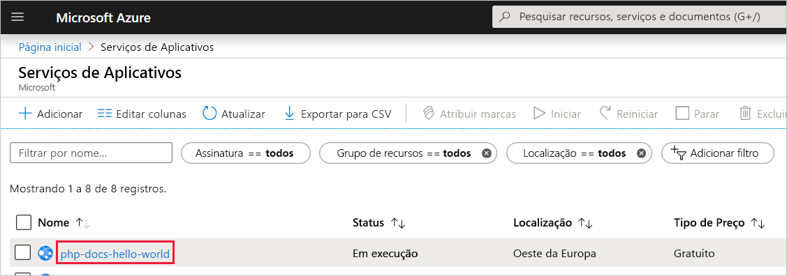
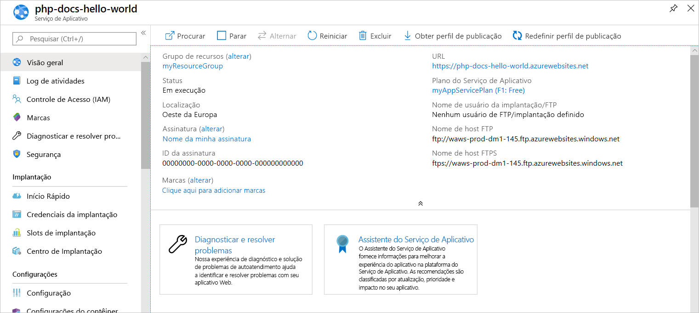

# <a name="create-a-php-web-app-in-azure"></a>Criar um aplicativo Web do PHP no Azure

> [!NOTE]
> Este artigo implanta um aplicativo no Serviço de Aplicativo no Windows. Para implantar o Serviço de Aplicativo em _Linux_, consulte [Criar um aplicativo Web PHP no Serviço de Aplicativo em Linux](./containers/quickstart-php.md).
>

Os [aplicativos Web do Azure](app-service-web-overview.md) fornecem um serviço de hospedagem na Web altamente escalonável,com aplicação automática de patches.  Este tutorial de início rápido mostra como implantar um aplicativo PHP em Aplicativos Web do Azure. Crie o aplicativo Web usando a [CLI do Azure](https://docs.microsoft.com/cli/azure/get-started-with-azure-cli) no Cloud Shell e use o Git para implantar o código PHP de exemplo para o aplicativo Web.


Você pode seguir as etapas aqui usando um computador Mac, Windows ou Linux. A conclusão das etapas demora cerca de cinco minutos assim que os pré-requisitos são instalados.

[!INCLUDE [quickstarts-free-trial-note](../../includes/quickstarts-free-trial-note.md)]

## <a name="prerequisites"></a>pré-requisitos

Para concluir este guia de início rápido:

* <a href="https://git-scm.com/" target="_blank">Instalar o Git</a>
* <a href="http://php.net/manual/install.php" target="_blank">Instalar o PHP</a>

## <a name="download-the-sample-locally"></a>Baixar o exemplo localmente

Em uma janela de terminal, execute os comandos a seguir. Isso clonará o aplicativo de exemplo no computador local e fará com que você navegue até o diretório que contém o código de exemplo.

```bash
git clone https://github.com/Azure-Samples/php-docs-hello-world
cd php-docs-hello-world
```

## <a name="run-the-app-locally"></a>Executar o aplicativo localmente

Execute o aplicativo localmente abrindo uma janela do terminal e usando o comando `php` para iniciar o servidor interno da Web do PHP.

```bash
php -S localhost:8080
```

Abra um navegador da Web e navegue até o aplicativo de exemplo em `http://localhost:8080`.

Você verá o **Olá, Mundo!** mensagem do aplicativo de exemplo exibida na página.


Na janela do terminal, pressione **Ctrl+C** para sair do servidor Web.

[!INCLUDE [cloud-shell-try-it.md](../../includes/cloud-shell-try-it.md)]

[!INCLUDE [Configure deployment user](../../includes/configure-deployment-user.md)]

[!INCLUDE [Create resource group](../../includes/app-service-web-create-resource-group.md)]

[!INCLUDE [Create app service plan](../../includes/app-service-web-create-app-service-plan.md)]

## <a name="create-a-web-app"></a>Criar um aplicativo Web

No Cloud Shell, crie um aplicativo Web no plano do Serviço de Aplicativo do `myAppServicePlan` com o comando [`az webapp create`](/cli/azure/webapp?view=azure-cli-latest#az_webapp_create). 

No exemplo a seguir, substitua `<app_name>` por um nome do aplicativo exclusivo globalmente (os caracteres válidos são `a-z`, `0-9` e `-`). A execução é predefinida para `PHP|7.0`. Para ver todos os tempos de execução com suporte, execute [`az webapp list-runtimes`](/cli/azure/webapp?view=azure-cli-latest#az_webapp_list_runtimes). 

```azurecli-interactive
# Bash
az webapp create --resource-group myResourceGroup --plan myAppServicePlan --name <app_name> --runtime "PHP|7.0" --deployment-local-git
# PowerShell
az --% webapp create --resource-group myResourceGroup --plan myAppServicePlan --name <app_name> --runtime "PHP|7.0" --deployment-local-git
```

Quando o aplicativo Web for criado, a CLI do Azure mostrará um resultado semelhante ao seguinte exemplo:

```json
Local git is configured with url of 'https://<username>@<app_name>.scm.azurewebsites.net/<app_name>.git'
{
  "availabilityState": "Normal",
  "clientAffinityEnabled": true,
  "clientCertEnabled": false,
  "cloningInfo": null,
  "containerSize": 0,
  "dailyMemoryTimeQuota": 0,
  "defaultHostName": "<app_name>.azurewebsites.net",
  "enabled": true,
  < JSON data removed for brevity. >
}
```
Você criou um novo aplicativo Web vazio com a implantação do Git habilitada.

> [!NOTE]
> A URL do Git remoto é mostrada na propriedade `deploymentLocalGitUrl` com o formato `https://<username>@<app_name>.scm.azurewebsites.net/<app_name>.git`. Salve essa URL, pois você precisará dela mais tarde.
>

Navegue até o aplicativo Web recém-criado. Substitua _&lt;app name>_ pelo seu nome de aplicativo exclusivo criado na etapa anterior.

```bash
http://<app name>.azurewebsites.net
```

Seu novo aplicativo Web deve ficar assim:


[!INCLUDE [Push to Azure](../../includes/app-service-web-git-push-to-azure.md)] 

```bash
Counting objects: 2, done.
Delta compression using up to 4 threads.
Compressing objects: 100% (2/2), done.
Writing objects: 100% (2/2), 352 bytes | 0 bytes/s, done.
Total 2 (delta 1), reused 0 (delta 0)
remote: Updating branch 'master'.
remote: Updating submodules.
remote: Preparing deployment for commit id '25f18051e9'.
remote: Generating deployment script.
remote: Running deployment command...
remote: Handling Basic Web Site deployment.
remote: Kudu sync from: '/home/site/repository' to: '/home/site/wwwroot'
remote: Copying file: '.gitignore'
remote: Copying file: 'LICENSE'
remote: Copying file: 'README.md'
remote: Copying file: 'index.php'
remote: Ignoring: .git
remote: Finished successfully.
remote: Running post deployment command(s)...
remote: Deployment successful.
To https://<app_name>.scm.azurewebsites.net/<app_name>.git
   cc39b1e..25f1805  master -> master
```

## <a name="browse-to-the-app"></a>Navegar até o aplicativo

Navegue até o aplicativo implantado usando o navegador da Web.

```
http://<app_name>.azurewebsites.net
```

O código de exemplo do PHP está em execução em um aplicativo Web do Serviço de Aplicativo do Azure.


**Parabéns!** Você implantou seu primeiro aplicativo PHP no Serviço de Aplicativo.

## <a name="update-locally-and-redeploy-the-code"></a>Atualizar localmente e reimplantar o código

Usando um editor de texto local, abra o arquivo `index.php` no aplicativo do PHP e faça uma pequena alteração no texto dentro da cadeia de caracteres para `echo`:

```php
echo "Hello Azure!";
```

Na janela do terminal local, confirme suas alterações no Git e então envie por push as alterações do código para o Azure.

```bash
git commit -am "updated output"
git push azure master
```

Depois que a implantação for concluída, retorne para a janela do navegador que foi aberta durante a etapa **Navegar até o aplicativo** e atualize a página.


## <a name="manage-your-new-azure-web-app"></a>Gerenciar seu novo aplicativo Web do Azure

Vá para o <a href="https://portal.azure.com" target="_blank">portal do Azure</a> para gerenciar o aplicativo Web que você criou.

No menu à esquerda, clique em **Serviços de Aplicativos** e então clique no nome do seu aplicativo Web do Azure.



A página Visão Geral do seu aplicativo Web será exibida. Aqui você pode executar tarefas básicas de gerenciamento como procurar, parar, iniciar, reiniciar e excluir.



O menu à esquerda fornece opções diferentes para configurar seu aplicativo. 

[!INCLUDE [cli-samples-clean-up](../../includes/cli-samples-clean-up.md)]

## <a name="next-steps"></a>Próximas etapas

> [!div class="nextstepaction"]
> [PHP com MySQL](app-service-web-tutorial-php-mysql.md)
