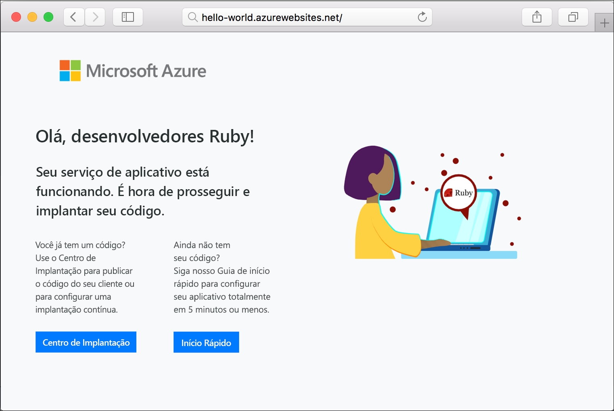

# <a name="create-a-ruby-app-in-app-service-on-linux"></a>Criar um aplicativo Ruby no Serviço de Aplicativo no Linux

O [Serviço de Aplicativo no Microsoft Azure](app-service-linux-intro.md) fornece um serviço de hospedagem na Web altamente escalonável e com aplicação automática de patches. Este guia de início rápido mostra como criar um aplicativo [Ruby on Rails](https://rubyonrails.org/) básico e implantá-lo no Microsoft Azure como um aplicativo Web no Linux.


[!INCLUDE [quickstarts-free-trial-note](../../../includes/quickstarts-free-trial-note.md)]

## <a name="prerequisites"></a>Pré-requisitos

* <a href="https://www.ruby-lang.org/en/documentation/installation/#rubyinstaller" target="_blank">Instale o Ruby 2.3 ou superior</a>
* <a href="https://git-scm.com/" target="_blank">Instalar o Git</a>

## <a name="download-the-sample"></a>Baixar o exemplo

Em uma janela de terminal, execute o comando a seguir para clonar o repositório do aplicativo de exemplo para o computador local:

```bash
git clone https://github.com/Azure-Samples/ruby-docs-hello-world
```

## <a name="run-the-application-locally"></a>Executar o aplicativo localmente

O servidor de trilhos precisa estar executando para o aplicativo funcionar. Altere para o `hello-world` diretório e use o `rails server` comando para iniciar o servidor.

```bash
cd hello-world\bin
rails server
```

Usando o navegador da Web, navegue até `http://localhost:3000` para testar o aplicativo localmente.


[!INCLUDE [Try Cloud Shell](../../../includes/cloud-shell-try-it.md)]

[!INCLUDE [Configure deployment user](../../../includes/configure-deployment-user.md)]

[!INCLUDE [Create resource group](../../../includes/app-service-web-create-resource-group-linux.md)]

[!INCLUDE [Create app service plan](../../../includes/app-service-web-create-app-service-plan-linux.md)]

## <a name="create-a-web-app"></a>Criar um aplicativo Web

[!INCLUDE [Create web app](../../../includes/app-service-web-create-web-app-ruby-linux-no-h.md)] 

Navegue até o site para ver seu aplicativo Web recém-criado com imagem interna. Substitua _&lt;nome do aplicativo>_ por um nome exclusivo do aplicativo web.

```bash
http://<app_name>.azurewebsites.net
```

Seu novo aplicativo Web deve ficar assim:



## <a name="deploy-your-application"></a>Implantar seu aplicativo

Execute os seguintes comandos para implantar o aplicativo local em seu site do Azure:

```bash
git remote add azure <Git deployment URL from above>
git add -A
git commit -m "Initial deployment commit"
git push azure master
```

Confirme que as operações de implantação remota relatam êxito. Os comandos produzem uma saída semelhante ao texto a seguir:

```bash
remote: Using sass-rails 5.0.6
remote: Updating files in vendor/cache
remote: Bundle gems are installed into ./vendor/bundle
remote: Updating files in vendor/cache
remote: ~site/repository
remote: Finished successfully.
remote: Running post deployment command(s)...
remote: Deployment successful.
To https://<your web app name>.scm.azurewebsites.net/<your web app name>.git
  579ccb....2ca5f31  master -> master
myuser@ubuntu1234:~workspace/<app name>$
```

Depois que a implantação for concluída, reinicie o aplicativo Web para a implantação entrar em vigor usando o comando [`az webapp restart`](/cli/azure/webapp?view=azure-cli-latest#az-webapp-restart), conforme mostrado aqui:

```azurecli-interactive
az webapp restart --name <app name> --resource-group myResourceGroup
```

Navegue até o site e verifique os resultados.

```bash
http://<app name>.azurewebsites.net
```


> [!NOTE]
> Enquanto o aplicativo estiver reiniciando, tentar navegar pelo site leva a um código de status HTTP `Error 503 Server unavailable`. Pode levar alguns minutos para reiniciar completamente.
>

[!INCLUDE [Clean-up section](../../../includes/cli-script-clean-up.md)]

## <a name="next-steps"></a>Próximas etapas

> [!div class="nextstepaction"]
> [Ruby on Rails com MySQL](tutorial-ruby-postgres-app.md)
