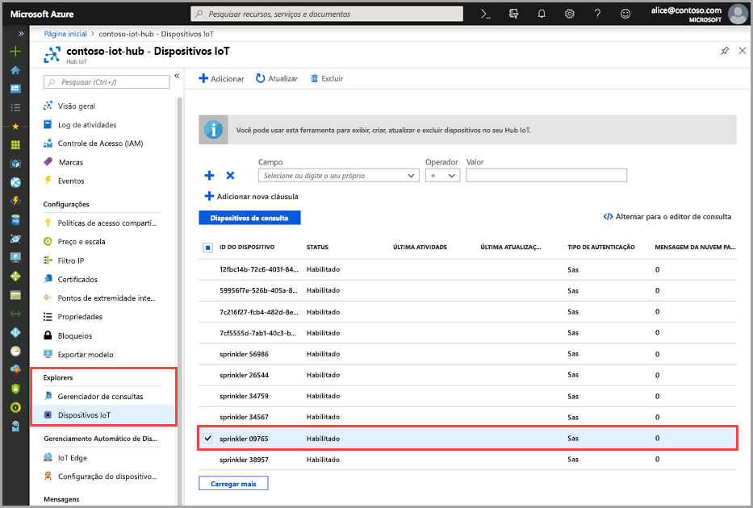

# Início Rápido: Criar um módulo gêmeo da ASC para IoT

> [!IMPORTANT]
> A ASC para IoT está atualmente em versão prévia pública. Essa versão prévia é fornecida sem um contrato de nível de serviço e não é recomendada para cargas de trabalho de produção. Alguns recursos podem não ter suporte ou podem ter restrição de recursos. Para obter mais informações, consulte [Termos de Uso Complementares de Versões Prévias do Microsoft Azure](https://azure.microsoft.com/support/legal/preview-supplemental-terms/).

Este guia de início rápido explica como criar módulos gêmeos individuais da ASC para IoT para novos dispositivos ou criar módulos gêmeos em lote para todos os dispositivos em um Hub IoT.  

## Conheça os módulos gêmeos da ASC para IoT 

Para soluções de IoT criadas no Azure, dispositivos gêmeos desempenham um papel fundamental tanto no gerenciamento do dispositivo quanto na automação do processo. 

A ASC para IoT oferece uma integração completa com sua plataforma de gerenciamento de dispositivo IoT existente, permitindo que você gerencie seu status de segurança de dispositivo, bem como faça o uso de recursos de controle de dispositivo existente. A integração da ASC para IoT é obtida usando o mecanismo gêmeo do Hub IoT.  

Veja [módulos gêmeos do Hub IoT](https://docs.microsoft.com/azure/iot-hub/iot-hub-devguide-module-twins) para saber mais sobre o conceito geral dos módulos gêmeos no Hub IoT do Azure. 
 
A ASC para IoT usa o mecanismo de módulo gêmeo e mantém um módulo gêmeo de segurança para cada um dos seus dispositivos. O módulo gêmeo de segurança contém todas as informações relevantes para a segurança de dispositivo para cada um dos seus dispositivos. 
 
Para aproveitar totalmente os recursos da ASC para IoT, você precisará criar, configurar e usar esses módulos gêmeos de segurança para cada dispositivo no serviço.  

## Criar um módulo gêmeo da ASC para IoT 

Os módulos gêmeos da ASC para IoT podem ser criados em modo lote usando a configuração padrão ou individualmente com configurações específicas para cada dispositivo. Para criar em modo lote novos dispositivos ou dispositivos sem um módulo gêmeo, use o [Módulo script de lote](https://aka.ms/iot-security-github-create-module). 

>[!NOTE] 
> Usar o método de lote não substitui os módulos gêmeos existentes. Usar o método de lote APENAS cria módulos gêmeos para dispositivos que ainda não têm um módulo gêmeo. 

Veja [Modificar um módulo gêmeo de segurança](how-to-modify-security-module-twin.md) para aprender como modificar ou alterar a configuração de um módulo gêmeo existente. 

Para criar um módulo gêmeo da ASC para IoT para um dispositivo, use as instruções a seguir: 

1. Em seu Hub IoT, localize e selecione o dispositivo para o qual deseja criar um módulo gêmeo de segurança. 
1. No campo **Nome de Identidade da Microsoft**, insira **ascforiotsecurity**.
1. Clique em **Salvar**. 

## Verificar a criação de um módulo gêmeo

Para verificar a existência de um módulo gêmeo de segurança para um dispositivo específico:

1. No seu Hub IoT do Azure, selecione **Dispositivos IoT** no menu **Explorers**.    
1. Insira a ID do dispositivo ou selecione uma opção no **Campo de dispositivo de consulta** e clique em **Dispositivos de consulta**. 
    
1. Selecione o dispositivo ou clique nele duas vezes para abrir a página de detalhes do Dispositivo. 
1. Selecione o menu **Identidades do módulo** e confirme a existência de um módulo **ascforiotsecurity** e uma **Estado de Conexão** de **Conectado** na lista de identidades de módulo associadas ao dispositivo. 
    

Para aprender mais sobre como personalizar propriedades de módulos gêmeos da ASC para IoT, consulte [Configuração do agente](concept-agent-configuration.md).

## Próximas etapas

Avance ao próximo artigo para aprender como criar alertas personalizados...

> [!div class="nextstepaction"]
> [Configurar alertas personalizados](quickstart-create-custom-alerts.md)
