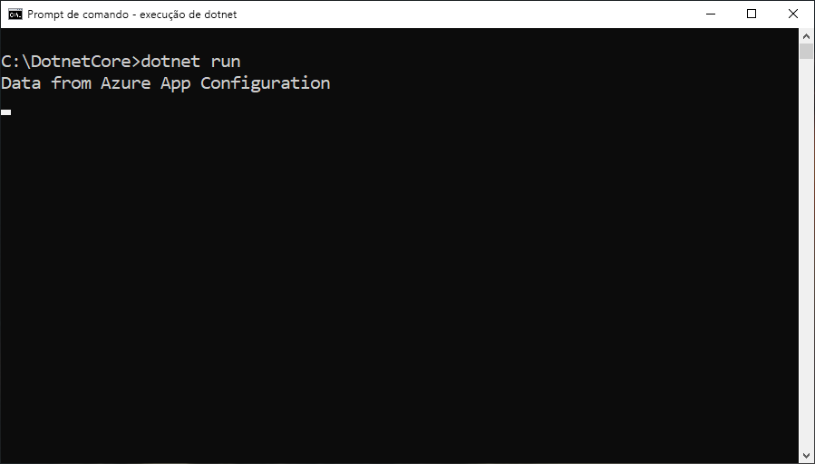

# <a name="quickstart-create-a-net-core-app-with-app-configuration"></a>Início Rápido: Criar um aplicativo .NET Core com a Configuração de Aplicativo

A Configuração de Aplicativo do Azure é um serviço de configuração gerenciada no Azure. É possível utilizá-lo para armazenar e gerenciar facilmente todas as configurações de aplicativo em um local separado do código. Este Início Rápido mostra como incorporar o serviço em um aplicativo de console .NET Core.

Você pode usar qualquer editor de código para executar as etapas deste início rápido. O [Visual Studio Code](https://code.visualstudio.com/) é uma excelente opção disponível nas plataformas Windows, macOS e Linux.



## <a name="prerequisites"></a>Pré-requisitos

Para fazer este início rápido, instale o [SDK do .NET Core](https://dotnet.microsoft.com/download).

[!INCLUDE [quickstarts-free-trial-note](../../includes/quickstarts-free-trial-note.md)]

## <a name="create-an-app-configuration-store"></a>Criar um repositório de configurações de aplicativo

[!INCLUDE [azure-app-configuration-create](../../includes/azure-app-configuration-create.md)]

6. Selecione **Explorador de Chave/Valor** > **+ Criar** para adicionar os pares chave-valor a seguir:

    | Chave | Valor |
    |---|---|
    | TestApp:Settings:Message | Dados da Configuração de Aplicativo do Azure |

    Deixe **Rótulo** e **Tipo de Conteúdo** vazios por enquanto.

## <a name="create-a-net-core-console-app"></a>Criar um aplicativo de console .NET Core

Você usará a [CLI (interface de linha de comando) do .NET Core](https://docs.microsoft.com/dotnet/core/tools/) para criar um projeto de aplicativo de console .NET Core. A vantagem de usar a CLI do .NET Core em relação ao Visual Studio é que ela está disponível nas plataformas Windows, macOS e Linux.

1. Crie uma nova pasta para o seu projeto.

2. Na nova pasta, execute o seguinte comando para criar um novo projeto de aplicativo Web do MVC do ASP.NET Core:

        dotnet new console

## <a name="connect-to-an-app-configuration-store"></a>Conectar um repositório de configurações de aplicativo

1. Adicione uma referência ao pacote NuGet `Microsoft.Extensions.Configuration.AzureAppConfiguration`, executando o seguinte comando:

        dotnet add package Microsoft.Extensions.Configuration.AzureAppConfiguration --version 1.0.0-preview-007830001

2. Execute o seguinte comando para restaurar pacotes do projeto:

        dotnet restore

3. Abra *Program.cs* e adicione uma referência a um provedor de configuração .NET Core da Configuração de Aplicativos.

    ```csharp
    using Microsoft.Extensions.Configuration;
    using Microsoft.Extensions.Configuration.AzureAppConfiguration;
    ```

4. Atualize o método `Main` para usar a Configuração de Aplicativos chamando o método `builder.AddAzureAppConfiguration()`.

    ```csharp
    static void Main(string[] args)
    {
        var builder = new ConfigurationBuilder();
        builder.AddAzureAppConfiguration(Environment.GetEnvironmentVariable("ConnectionString"));

        var config = builder.Build();
        Console.WriteLine(config["TestApp:Settings:Message"] ?? "Hello world!");
    }
    ```

## <a name="build-and-run-the-app-locally"></a>Compilar e executar o aplicativo localmente

1. Defina uma variável de ambiente chamada **ConnectionString** e defina-a como a chave de acesso ao repositório de configurações de aplicativo. Se você usar o prompt de comando do Windows, execute o comando a seguir e reinicie o prompt de comando para permitir que a alteração entre em vigor:

        setx ConnectionString "connection-string-of-your-app-configuration-store"

    Se você usa o Windows PowerShell, execute o comando a seguir:

        $Env:ConnectionString = "connection-string-of-your-app-configuration-store"

    Se você usa macOS ou Linux, execute o comando a seguir:

        export ConnectionString='connection-string-of-your-app-configuration-store'

2. Execute o seguinte comando para compilar o aplicativo de console:

        dotnet build

3. Depois que a construção for concluída com êxito, execute o seguinte comando para executar o aplicativo localmente:

        dotnet run

## <a name="clean-up-resources"></a>Limpar recursos

[!INCLUDE [azure-app-configuration-cleanup](../../includes/azure-app-configuration-cleanup.md)]

## <a name="next-steps"></a>Próximas etapas

Neste início rápido, você criou um repositório de configurações de aplicativos e o usou com um aplicativo de console .NET Core por meio do [Provedor de Configuração de Aplicativos](https://go.microsoft.com/fwlink/?linkid=2074664). Para saber mais sobre como usar a Configuração de Aplicativo, vá para o próximo tutorial que demonstra a autenticação.

> [!div class="nextstepaction"]
> [Integração de identidade gerenciada](./howto-integrate-azure-managed-service-identity.md)
