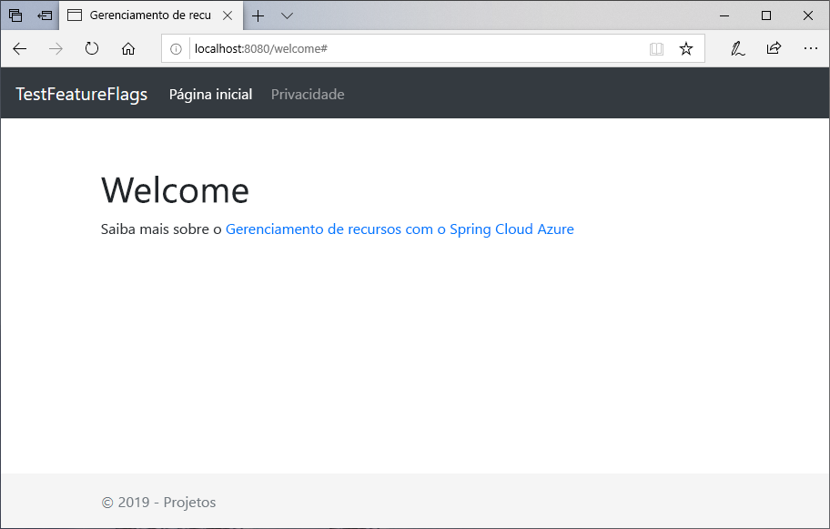
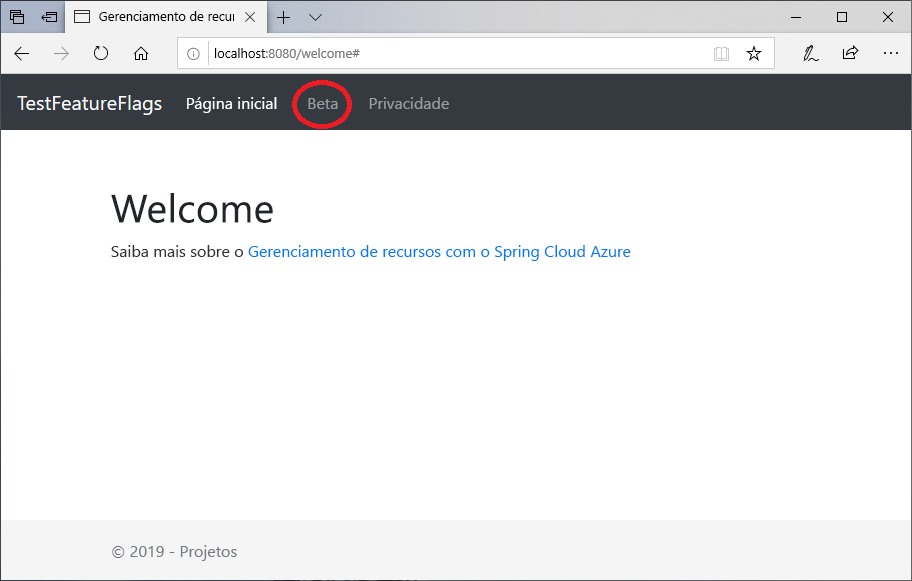

# <a name="quickstart-add-feature-flags-to-a-spring-boot-app"></a>Início Rápido: Adicionar sinalizadores de recursos a um aplicativo Spring Boot

Neste início rápido, você incorpora a Configuração de Aplicativos do Azure a um aplicativo Web Spring Boot para criar uma implementação de ponta a ponta do gerenciamento de recursos. Você pode usar o serviço de Configuração de Aplicativos para armazenar de forma centralizada todos os sinalizadores de recurso e controlar seus estados.

As bibliotecas do Gerenciamento de Recursos do Spring Boot estendem a estrutura com suporte abrangente para sinalizadores de recursos. Essas bibliotecas **não** têm uma dependência de nenhuma biblioteca do Azure. Elas se integram perfeitamente à Configuração de Aplicativos por meio de seu provedor de configuração do Spring Boot.

## <a name="prerequisites"></a>Pré-requisitos

- Assinatura do Azure - [criar uma gratuitamente](https://azure.microsoft.com/free/)
- Um [SDK do Java Development Kit](https://docs.microsoft.com/java/azure/jdk) com suporte na versão 8.
- [Apache Maven](https://maven.apache.org/download.cgi), versão 3.0 ou posterior.

## <a name="create-an-app-configuration-store"></a>Criar um repositório de Configuração de Aplicativos

[!INCLUDE [azure-app-configuration-create](../../includes/azure-app-configuration-create.md)]

6. Escolha **Gerenciador de Recursos** >  **+ Criar** para adicionar os seguintes sinalizadores de recursos:

    | Chave | Estado |
    |---|---|
    | Beta | Desativar |

## <a name="create-a-spring-boot-app"></a>Criar um aplicativo Spring Boot

Você usa o [Spring Initializr](https://start.spring.io/) para criar um novo projeto Spring Boot.

1. Navegue até <https://start.spring.io/>.

2. Especifique as seguintes opções:

   - Gere um projeto **Maven** com **Java**.
   - Especifique uma versão do **Spring Boot** igual ou maior que 2.0.
   - Especifique os nomes de **Grupo** e **Artefato** do aplicativo.
   - Adicione a dependência da **Web**.

3. Após especificar as opções anteriores, selecione **Gerar Projeto**. Quando solicitado, baixe o projeto para um caminho no computador local.

## <a name="add-feature-management"></a>Adicionar Gerenciamento de Recursos

1. Após extrair os arquivos no sistema local, o aplicativo Spring Boot simples estará pronto para edição. Localize o arquivo *pom.xml* no diretório raiz do aplicativo.

2. Abra o arquivo *pom.xml* em um editor de texto e adicione o iniciador da Configuração do Azure do Spring Cloud e o Gerenciamento de Recursos à lista de `<dependencies>`:

    ```xml
    <dependency>
        <groupId>com.microsoft.azure</groupId>
        <artifactId>spring-cloud-starter-azure-appconfiguration-config</artifactId>
        <version>1.1.0.M4</version>
    </dependency>
    <dependency>
        <groupId>com.microsoft.azure</groupId>
        <artifactId>spring-cloud-azure-feature-management-web</artifactId>
        <version>1.1.0.M4</version>
    </dependency>
    <dependency>
            <groupId>org.springframework.boot</groupId>
            <artifactId>spring-boot-starter-thymeleaf</artifactId>
    </dependency>
    ```

> [!Note]
> Há uma Biblioteca de Gerenciamento de Recursos não Web que não tem uma dependência do spring-web. Confira os [Documentos](https://github.com/microsoft/spring-cloud-azure/tree/master/spring-cloud-azure-feature-management) adicionais para obter diferenças. Além disso, quando não estiver usando a Configuração de Aplicativos, confira a [Declaração do Sinalizador de Recursos](https://github.com/microsoft/spring-cloud-azure/tree/master/spring-cloud-azure-feature-management#feature-flag-declaration).

## <a name="connect-to-an-app-configuration-store"></a>Conectar um repositório de Configuração de Aplicativos

1. Abra `bootstrap.properties`, que está no diretório de recursos do seu aplicativo e adicione as seguintes linhas ao arquivo. Adicione as informações da Configuração de Aplicativos.

    ```properties
    spring.cloud.azure.appconfiguration.stores[0].name= ${APP_CONFIGURATION_CONNECTION_STRING}
    ```

2. No portal da Configuração de Aplicativos do seu armazenamento de configurações, acesse as Chaves de acesso. Selecione a guia Chaves somente leitura. Nesta guia, copie o valor de uma das Cadeias de Conexão e adicione-o como uma nova Variável de Ambiente com o Nome de variável `APP_CONFIGURATION_CONNECTION_STRING`.

3. Abra o arquivo Java do aplicativo principal e adicione `@EnableConfigurationProperties` para habilitar esse recurso.

    ```java
    @SpringBootApplication
    @EnableConfigurationProperties(MessageProperties.class)
    public class AzureConfigApplication {
        public static void main(String[] args) {
            SpringApplication.run(AzureConfigApplication.class, args);
        }
    }
    ```

4. Crie um arquivo Java chamado *HelloController.java* no diretório do pacote do aplicativo. Adicione as linhas a seguir:

    ```java
    @Controller
    @ConfigurationProperties("controller")
    public class HelloController {

        private FeatureManager featureManager;

        public HelloController(FeatureManager featureManager) {
            this.featureManager = featureManager;
        }

        @GetMapping("/welcome")
        public String mainWithParam(Model model) {
            model.addAttribute("Beta", featureManager.isEnabled("Beta"));
            return "welcome";
        }
    }
    ```

5. Crie um arquivo HTML chamado *welcome.html* no diretório de modelos do seu aplicativo. Adicione as linhas a seguir:

    ```html
    <!DOCTYPE html>
    <html lang="en" xmlns:th="http://www.thymeleaf.org">
    <head>
        <meta charset="utf-8">
        <meta name="viewport" content="width=device-width, initial-scale=1, shrink-to-fit=no">
        <title>Feature Management with Spring Cloud Azure</title>

        <link rel="stylesheet" href="/css/main.css">
        <link rel="stylesheet" href="https://stackpath.bootstrapcdn.com/bootstrap/4.3.1/css/bootstrap.min.css" integrity="sha384-ggOyR0iXCbMQv3Xipma34MD+dH/1fQ784/j6cY/iJTQUOhcWr7x9JvoRxT2MZw1T" crossorigin="anonymous">

        <script src="https://code.jquery.com/jquery-3.3.1.slim.min.js" integrity="sha384-q8i/X+965DzO0rT7abK41JStQIAqVgRVzpbzo5smXKp4YfRvH+8abtTE1Pi6jizo" crossorigin="anonymous"></script>
        <script src="https://cdnjs.cloudflare.com/ajax/libs/popper.js/1.14.7/umd/popper.min.js" integrity="sha384-UO2eT0CpHqdSJQ6hJty5KVphtPhzWj9WO1clHTMGa3JDZwrnQq4sF86dIHNDz0W1" crossorigin="anonymous"></script>
        <script src="https://stackpath.bootstrapcdn.com/bootstrap/4.3.1/js/bootstrap.min.js" integrity="sha384-JjSmVgyd0p3pXB1rRibZUAYoIIy6OrQ6VrjIEaFf/nJGzIxFDsf4x0xIM+B07jRM" crossorigin="anonymous"></script>

    </head>
    <body>
        <header>
        <!-- Fixed navbar -->
        <nav class="navbar navbar-expand-md navbar-dark fixed-top bg-dark">
            <a class="navbar-brand" href="#">TestFeatureFlags</a>
            <button class="navbar-toggler" aria-expanded="false" aria-controls="navbarCollapse" aria-label="Toggle navigation" type="button" data-target="#navbarCollapse" data-toggle="collapse">
            <span class="navbar-toggler-icon"></span>
            </button>
            <div class="collapse navbar-collapse" id="navbarCollapse">
            <ul class="navbar-nav mr-auto">
                <li class="nav-item active">
                <a class="nav-link" href="#">Home <span class="sr-only">(current)</span></a>
                </li>
                <li class="nav-item" th:if="${Beta}">
                <a class="nav-link" href="#">Beta</a>
                </li>
                <li class="nav-item">
                <a class="nav-link" href="#">Privacy</a>
                </li>
            </ul>
            </div>
        </nav>
        </header>
        <div class="container body-content">
            <h1 class="mt-5">Welcome</h1>
            <p>Learn more about <a href="https://github.com/microsoft/spring-cloud-azure/blob/master/spring-cloud-azure-feature-management/README.md">Feature Management with Spring Cloud Azure</a></p>

        </div>
        <footer class="footer">
            <div class="container">
            <span class="text-muted">&copy; 2019 - Projects</span>
        </div>

        </footer>
    </body>
    </html>

    ```

6. Crie uma pasta chamada CSS em estático e, dentro dele, um arquivo CSS chamado *main.css*. Adicione as linhas a seguir:

    ```css
    html {
    position: relative;
    min-height: 100%;
    }
    body {
    margin-bottom: 60px;
    }
    .footer {
    position: absolute;
    bottom: 0;
    width: 100%;
    height: 60px;
    line-height: 60px;
    background-color: #f5f5f5;
    }

    body > .container {
    padding: 60px 15px 0;
    }

    .footer > .container {
    padding-right: 15px;
    padding-left: 15px;
    }

    code {
    font-size: 80%;
    }
    ```

## <a name="build-and-run-the-app-locally"></a>Compilar e executar o aplicativo localmente

1. Compile o aplicativo Spring Boot com Maven e execute-o, por exemplo:

    ```shell
    mvn clean package
    mvn spring-boot:run
    ```

2. Abra uma janela do navegador e vá para `https://localhost:8080`, que é a URL padrão do aplicativo Web hospedado localmente.

    

3. No portal da Configuração de Aplicativos, selecione **Gerenciador de Recursos** e altere o estado da chave **Beta** para **Ativado**:

    | Chave | Estado |
    |---|---|
    | Beta | Por |

4. Atualize a página do navegador para ver as novas definições de configuração.

    

## <a name="clean-up-resources"></a>Limpar recursos

[!INCLUDE [azure-app-configuration-cleanup](../../includes/azure-app-configuration-cleanup.md)]

## <a name="next-steps"></a>Próximas etapas

Neste início rápido, você criou um novo repositório de configurações de aplicativos e o usou para gerenciar recursos em um aplicativo Web Spring Boot por meio das [bibliotecas do Gerenciamento de Recursos](https://go.microsoft.com/fwlink/?linkid=2074664).

- Saiba mais sobre o [gerenciamento de recursos](./concept-feature-management.md).
- [Gerenciar sinalizadores de recursos](./manage-feature-flags.md).
- [Usar sinalizadores de recursos em um aplicativo Spring Boot Core](./use-feature-flags-spring-boot.md).
