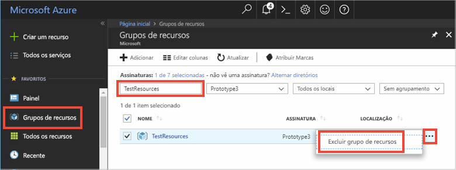

# <a name="quickstart-use-azure-cache-for-redis-with-python"></a>Início Rápido: Usar o Cache do Azure para Redis com Python


## <a name="introduction"></a>Introdução

Este guia de início rápido mostra como se conectar a um Cache do Azure para Redis com o Python para ler e gravar em um cache. 


[!INCLUDE [quickstarts-free-trial-note](../../includes/quickstarts-free-trial-note.md)]

## <a name="prerequisites"></a>Pré-requisitos

* [Ambiente de Python 2 ou Python 3](https://www.python.org/downloads/) instalado com [pip](https://pypi.org/project/pip/). 

## <a name="create-an-azure-cache-for-redis-on-azure"></a>Criar um Cache do Azure para Redis no Azure
[!INCLUDE [redis-cache-create](../../includes/redis-cache-create.md)]

[!INCLUDE [redis-cache-create](../../includes/redis-cache-access-keys.md)]

## <a name="install-redis-py"></a>Instale o redis-py

[Redis-py](https://github.com/andymccurdy/redis-py) é uma interface de Python para o Cache do Azure para Redis. Use a ferramenta de pacotes do Python, *pip*, para instalar o pacote de py redis. 

O exemplo a seguir usa *pip3* para Python3 para instalar o pacote de redis piar no Windows 10 usando um prompt de Comando de Desenvolvedor do Visual Studio 2017 com os privilégio de Administrador elevados.

    pip3 install redis


## <a name="read-and-write-to-the-cache"></a>Ler e gravar no cache

Execute o Python e teste usando o cache a partir da linha de comando. Substitua `<Your Host Name>` e `<Your Access Key>` pelos valores para o Cache do Azure para Redis. 

```python
>>> import redis
>>> r = redis.StrictRedis(host='<Your Host Name>.redis.cache.windows.net',
        port=6380, db=0, password='<Your Access Key>', ssl=True)
>>> r.set('foo', 'bar')
True
>>> r.get('foo')
b'bar'
```

## <a name="create-a-python-script"></a>Executar um script do Python

Criar um novo arquivo de texto de script denominado *PythonApplication1.py*.

Adicione o seguinte script para *PythonApplication1.py* e salve o arquivo. Este script vai testar o acesso ao cache. Substitua `<Your Host Name>` e `<Your Access Key>` pelos valores para o Cache do Azure para Redis. 

```python
import redis

myHostname = "<Your Host Name>.redis.cache.windows.net"
myPassword = "<Your Access Key>"

r = redis.StrictRedis(host=myHostname, port=6380,password=myPassword,ssl=True)

result = r.ping()
print("Ping returned : " + str(result))

result = r.set("Message", "Hello!, The cache is working with Python!")
print("SET Message returned : " + str(result))

result = r.get("Message")
print("GET Message returned : " + result.decode("utf-8"))

result = r.client_list()
print("CLIENT LIST returned : ") 
for c in result:
    print("id : " + c['id'] + ", addr : " + c['addr'])
```

Execute o script com Python.


## <a name="clean-up-resources"></a>Limpar recursos

Se você pretende continuar com outro tutorial, mantenha os recursos criados neste início rápido e reutilize-os.

Caso contrário, se você não for mais usar o aplicativo de exemplo do início rápido, exclua os recursos do Azure criados neste início rápido para evitar encargos. 

> [!IMPORTANT]
> A exclusão de um grupo de recursos é irreversível, e o grupo de recursos e todos os recursos contidos nele são excluídos permanentemente. Não exclua acidentalmente o grupo de recursos ou os recursos incorretos. Se tiver criado os recursos para hospedar este exemplo dentro de um grupo de recursos existente que contém recursos que você quer manter, exclua cada recurso individualmente de suas respectivas folhas, em vez de excluir o grupo de recursos.
>

Entre no [portal do Azure](https://portal.azure.com) e clique em **Grupos de recursos**.

Na caixa de texto **Filtrar por nome...**, digite o nome do seu grupo de recursos. As instruções deste artigo usaram um grupo de recursos chamado *TestResources*. Em seu grupo de recursos, na lista de resultados, clique em **...**, depois em **Excluir grupo de recursos**.



Você receberá uma solicitação para confirmar a exclusão do grupo de recursos. Digite o nome do grupo de recursos para confirmar e clique em **Excluir**.

Após alguns instantes, o grupo de recursos, e todos os recursos contidos nele, serão excluídos.


## <a name="next-steps"></a>Próximas etapas

> [!div class="nextstepaction"]
> [Crie um aplicativo Web ASP.NET simples que usa um Cache do Azure para Redis.](./cache-web-app-howto.md)


<!--Image references-->
[1]: ./media/cache-python-get-started/redis-cache-new-cache-menu.png
[2]: ./media/cache-python-get-started/redis-cache-cache-create.png
