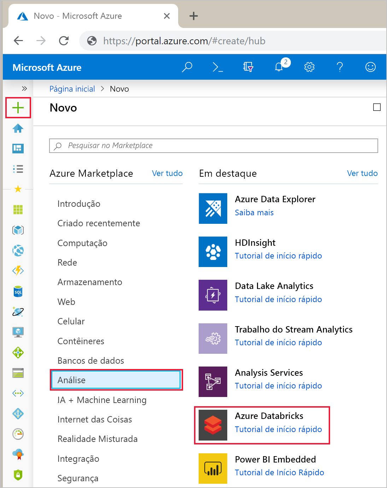
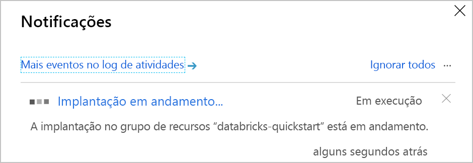
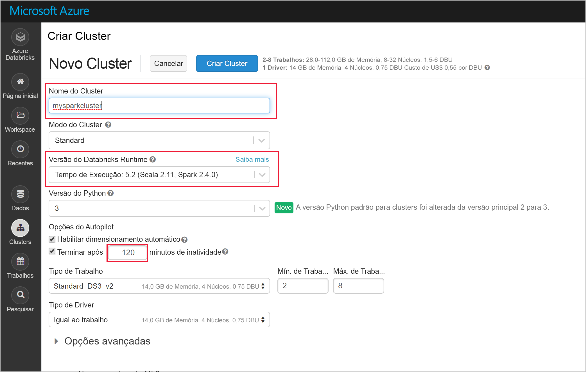

# <a name="quickstart-run-a-spark-job-on-azure-databricks-using-the-azure-portal"></a>Início rápido: executar um trabalho de Spark no Azure Databricks usando o portal do Azure

O início rápido mostra como criar um workspace do Azure Databricks e um cluster do Apache Spark dentro desse workspace. Por fim, você sabe como executar um trabalho do Spark no cluster do Databricks. Para obter mais informações sobre o Azure Databricks, consulte [O que é o Azure Databricks?](what-is-azure-databricks.md)

Neste guia de início rápido, como parte do trabalho do Spark, você analisa dados de uma assinatura de canal de rádio para obter ideias sobre uso gratuito/pago com base em dados demográficos. 

Se você não tiver uma assinatura do Azure, [crie uma conta gratuita](https://azure.microsoft.com/free/) antes de começar.

## <a name="log-in-to-the-azure-portal"></a>Faça logon no Portal do Azure

Faça logon no [Portal do Azure](https://portal.azure.com).

## <a name="create-an-azure-databricks-workspace"></a>Criar um workspace do Azure Databricks

Nesta seção, você deve cria um workspace do Azure Databricks usando o Portal do Azure. 

1. No Portal do Azure, selecione **Criar um recurso** > **Dados + Análise** > **Azure Databricks**. 

    

2. Em **Serviço do Azure Databricks**, forneça os valores para criar um workspace do Databricks.

    

    Forneça os seguintes valores: 
     
    |Propriedade  |DESCRIÇÃO  |
    |---------|---------|
    |**Nome do workspace**     | Forneça um nome para seu workspace do Databricks        |
    |**Assinatura**     | Na lista suspensa, selecione sua assinatura do Azure.        |
    |**Grupo de recursos**     | Especifique se deseja criar um novo grupo de recursos ou usar um existente. Um grupo de recursos é um contêiner que mantém os recursos relacionados a uma solução do Azure. Para obter mais informações, consulte [Visão geral do Grupo de Recursos do Azure](../azure-resource-manager/resource-group-overview.md). |
    |**Localidade**     | Selecione **Leste dos EUA 2**. Para outras regiões disponíveis, consulte [serviços do Azure por região](https://azure.microsoft.com/regions/services/).        |
    |**Tipo de preço**     |  Escolha entre o cluster **Standard** e o **Premium**. Para saber mais sobre essas camadas, confira [Página de preços do Databricks](https://azure.microsoft.com/pricing/details/databricks/).       |

    Selecione **Fixar no painel** e clique em **Criar**.

4. A criação do workspace leva alguns minutos. Durante a criação do workspace, o portal exibe o bloco **Enviando a implantação para o Azure Databricks** no lado direito. Talvez seja necessário rolar diretamente no painel para ver o bloco. Também é exibida na parte superior da tela de uma barra de progresso. Você pode assistir a área de andamento.

    

## <a name="create-a-spark-cluster-in-databricks"></a>Criar um cluster Spark no Databricks

> [!NOTE] 
> Para usar uma conta gratuita para criar o cluster do Azure Databricks, antes de criar o cluster, vá até o seu perfil e altere sua assinatura para **pré-pago**. Para saber mais, confira [Conta gratuita do Azure](https://azure.microsoft.com/free/).  

1. No portal do Azure, vá para o workspace do Databricks que você criou e clique em **Inicializar Workspace**.

2. Você é redirecionado para o portal do Azure Databricks. No portal, clique em **Cluster**.

    

3. Na página **Novo cluster**, forneça os valores para criar um cluster.

    

    Aceite todos os outros valores padrão que não sejam o seguinte:

    * Insira um nome para o cluster.
    * Neste artigo, crie um cluster com o tempo de execução **4.0**. 
    * Verifique se você marcou a caixa de seleção **Terminar depois de \_\_ minutos de inatividade**. Forneça uma duração (em minutos) para encerrar o cluster caso ele não esteja sendo usado.
    
    Selecione **Criar cluster**. Quando o cluster está em execução, você pode anexar blocos de notas a ele e executar trabalhos do Spark. 

Para obter mais informações sobre como criar clusters, consulte [Criar um cluster Spark no Azure Databricks](https://docs.azuredatabricks.net/user-guide/clusters/create.html).


## <a name="download-a-sample-data-file"></a>Baixar um arquivo de dados de exemplo
Baixe um arquivo de dados JSON de exemplo e salve-o no armazenamento de Blobs do Azure.

1. Baixe este arquivo de dados JSON de exemplo [do Github](https://raw.githubusercontent.com/Azure/usql/master/Examples/Samples/Data/json/radiowebsite/small_radio_json.json) no seu computador local. Clique com o botão direito e em salvar como para salvar o arquivo bruto localmente. 

2. Se você ainda não tiver uma conta de armazenamento, crie uma. 
   - No Portal do Azure, selecione **Criar um recurso**.  Selecione a categoria **Armazenamento** e selecione **Contas de armazenamento**  
   - Forneça um nome exclusivo para a conta de armazenamento.
   - Selecione **Tipo de conta**: **Armazenamento de Blobs**
   - Selecione um nome para o **Grupo de recursos**. Use o mesmo grupo de recursos no qual o workspace do Databricks foi criado.
   
   Para saber mais informações, consulte [Criar uma conta de armazenamento de Blobs do Azure](../storage/common/storage-quickstart-create-account.md). 

3. Crie um contêiner de armazenamento na conta de Armazenamento de Blobs e carregue o arquivo JSON de exemplo no contêiner. Também é possível usar o portal do Azure ou o [Gerenciador de Armazenamento do Microsoft Azure](../vs-azure-tools-storage-manage-with-storage-explorer.md) para carregar o arquivo.

   - Abra a conta de armazenamento no portal do Azure.
   - Selecione **Blobs**.
   - Selecione **+ Contêiner** para criar um novo contêiner vazio.
   - Forneça um **Nome** para o contêiner, como `databricks`. 
   - Selecione o nível de acesso **privado (acesso não anônimo)**.
   - Depois que o contêiner for criado, selecione o nome do contêiner.
   - Selecione o botão **Carregar**.
   - Na página **Arquivos**, selecione o **ícone de pasta** para procurar e selecionar o arquivo de exemplo `small_radio_json.json` para upload. 
   - Selecione **Carregar** para carregar o arquivo.
   
   
## <a name="run-a-spark-sql-job"></a>Executar um trabalho SQL do Spark
Execute as seguintes tarefas para criar um bloco de notas em Databricks, configurar o bloco de notas para ler dados de uma conta de armazenamento de Blob do Azure e executar um trabalho SQL do Spark nos dados.

1. No painel esquerdo, clique em **Workspace**. Na lista suspensa do **Workspace**, clique em **Criar** e depois em **Bloco de notas**.

    

2. Na caixa de diálogo **Criar Bloco de Notas**, insira um nome, selecione **Scala** como a linguagem e selecione o cluster Spark criado anteriormente.

    

    Clique em **Criar**.

3. Nesta etapa, associe a conta de Armazenamento do Azure com o cluster Databricks Spark. Há duas maneiras para realizar essa associação. Você pode montar a conta de Armazenamento do Azure para o Databricks Filesystem (DBFS) ou acessando a conta de armazenamento do Azure diretamente do aplicativo que você criar.  

    > [!IMPORTANT]
    >Este artigo usa a abordagem para **montar o armazenamento com o DBFS**. Essa abordagem garante que o armazenamento montado se associará ao sistema de arquivos do cluster em si. Portanto, qualquer aplicativo que está acessando o cluster é capaz de usar o armazenamento associado. A abordagem de acesso direto é limitada ao aplicativo de onde você pode configurar o acesso.
    >
    > Para usar a abordagem de montagem, você deve criar um cluster Spark com a versão de tempo de execução Databricks **4.0**, que é o que você escolheu neste artigo.

    No snippet a seguir, substitua `{YOUR CONTAINER NAME}`, `{YOUR STORAGE ACCOUNT NAME}`, e `{YOUR STORAGE ACCOUNT ACCESS KEY}` pelos valores apropriados para sua conta de armazenamento do Azure. Cole o snippet de código em uma célula vazia no bloco de notas e pressione SHIFT + ENTER para executar a célula do código.

    * **Monte a conta de armazenamento com o DBFS (recomendado)**. Neste snippet, o caminho da conta de Armazenamento do Azure está montado em `/mnt/mypath`. Portanto, em todas as ocorrências futuras em que você acessar a conta de Armazenamento do Azure, não será necessário fornecer o caminho completo. Você pode usar apenas `/mnt/mypath`.

          dbutils.fs.mount(
            source = "wasbs://{YOUR CONTAINER NAME}@{YOUR STORAGE ACCOUNT NAME}.blob.core.windows.net/",
            mountPoint = "/mnt/mypath",
            extraConfigs = Map("fs.azure.account.key.{YOUR STORAGE ACCOUNT NAME}.blob.core.windows.net" -> "{YOUR STORAGE ACCOUNT ACCESS KEY}"))

    * **Acessar diretamente a conta de armazenamento**

          spark.conf.set("fs.azure.account.key.{YOUR STORAGE ACCOUNT NAME}.blob.core.windows.net", "{YOUR STORAGE ACCOUNT ACCESS KEY}")

    Para obter instruções sobre como recuperar sua chave da conta de armazenamento, confira [Gerenciar chaves de acesso de armazenamento](../storage/common/storage-account-manage.md#access-keys).

    > [!NOTE]
    > Você também pode usar o Azure Data Lake Store com um cluster Spark no Azure Databricks. Para obter instruções, consulte [Usar Data Lake Store com Azure Databricks](https://go.microsoft.com/fwlink/?linkid=864084).

4. Execute uma instrução SQL para criar uma tabela temporária usando dados do arquivo de dados JSON de exemplo, **small_radio_json.json**. No snippet de código a seguir, substitua os valores de espaço reservado pelo nome do seu contêiner e o nome da conta de armazenamento. Cole o snippet de código em uma célula de código no bloco de notas e pressione SHIFT + ENTER. No snippet de código, `path` indica o local do arquivo JSON de exemplo que você carregou na sua Conta de armazenamento do Azure.

    ```sql
    %sql 
    DROP TABLE IF EXISTS radio_sample_data;
    CREATE TABLE radio_sample_data
    USING json
    OPTIONS (
     path "/mnt/mypath/small_radio_json.json"
    )
    ```

    Assim que o comando for concluído com êxito, você terá todos os dados do arquivo JSON como uma tabela no cluster do Databricks.

    O comando mágico de linguagem `%sql` permite que você execute um código SQL do bloco de notas, mesmo que o bloco seja de outro tipo. Para obter mais informações, consulte [Combinar linguagens em um bloco de notas](https://docs.azuredatabricks.net/user-guide/notebooks/index.html#mixing-languages-in-a-notebook).

5. Vamos examinar um instantâneo dos dados do JSON de exemplo para entender melhor a consulta que você executou. Cole o snippet de código a seguir em uma célula de código e pressione **SHIFT+ENTER**.

    ```sql
    %sql 
    SELECT * from radio_sample_data
    ```

6. Você verá uma saída tabular como mostrado na seguinte captura de tela (somente algumas colunas são mostradas):

    

    Entre outros detalhes, os dados de exemplo capturam o gênero do público de um canal de rádio (nome da coluna: **gênero**) e se a sua assinatura é gratuita ou paga (nome da coluna: **nível**).

7. Agora crie uma representação visual dos dados para mostrar quantos usuários têm contas gratuitas e quantos são assinantes pagantes para cada gênero. Na parte inferior da saída tabular, clique no ícone de **Gráfico de barras** e depois em **Opções de plotagem**.

    

8. Em **Personalizar plotagem**, arraste e solte valores conforme mostrado na captura de tela.

    

    * Definir **Chaves** como **gênero**.
    * Definir **Agrupamentos de série** como **nível**.
    * Definir **Valores** como **nível**.
    * Definir **Agregação** como **CONTAGEM**.

    Clique em **Aplicar**.

9. A saída mostra a representação visual, conforme ilustrado na seguinte captura de tela:

     

## <a name="clean-up-resources"></a>Limpar recursos

Depois de terminar o artigo, você poderá encerrar o cluster. Para isso, no workspace do Azure Databricks, no painel esquerdo, selecione **Clusters**. No cluster que deseja encerrar, mova o cursor sobre o botão de reticências na coluna **Ações** e selecione o ícone **Terminar**.


Se você não encerrar o cluster manualmente, ele será interrompido automaticamente, desde que você tenha selecionado a caixa de seleção **Terminar depois de __ minutos de inatividade** ao criar o cluster. Nesse caso, o cluster é interrompido automaticamente se ficar inativo durante o tempo especificado.

## <a name="next-steps"></a>Próximas etapas

Neste artigo, você criou um cluster Spark no Azure Databricks e executou um trabalho do Spark usando os dados no armazenamento do Azure. Você também pode examinar [Fontes de dados do Spark](https://docs.azuredatabricks.net/spark/latest/data-sources/index.html) para saber como importar dados de outras fontes de dados para o Azure Databricks. Siga até o próximo artigo para saber como executar uma operação de ETL (extração, transformação e carregamento de dados) usando o Azure Databricks.

> [!div class="nextstepaction"]
>[Extrair, transformar e carregar dados usando o Azure Databricks](databricks-extract-load-sql-data-warehouse.md)
