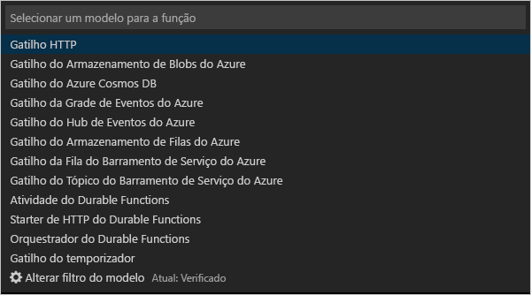

# <a name="create-your-first-durable-function-in-javascript"></a>Criar sua primeira função durável em JavaScript

*Durable Functions* são uma extensão do [Azure Functions](../functions-overview.md) que permitem que você escreva funções com estado em um ambiente sem servidor. A extensão gerencia estado, pontos de verificação e reinicializações para você.

Neste artigo, você aprenderá a usar a extensão do Azure Functions do Visual Studio Code para criar e testar localmente uma função durável "hello world".  Essa função orquestrará e encadeará chamadas para outras funções. Em seguida, você publicará o código de função no Azure.


## <a name="prerequisites"></a>Pré-requisitos

Para concluir este tutorial:

* Instale o [Visual Studio Code](https://code.visualstudio.com/download).

* Verifique se você tem as [ferramentas mais recentes do Azure Functions](../functions-develop-vs.md#check-your-tools-version).

* Em um computador Windows, verifique se você tem o [Emulador de Armazenamento do Azure](../../storage/common/storage-use-emulator.md) instalado e em execução. Em um computador Mac ou Linux, você deve usar uma conta de armazenamento real do Azure.

* Verifique se você tem a versão 8.0 ou posterior do [Node.js](https://nodejs.org/) instalada.

[!INCLUDE [quickstarts-free-trial-note](../../../includes/quickstarts-free-trial-note.md)]

[!INCLUDE [functions-install-vs-code-extension](../../../includes/functions-install-vs-code-extension.md)]

[!INCLUDE [functions-create-function-app-vs-code](../../../includes/functions-create-function-app-vs-code.md)]

## <a name="create-a-starter-function"></a>Criar uma Starter Function

Primeiro, crie uma função disparada por HTTP que inicia uma orquestração de função durável.

1. De **Azure: Functions**, escolha o ícone Criar Função.

    

1. Selecione a pasta com seu projeto de aplicativo de funções e selecione o modelo de função **gatilho HTTP**.

    

1. Digite `HttpStart` como o nome da função e pressione Enter, depois selecione autenticação **Anônima**.

    

    Uma função é criada na linguagem escolhida por você usando o modelo de uma função disparada por HTTP.

1. Substitua index.js pelo JavaScript abaixo:

    ```javascript
    const df = require("durable-functions");
    
    module.exports = async function (context, req) {
        const client = df.getClient(context);
        const instanceId = await client.startNew(req.params.functionName, undefined, req.body);
    
        context.log(`Started orchestration with ID = '${instanceId}'.`);
    
        return client.createCheckStatusResponse(context.bindingData.req, instanceId);
    };
    ```

1. Substitua o function.json pelo o JSON abaixo:

    ```JSON
    {
      "bindings": [
        {
          "authLevel": "anonymous",
          "name": "req",
          "type": "httpTrigger",
          "direction": "in",
          "route": "orchestrators/{functionName}",
          "methods": ["post"]
        },
        {
          "name": "$return",
          "type": "http",
          "direction": "out"
        },
        {
          "name": "starter",
          "type": "orchestrationClient",
          "direction": "in"
        }
      ],
      "disabled": false
    }
    ```

Agora, criamos um ponto de entrada em nossa Durable Function. Vamos adicionar um orquestrador.

## <a name="create-an-orchestrator-function"></a>Criar uma Orchestrator Function

Em seguida, você pode criar outra função para ser o orchestrator. Usamos o modelo de função de gatilho HTTP para sua conveniência. O próprio código de função é substituído pelo código do orquestrador.

1. Repita as etapas da seção anterior para criar uma segunda função usando o modelo de gatilho HTTP. Agora, nomeie a função como `OrchestratorFunction`.

1. Abra o arquivo index.js da nova função e substitua o conteúdo pelo seguinte código:

    [!code-json[Main](~/samples-durable-functions/samples/javascript/E1_HelloSequence/index.js)]

1. Abra o arquivo function.json e substitua-o pelo JSON a seguir:

    [!code-json[Main](~/samples-durable-functions/samples/javascript/E1_HelloSequence/function.json)]

Adicionamos um orquestrador para coordenar as funções de atividade. Agora, vamos adicionar a função de atividade referenciada.

## <a name="create-an-activity-function"></a>Criar uma Activity Function

1. Repita as etapas da seção anterior para criar uma terceira função usando o modelo de gatilho HTTP. Porém, dessa vez, nomeie a função como `SayHello`.

1. Abra o arquivo index.js da nova função e substitua o conteúdo pelo seguinte código:

    [!code-javascript[Main](~/samples-durable-functions/samples/javascript/E1_SayHello/index.js)]

1. Substitua o function.json pelo o JSON abaixo:

    [!code-json[Main](~/samples-durable-functions/samples/csx/E1_SayHello/function.json)]

Agora adicionamos todos os componentes necessários para iniciar uma orquestração e unir as funções de atividade.

## <a name="test-the-function-locally"></a>Testar a função localmente

As Ferramentas Principais do Azure Functions permitem executar um projeto do Azure Functions no seu computador de desenvolvimento local. É solicitado que você instale essas ferramentas na primeira vez em que inicia uma função no Visual Studio Code.  

1. Instale o pacote npm de funções duráveis executando `npm install durable-functions` no diretório raiz do aplicativo de funções.

1. Em um computador Windows, inicie o Emulador de Armazenamento do Azure e verifique se a propriedade **AzureWebJobsStorage** de local.settings.json está definida como `UseDevelopmentStorage=true`. Em um computador Mac ou Linux, defina a propriedade **AzureWebJobsStorage** na cadeia de conexão de uma conta de armazenamento do Azure existente. Você pode criar a conta de armazenamento mais tarde neste artigo.

1. Para testar sua função, defina um ponto de interrupção no código da função e pressione F5 para iniciar o projeto de aplicativo de funções. A saída do Core Tools é exibida no painel **Terminal**. Se essa for a primeira vez que você usa Durable Functions, a extensão Durable Functions será instalada e a compilação poderá levar alguns segundos.

1. No painel **Terminal**, copie o ponto de extremidade de URL da sua função disparada por HTTP.

    

1. Cole a URL para a solicitação HTTP na barra de endereços do navegador e observe o status da orquestração.

1. Para interromper a depuração, pressione Shift + F1.

Após verificar se a função foi executada corretamente no computador local, é hora de publicar o projeto no Azure.

[!INCLUDE [functions-create-function-app-vs-code](../../../includes/functions-sign-in-vs-code.md)]

[!INCLUDE [functions-publish-project-vscode](../../../includes/functions-publish-project-vscode.md)]

## <a name="test-your-function-in-azure"></a>Testar sua função no Azure

1. Copie a URL do gatilho de HTTP do painel **Saída**. A URL que chama a função HTTP disparada deve estar no seguinte formato:

        http://<functionappname>.azurewebsites.net/api/<functionname>

1. Cole essa nova URL para a solicitação HTTP na barra de endereços do navegador. Ao usar o aplicativo publicado, você deve obter a mesma resposta de status como antes.

## <a name="next-steps"></a>Próximas etapas

Você usou o Visual Studio Code para criar e publicar um aplicativo de funções duráveis de JavaScript.

> [!div class="nextstepaction"]
> [Saiba mais sobre os padrões comuns de função durável](durable-functions-overview.md)