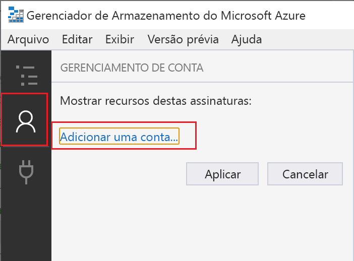
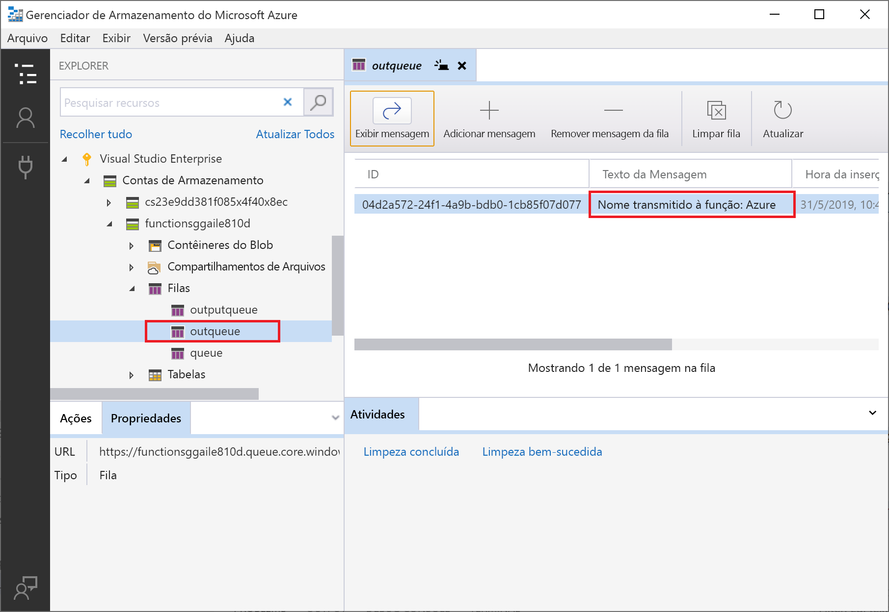
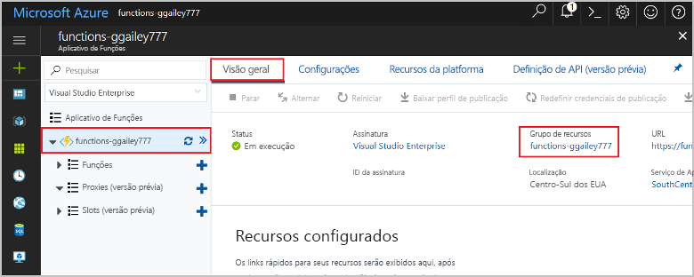

# <a name="connect-functions-to-azure-storage-using-visual-studio-code"></a>Conectar funções ao Armazenamento do Azure usando o Visual Studio Code

[!INCLUDE [functions-add-storage-binding-intro](../../includes/functions-add-storage-binding-intro.md)]

Este artigo mostra como usar Visual Studio Code para conectar a função criada no [artigo de início rápido anterior](functions-create-first-function-vs-code.md) ao Armazenamento do Azure. A associação de saída que você adiciona a essa função escreve dados da solicitação HTTP em uma mensagem na fila. 

A maioria das associações requer uma cadeia de conexão armazenada que o Functions usa para acessar o serviço vinculado. Para facilitar, use a Conta de armazenamento que você criou com o seu aplicativo de funções. A conexão com essa conta já está armazenada em uma configuração de aplicativo chamada `AzureWebJobsStorage`.  

## <a name="prerequisites"></a>Pré-requisitos

Antes de iniciar este artigo, você deve atender aos seguintes requisitos:

* Instale a [extensão de Armazenamento do Azure para o Visual Studio Code](https://marketplace.visualstudio.com/items?itemName=ms-azuretools.vscode-azurestorage).
* Instale o [Gerenciador de Armazenamento do Azure](https://storageexplorer.com/). O Gerenciador de Armazenamento é uma ferramenta que você usará para examinar as mensagens da fila geradas pela associação de saída. O Gerenciador de Armazenamento tem suporte em sistemas operacionais baseados em macOS, Windows e Linux.
* Instale [ferramentas de CLI do .NET Core](https://docs.microsoft.com/dotnet/core/tools/?tabs=netcore2x) (somente projetos C#).
* Conclua as etapas na [parte 1 do início rápido do Visual Studio Code](functions-create-first-function-vs-code.md). 

Este artigo pressupõe que você já esteja conectado à sua assinatura do Azure do Visual Studio Code. Você pode entrar executando `Azure: Sign In` na paleta de comandos. 

## <a name="download-the-function-app-settings"></a>Baixar as configurações do aplicativo de funções

No [artigo de início rápido anterior](functions-create-first-function-vs-code.md), você criou um aplicativo de funções no Azure, juntamente com a Conta de armazenamento necessária. A cadeia de conexão dessa conta é armazenada com segurança nas configurações do aplicativo no Azure. Neste artigo, você escreverá mensagens em uma Fila de armazenamento na mesma conta. Para se conectar à sua Conta de armazenamento ao executar a função localmente, é necessário baixar as configurações do aplicativo para o arquivo local.settings.json. 

1. Pressione a tecla F1 para abrir a paleta de comandos, pesquise e execute o comando `Azure Functions: Download Remote Settings....`. 

1. Escolha o aplicativo de função que você criou no artigo anterior. Selecione **Sim para todos** para substituir as configurações locais existentes. 

    > [!IMPORTANT]  
    > Como ela contém segredos, o arquivo local.settings.json nunca é publicado e é excluído do controle do código-fonte.

1. Copie o valor `AzureWebJobsStorage`, que é a chave do valor da cadeia de conexão da Conta de armazenamento. Use esta conexão para verificar se a associação de saída funciona conforme o esperado.

## <a name="register-binding-extensions"></a>Registrar as extensões de associação

Como está usando uma associação de saída Armazenamento de Filas, você precisa ter a extensão de associações de Armazenamento instalada antes de executar o projeto. 

# <a name="javascripttabnodejs"></a>[JavaScript](#tab/nodejs)

[!INCLUDE [functions-extension-bundles](../../includes/functions-extension-bundles.md)]

# <a name="ctabcsharp"></a>[C\#](#tab/csharp)

Com exceção dos gatilhos de timer e HTTP, as associações são implementadas como pacotes de extensão. Execute o comando [dotnet add package](/dotnet/core/tools/dotnet-add-package) a seguir na janela Terminal para adicionar o pacote de extensão Armazenamento ao seu projeto.

```bash
dotnet add package Microsoft.Azure.WebJobs.Extensions.Storage --version 3.0.4
```
---
Agora, você pode adicionar a associação de saída do armazenamento ao seu projeto.

## <a name="add-an-output-binding"></a>Adicionar uma associação de saída

No Functions, cada tipo de associação requer que um `direction`, `type` e um `name` exclusivo seja definido no arquivo functions.json. A maneira como você define esses atributos depende do idioma do seu aplicativo de funções.

# <a name="javascripttabnodejs"></a>[JavaScript](#tab/nodejs)

[!INCLUDE [functions-add-output-binding-json](../../includes/functions-add-output-binding-json.md)]

# <a name="ctabcsharp"></a>[C\#](#tab/csharp)

[!INCLUDE [functions-add-storage-binding-csharp-library](../../includes/functions-add-storage-binding-csharp-library.md)]

---

## <a name="add-code-that-uses-the-output-binding"></a>Adicionar o código que usa a associação de saída

Depois que a associação é definida, você pode usar o `name` da associação para acessá-la como um atributo na assinatura de função. Ao usar uma associação de saída, não é necessário usar o código do SDK do Armazenamento do Azure para se autenticar, para obter uma referência de fila ou para escrever dados. O tempo de execução do Functions e a associação de saída da fila fazem essas tarefas para você.

# <a name="javascripttabnodejs"></a>[JavaScript](#tab/nodejs)

[!INCLUDE [functions-add-output-binding-js](../../includes/functions-add-output-binding-js.md)]

# <a name="ctabcsharp"></a>[C\#](#tab/csharp)

[!INCLUDE [functions-add-storage-binding-csharp-library-code](../../includes/functions-add-storage-binding-csharp-library-code.md)]

---

[!INCLUDE [functions-run-function-test-local-vs-code](../../includes/functions-run-function-test-local-vs-code.md)]

Uma nova fila denominada **outqueue** é criada na sua conta de armazenamento pelo tempo de execução do Functions quando a associação de saída é usada pela primeira vez. Você usará o Gerenciador de Armazenamento para verificar se a fila foi criada junto com a nova mensagem.

### <a name="connect-storage-explorer-to-your-account"></a>Conectar o Gerenciador de Armazenamento à sua conta

Ignore esta seção se você já instalou o Gerenciador de Armazenamento do Azure e o conectou à sua conta do Azure.

1. Execute a ferramenta [Gerenciador de Armazenamento do Azure], selecione o ícone de conexão à esquerda e selecione **Adicionar uma conta**.

    

1. Na caixa de diálogo **Conectar**, escolha **Adicionar uma conta do Azure**, escolha seu **Ambiente do Azure** e selecione **Entrar...** . 

    

Depois de entrar na sua conta, você verá todas as assinaturas do Azure associadas à ela.

### <a name="examine-the-output-queue"></a>Examinar a fila de saída

1. No Visual Studio Code, pressione a tecla F1 para abrir a paleta de comandos, em seguida, procure e execute o comando `Azure Storage: Open in Storage Explorer` e escolha o nome da sua conta de armazenamento. Sua conta de armazenamento é aberta no Gerenciador de Armazenamento do Azure.  

1. Expanda o nó **Filas** e selecione a fila denominada **outqueue**. 

   A fila contém a mensagem que a associação de saída de fila criou quando você executou a função disparada por HTTP. Se você tiver invocado a função com o valor `name` padrão do *Azure*, a mensagem da fila será *Nome transmitido à função: Azure*.

    

1. Execute a função novamente, envie outra solicitação e você verá uma nova mensagem na fila.  

Agora, chegou a hora de republicar o aplicativo de funções atualizado no Azure.

## <a name="redeploy-and-verify-the-updated-app"></a>Reimplementar e verificar o aplicativo atualizado

1. No Visual Studio Code, pressione F1 para abrir a paleta de comandos. Na paleta de comandos, pesquise e selecione `Azure Functions: Deploy to function app...`.

1. Escolha o aplicativo de funções que você criou no primeiro artigo. Como você está reimplementando seu projeto para o mesmo aplicativo, selecione **Implantar** para descartar o aviso de substituição de arquivos.

1. Após a conclusão da implantação, você poderá usar novamente o cURL ou um navegador para testar a função reimplementada. Como antes, acrescente a cadeia de consulta `&name=<yourname>` à URL, como no seguinte exemplo:

    ```bash
    curl https://myfunctionapp.azurewebsites.net/api/httptrigger?code=cCr8sAxfBiow548FBDLS1....&name=<yourname>
    ```

1. Novamente, [Examinar a Mensagem da fila de armazenamento](#examine-the-output-queue) para verificar se a associação de saída gera novamente uma nova mensagem na fila.

## <a name="clean-up-resources"></a>Limpar recursos

Os *Recursos* no Azure se referem a aplicativos de funções, funções, contas de armazenamento e assim por diante. Eles são agrupados em *grupos de recursos*, e você pode excluir tudo junto ao excluir o grupo.

Você criou recursos para concluir esses guias de início rápido. Você pode ser cobrado por esses recursos, dependendo do [status de conta](https://azure.microsoft.com/account/) e [preços do serviço](https://azure.microsoft.com/pricing/). Caso não precise mais dos recursos, é possível excluí-los desta maneira:

1. No Visual Studio Code, pressione F1 para abrir a paleta de comandos. Na paleta de comandos, pesquise e selecione `Azure Functions: Open in portal`.

1. Escolha seu aplicativo de funções e pressione Enter. A página do aplicativo de funções é aberta no [portal do Azure](https://portal.azure.com).

1. Na guia **Visão geral**, selecione o link nomeado em **Grupo de Recursos**.

    

1. Na página **Grupo de recursos**, examine a lista de recursos incluídos e verifique se eles são aqueles que deseja excluir.
 
1. Selecione **Excluir grupo de recursos** e siga as instruções.

   A exclusão poderá levar alguns minutos. Ao ser concluída, uma notificação será exibida por alguns segundos. Também é possível selecionar o ícone de sino na parte superior da página para exibir a notificação.

## <a name="next-steps"></a>Próximas etapas

Você atualizou sua função disparada por HTTP para gravar dados em uma Fila de armazenamento. Para saber mais sobre o desenvolvimento de funções, confira [Desenvolver Funções do Azure usando o Visual Studio Code](functions-develop-vs-code.md).

Em seguida, você deve habilitar o monitoramento do Application Insights para seu aplicativo de funções:

> [!div class="nextstepaction"]
> [Habilitar a integração do Application Insights](functions-monitoring.md#manually-connect-an-app-insights-resource)

[Gerenciador de Armazenamento do Azure]: https://storageexplorer.com/
