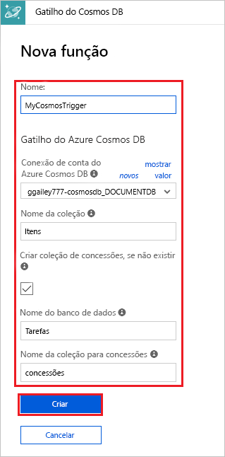
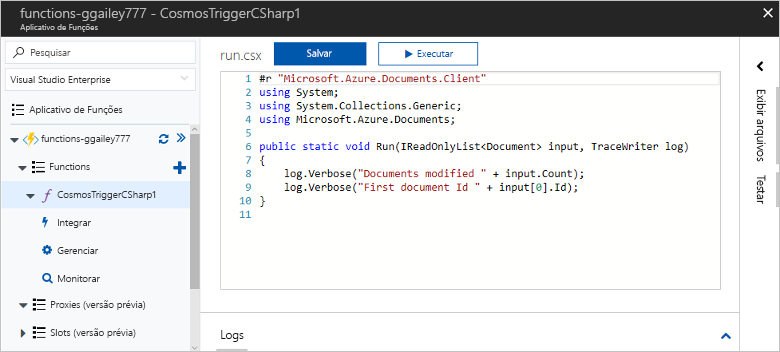

# Criar uma função disparada pelo Azure Cosmos DB

Saiba como criar uma função disparada quando dados são adicionados ou alterados no Azure Cosmos DB. Para obter mais informações sobre o Azure Cosmos DB, consulte [Azure Cosmos DB: computação de banco de dados sem servidor usando o Azure Functions](..\cosmos-db\serverless-computing-database.md).

## pré-requisitos

Para concluir este tutorial:

+ Se você não tiver uma assinatura do Azure, crie uma [conta gratuita](https://azure.microsoft.com/free/?WT.mc_id=A261C142F) antes de começar.

## Criar um Aplicativo de funções do Azure

[!INCLUDE [Create function app Azure portal](../../includes/functions-create-function-app-portal.md)]

Em seguida, crie uma nova função no novo aplicativo de funções.

## Criar gatilho do Azure Cosmos DB

1. Expanda seu aplicativo de funções e clique no botão **+** ao lado de **Functions**. Se essa for a primeira função em seu aplicativo de funções, selecione **Função personalizada**. Exibe o conjunto completo de modelos de função.

    

2. No campo de pesquisa, digite `cosmos` e depois escolha a linguagem desejada para o modelo de gatilho do Azure Cosmos DB.

    

3. Configure o novo gatilho com as configurações conforme especificado na tabela abaixo da imagem.

    
    
    | Configuração      | Valor sugerido  | Descrição                                |
    | ------------ | ---------------- | ------------------------------------------ |
    | **Nome** | Padrão | Use o nome da função padrão sugerido pelo modelo. |
    | **Nome da coleção** | Itens | Nome da coleção a ser monitorada. |
    | **Crie a coleção de concessão, se ela não existir** | Verificado | A coleção ainda não existe, então crie uma. |
    | **Nome do banco de dados** | Tarefas | Nome do banco de dados com a coleção a ser monitorada. |

4. Selecione **Novo** ao lado do rótulo **Conexão da conta do Azure Cosmos DB** e escolha uma conta existente do Cosmos DB ou **+ Criar novo**. 
 
    

6. Ao criar uma nova conta do Cosmos DB, use as configurações de **Nova conta**, conforme especificado na tabela.

    | Configuração      | Valor sugerido  | DESCRIÇÃO                                |
    | ------------ | ---------------- | ------------------------------------------ |
    | **ID** | Nome do banco de dados | ID exclusiva para o banco de dados do Azure Cosmos DB  |
    | **API** | SQL | Este tópico usa a API do SQL.  |
    | **Assinatura** | Assinatura do Azure | A assinatura na qual esta nova conta do Cosmos DB será criada.  |
    | **Grupo de recursos** | myResourceGroup |  Use o grupo de recursos existente que contém seu aplicativo de função. |
    | **Localidade**  | WestEurope | Selecione um local próximo ao seu aplicativo de função ou a outros aplicativos que usam os documentos armazenados.  |

6. Clique em **OK** para criar o banco de dados. A criação do banco de dados pode demorar alguns minutos. Após a criação do banco de dados, a cadeia de conexão de banco de dados é armazenada como uma configuração de aplicativo de função. O nome dessa configuração de aplicativo é inserido na **conexão da conta do Azure Cosmos DB**. 

7. Clique em **Criar** para criar o banco de dados da função disparada do Azure Cosmos DB. Depois que a função for criada, o código de função baseado em modelo será exibido.  

    

    Esse modelo de função grava o número de documentos e a primeira ID de documento para os logs. 

Em seguida, você conecta-se à sua conta do Azure Cosmos DB e cria a coleção **Tarefas** no banco de dados. 

## Criar a coleção de itens

1. Abra uma segunda instância do [portal do Azure](https://portal.azure.com) em uma nova guia no navegador. 

2. No lado esquerdo do portal, expanda a barra de ícones, digite `cosmos` no campo de pesquisa e selecione **Azure Cosmos DB**.

    

2. Escolha sua conta do Azure Cosmos DB e selecione o **Data Explorer**. 
 
3. Em **Coleções**, escolha **taskDatabase** e selecione **Nova Coleção**.

    

4. Em **Adicionar Coleção**, use as configurações mostradas na tabela abaixo da imagem. 
 
    
 
    | Configuração|Valor sugerido|DESCRIÇÃO |
    | ---|---|--- |
    | **ID do banco de dados** | Tarefas |O nome do novo banco de dados. Isso deve corresponder ao nome definido na sua associação de função. |
    | **ID da coleção** | Itens | O nome da nova coleção. Isso deve corresponder ao nome definido na sua associação de função.  |
    | **Capacidade de armazenamento** | Fixo (10 GB)|Use o valor padrão. Esse valor é a capacidade de armazenamento do banco de dados. |
    | **Taxa de transferência** |400 RU| Use o valor padrão. Se quiser reduzir a latência, você poderá escalar verticalmente a taxa de transferência mais tarde. |
    | **[Chave de partição](../cosmos-db/partition-data.md#design-for-scale)** | /category|Uma chave de partição que distribui dados uniformemente para cada partição. É importante selecionar a chave de partição correta ao criar uma coleção de alto desempenho. | 

1. Clique em **OK** para criar a coleção **Tarefas**. Pode levar alguns instantes para a coleção ser criada.

Depois que a coleção especificada na associação de função existir, você poderá testar a função adicionando documentos a essa nova coleção.

## Testar a função

1. Expanda a nova coleção **taskCollection** no Data Explorer, escolha **Documentos** e, em seguida, selecione **Novo Documento**.

    

2. Substitua o conteúdo do novo documento pelo conteúdo a seguir e então escolha **Salvar**.

        {
            "id": "task1",
            "category": "general",
            "description": "some task"
        }

1. Mude para a primeira guia do navegador que contém a função no portal. Expanda os logs de função e verifique se o novo documento disparou a função. Veja se o valor de ID do documento `task1` é gravado nos logs. 

    

4. (Opcional) Volte para o seu documento, faça uma alteração e, em seguida, clique em **Atualizar**. Em seguida, volte para os logs de função e verifique se a atualização também disparou a função.

## Limpar recursos

[!INCLUDE [Next steps note](../../includes/functions-quickstart-cleanup.md)]

## Próximas etapas

Você criou uma função que é executada quando um documento é adicionado ou modificado no Azure Cosmos DB.

[!INCLUDE [Next steps note](../../includes/functions-quickstart-next-steps.md)]

Para obter mais informações sobre gatilhos do Azure Cosmos DB, consulte [Associações do Azure Cosmos DB para Azure Functions](functions-bindings-cosmosdb.md).
