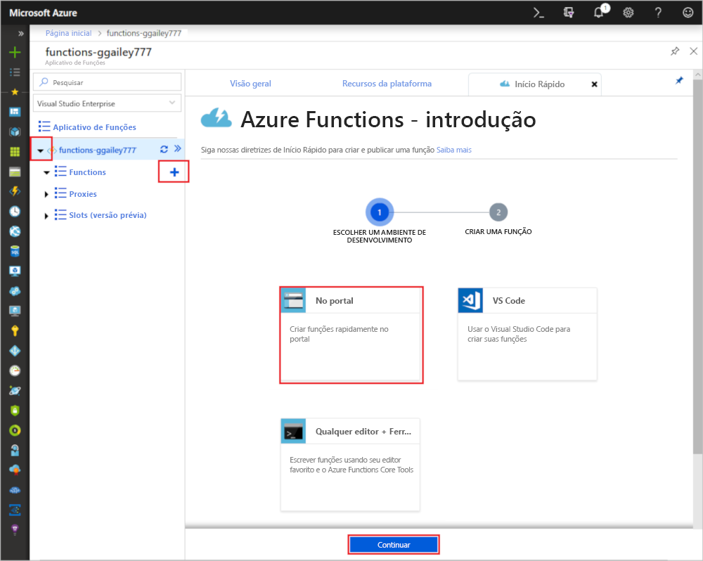
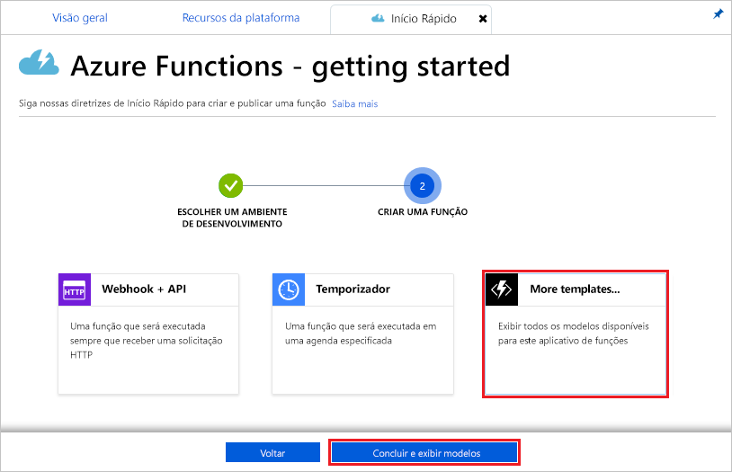
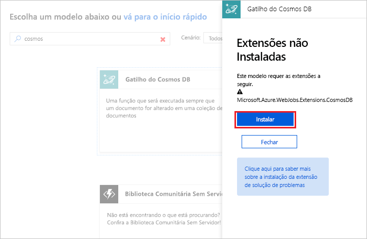
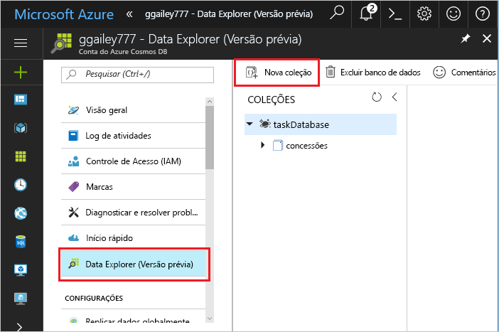
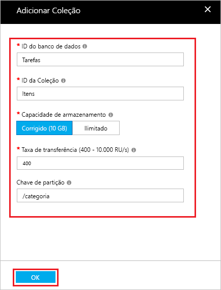

# Criar uma função disparada pelo Azure Cosmos DB

Saiba como criar uma função disparada quando dados são adicionados ou alterados no Azure Cosmos DB. Para saber mais sobre o Azure Cosmos DB, confira [Azure Cosmos DB: computação de banco de dados sem servidor usando o Azure Functions](../cosmos-db/serverless-computing-database.md).

## Pré-requisitos

Para concluir este tutorial:

+ Se você não tiver uma assinatura do Azure, crie uma [conta gratuita](https://azure.microsoft.com/free/?WT.mc_id=A261C142F) antes de começar.

> [!NOTE]
> [!INCLUDE [SQL API support only](../../includes/functions-cosmosdb-sqlapi-note.md)]

## Criar uma conta do Azure Cosmos DB

Antes de criar o gatilho, você precisa ter uma conta do Azure Cosmos DB que use a API de SQL.

[!INCLUDE [cosmos-db-create-dbaccount](../../includes/cosmos-db-create-dbaccount.md)]

## Criar um Aplicativo de funções do Azure

[!INCLUDE [Create function app Azure portal](../../includes/functions-create-function-app-portal.md)]

Em seguida, crie uma nova função no novo aplicativo de funções.

## Criar gatilho do Azure Cosmos DB

1. Expanda seu aplicativo de funções e clique no botão **+** ao lado de **Functions**. Se essa for a primeira função em seu aplicativo de funções, selecione **No portal** e depois **Continuar**. Caso contrário, vá para a etapa três.

   

1. Escolha **Mais modelos** e, em seguida, **Concluir e exibir modelos**.

    

1. No campo de pesquisa, digite `cosmos` e escolha o modelo **Gatilho do Azure Cosmos DB**.

1. Se solicitado, selecione **Instalar** para instalar a extensão do Azure Cosmos DB no aplicativo de funções. Após a instalação ser bem-sucedida, selecione **Continuar**.

    

1. Configure o novo gatilho com as configurações conforme especificado na tabela abaixo da imagem.

    

    | Configuração      | Valor sugerido  | Descrição                                |
    | ------------ | ---------------- | ------------------------------------------ |
    | **Nome** | Padrão | Use o nome da função padrão sugerido pelo modelo.|
    | **Conexão de conta do Azure Cosmos DB** | Nova configuração | Selecione **Novo** e depois escolha sua **Assinatura**, a **Conta de banco de dados** criada anteriormente e **Selecionar**. Isso cria uma configuração de aplicativo para sua conexão de conta. Essa configuração é usada pela associação para conexão com o banco de dados. |
    | **Nome da coleção** | Itens | Nome da coleção a ser monitorada. |
    | **Crie a coleção de concessão, se ela não existir** | Verificado | A coleção ainda não existe, então crie uma. |
    | **Nome do banco de dados** | Tarefas | Nome do banco de dados com a coleção a ser monitorada. |

1. Clique em **Criar** para criar o banco de dados da função disparada do Azure Cosmos DB. Depois que a função for criada, o código de função baseado em modelo será exibido.  

    

    Esse modelo de função grava o número de documentos e a primeira ID de documento para os logs.

Em seguida, você conecta-se à sua conta do Azure Cosmos DB e cria a coleção `Items` no banco de dados `Tasks`.

## Criar a coleção de itens

1. Abra uma segunda instância do [portal do Azure](https://portal.azure.com) em uma nova guia no navegador.

1. No lado esquerdo do portal, expanda a barra de ícones, digite `cosmos` no campo de pesquisa e selecione **Azure Cosmos DB**.

    

1. Escolha sua conta do Azure Cosmos DB e selecione o **Data Explorer**. 

1. Em **Coleções**, escolha **taskDatabase** e selecione **Nova Coleção**.

    

1. Em **Adicionar Coleção**, use as configurações mostradas na tabela abaixo da imagem. 

    

    | Configuração|Valor sugerido|DESCRIÇÃO |
    | ---|---|--- |
    | **ID do banco de dados** | Tarefas |O nome do novo banco de dados. Isso deve corresponder ao nome definido na sua associação de função. |
    | **ID da coleção** | Itens | O nome da nova coleção. Isso deve corresponder ao nome definido na sua associação de função.  |
    | **Capacidade de armazenamento** | Fixo (10 GB)|Use o valor padrão. Esse valor é a capacidade de armazenamento do banco de dados. |
    | **Taxa de transferência** |400 RU| Use o valor padrão. Se quiser reduzir a latência, você poderá escalar verticalmente a taxa de transferência mais tarde. |
    | **[Chave de partição](../cosmos-db/partition-data.md)** | /category|Uma chave de partição que distribui dados uniformemente para cada partição. É importante selecionar a chave de partição correta ao criar uma coleção de alto desempenho. | 

1. Clique em **OK** para criar a coleção Itens. Pode levar alguns instantes para a coleção ser criada.

Depois que a coleção especificada na associação de função existir, você poderá testar a função adicionando documentos a essa nova coleção.

## Testar a função

1. Expanda a nova coleção **taskCollection** no Data Explorer, escolha **Documentos** e, em seguida, selecione **Novo Documento**.

    

1. Substitua o conteúdo do novo documento pelo conteúdo a seguir e então escolha **Salvar**.

        {
            "id": "task1",
            "category": "general",
            "description": "some task"
        }

1. Mude para a primeira guia do navegador que contém a função no portal. Expanda os logs de função e verifique se o novo documento disparou a função. Veja se o valor de ID do documento `task1` é gravado nos logs. 

    

1. (Opcional) Volte para o seu documento, faça uma alteração e, em seguida, clique em **Atualizar**. Em seguida, volte para os logs de função e verifique se a atualização também disparou a função.

## Limpar recursos

[!INCLUDE [Next steps note](../../includes/functions-quickstart-cleanup.md)]

## Próximas etapas

Você criou uma função que é executada quando um documento é adicionado ou modificado no Azure Cosmos DB. Para obter mais informações sobre gatilhos do Azure Cosmos DB, consulte [Associações do Azure Cosmos DB para Azure Functions](functions-bindings-cosmosdb.md).

[!INCLUDE [Next steps note](../../includes/functions-quickstart-next-steps.md)]
