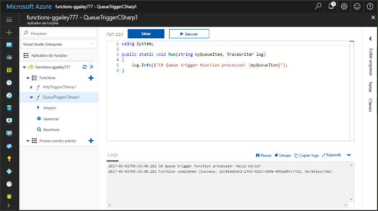
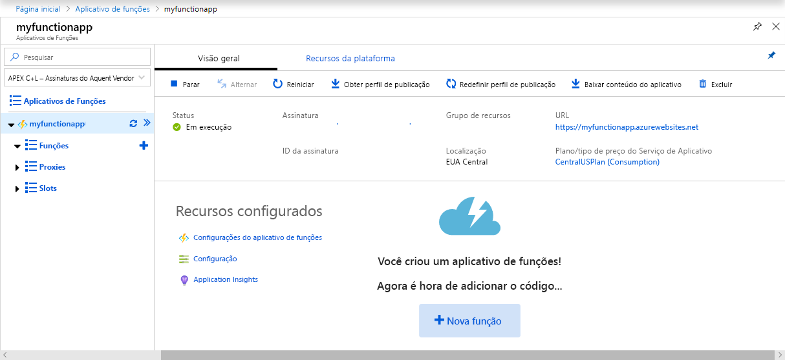
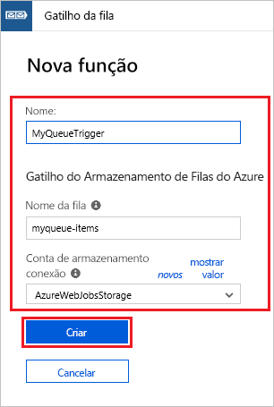
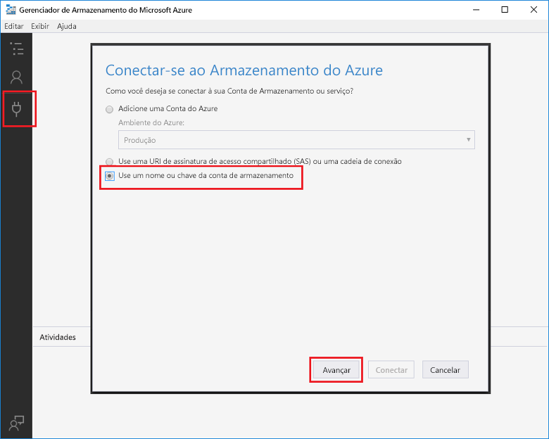
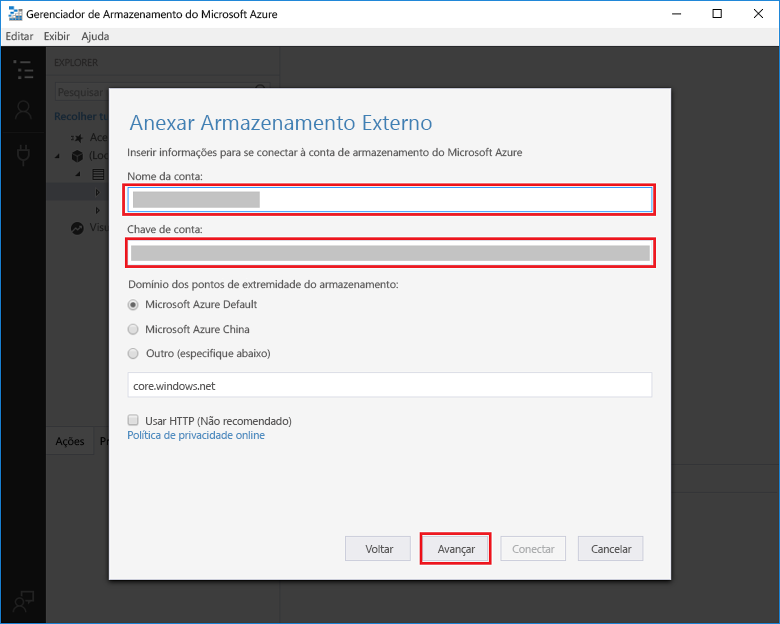
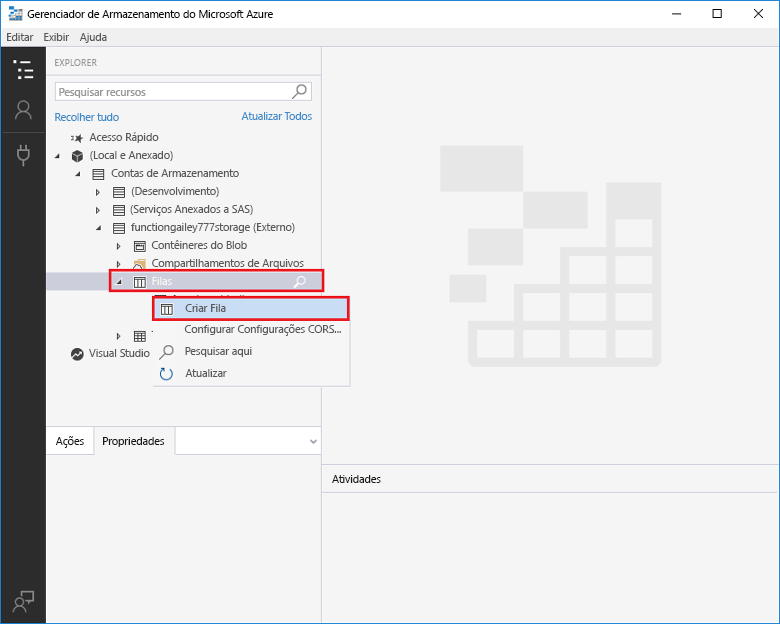
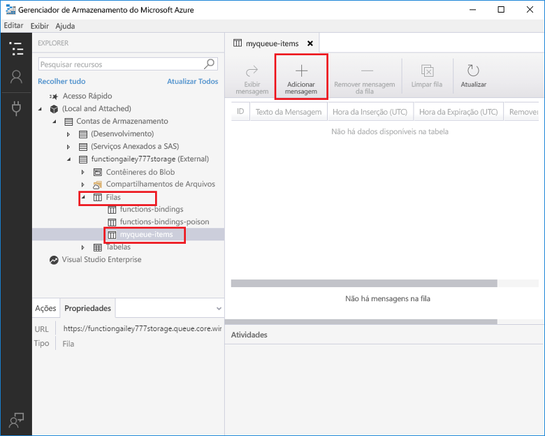

# Criar uma função disparada pelo Armazenamento de Filas do Azure

Saiba como criar uma função que é disparada quando as mensagens são enviadas para uma fila do Armazenamento do Azure.

## Pré-requisitos

- Baixe e instale o [Gerenciador de Armazenamento do Microsoft Azure](https://storageexplorer.com/).

- Uma assinatura do Azure. Se você não tiver uma, crie uma [conta gratuita](https://azure.microsoft.com/free/?WT.mc_id=A261C142F) antes de começar.

## Criar um Aplicativo de funções do Azure

[!INCLUDE [Create function app Azure portal](../../includes/functions-create-function-app-portal.md)]

Em seguida, crie uma nova função no novo aplicativo de funções.

## Criar uma função disparada por Filas

1. Expanda seu aplicativo de funções e clique no botão **+** ao lado de **Functions**. Se essa for a primeira função em seu aplicativo de funções, selecione **No portal** e depois **Continuar**. Caso contrário, vá para a etapa três.

   

1. Escolha **Mais modelos** e, em seguida, **Concluir e exibir modelos**.

    

1. No campo de pesquisa, digite `queue` e escolha o modelo **Gatilho de fila**.

1. Se solicitado, selecione **Instalar** para instalar a extensão de Armazenamento do Azure em todas as dependências no aplicativo de funções. Após a instalação ser bem-sucedida, selecione **Continuar**.

    

1. Use as configurações conforme especificado na tabela abaixo da imagem.

    

    | Configuração | Valor sugerido | Descrição |
    |---|---|---|
    | **Nome** | Exclusivo no aplicativo de funções | O nome dessa função disparada por filas. |
    | **Nome da fila**   | myqueue-items    | Nome da fila à qual se conectar em sua conta de armazenamento. |
    | **Conexão da conta de armazenamento** | AzureWebJobStorage | Você pode usar a conexão da conta de armazenamento que já está sendo usada por seu aplicativo de funções ou criar uma nova.  |    

1. Clique em **Criar** para criar a função.

Em seguida, você pode se conectar à sua conta de armazenamento do Azure e criar a fila de armazenamento **myqueue-items**.

## Criar a fila

1. Em sua função, clique em **Integrar**, expanda **Documentação**e copie **Nome da conta** e **Chave de conta**. Você usa essas credenciais para conectar-se à conta de armazenamento no Gerenciador de Armazenamento do Microsoft Azure. Se você já tiver se conectado à conta de armazenamento, vá para a etapa 4.

    

1. Execute a ferramenta [Gerenciador de Armazenamento do Microsoft Azure](https://storageexplorer.com/), clique no ícone conectar-se à esquerda, escolha **Usar um nome e chave de conta de armazenamento** e clique em **Avançar**.

    

1. Insira o **Nome da conta** e **Chave de conta** da etapa 1, clique em **Avançar** e em **Conectar**.

    

1. Expanda a conta de armazenamento anexada, clique com o botão direito do mouse em **Filas**, clique em **Criar Fila**, digite `myqueue-items` e pressione enter.

    

Agora que você tem uma fila de armazenamento, você pode testar a função adicionando uma mensagem à fila.

## Testar a função

1. De volta ao Portal do Azure, navegue até sua função, expanda os **Logs** na parte inferior da página e verifique se o streaming de log não está em pausa.

1. No Gerenciador de Armazenamento, expanda sua conta de armazenamento, **Filas** e **myqueue-items**; em seguida, clique em **Adicionar mensagem**.

    

1. Digite sua mensagem "Olá, Mundo!" em **Texto da mensagem** e clique em **OK**.

1. Aguarde alguns segundos, depois volte para seus logs de função e verifique se a nova mensagem foi lida da fila.

    

1. No Gerenciador de Armazenamento, clique em **Atualizar** e verifique se a mensagem foi processada e se não está mais na fila.

## Limpar recursos

[!INCLUDE [Next steps note](../../includes/functions-quickstart-cleanup.md)]

## Próximas etapas

Você criou uma função que é executada quando uma mensagem é adicionada a uma fila de armazenamento. Para obter mais informações sobre gatilhos de Armazenamento de Filas, consulte [Associações de fila do Armazenamento do Azure Functions](functions-bindings-storage-queue.md).

Agora que você criou sua primeira função, vamos adicionar uma associação de saída à função que grava uma mensagem de volta em outra fila.

> [!div class="nextstepaction"]
> [Adicionar mensagens a uma fila do Armazenamento do Azure usando o Functions](functions-integrate-storage-queue-output-binding.md)
