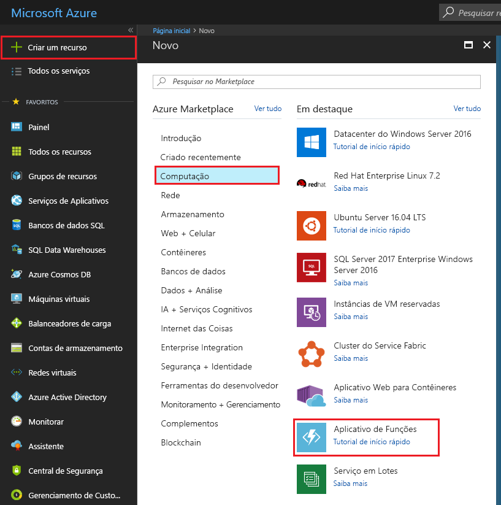
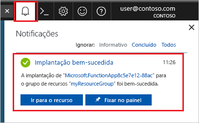
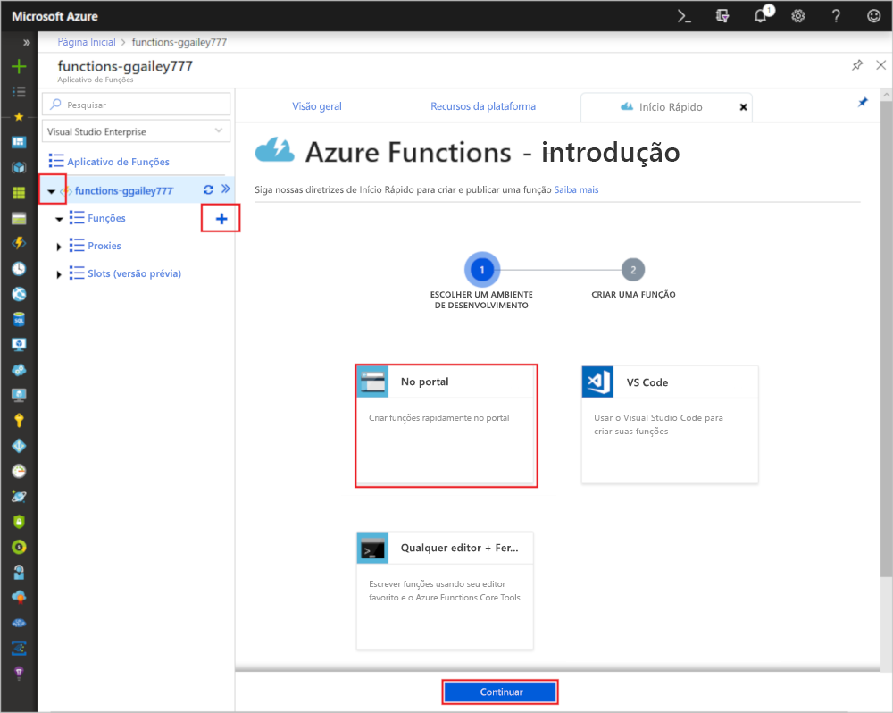
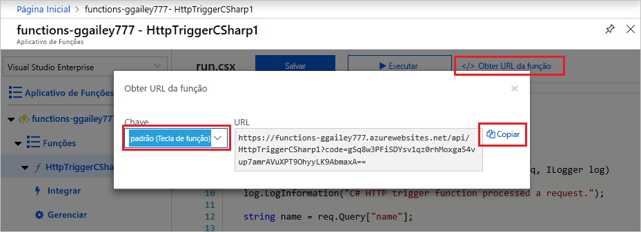

# Criar uma função usando o Microsoft Azure for Students Starter

Neste tutorial, criaremos uma função HTTP Olá, Mundo em uma assinatura do Microsoft Azure for Students Starter. Também examinaremos o que está disponível no Azure Functions nesse tipo de assinatura.

O Microsoft *Azure for Students Starter* oferece uma introdução aos produtos do Azure necessários para desenvolver na nuvem sem nenhum custo para você. [Saiba mais sobre essa oferta aqui.](https://azure.microsoft.com/offers/ms-azr-0144p/)

O Azure Functions lhe permite executar seu código em um ambiente [sem servidor](https://azure.microsoft.com/solutions/serverless/) sem que seja preciso primeiro criar uma VM ou publicar um aplicativo Web. [Saiba mais sobre o Functions aqui.](./functions-overview.md)

## Criar uma função

 Neste tópico, aprenda a usar o Functions para criar uma função "Olá, Mundo" disparada por HTTP no portal do Microsoft Azure.

## Entrar no Azure

Entre no portal do Azure em <https://portal.azure.com> com sua conta do Azure.

## Criar um aplicativo de funções

Você deve ter um aplicativo de funções para hospedar a execução de suas funções. Um aplicativo de funções permite a você agrupar funções como uma unidade lógica para facilitar o gerenciamento, implantação e compartilhamento de recursos. 

1. Selecione o botão **Novo** no canto superior esquerdo do portal do Azure, e selecione **Computação** > **Aplicativo de funções**.

    

2. Use as configurações do aplicativo de funções especificadas na tabela abaixo da imagem.

    

    | Configuração      | Valor sugerido  | DESCRIÇÃO                                        |
    | ------------ |  ------- | -------------------------------------------------- |
    | **Nome do aplicativo** | Nome globalmente exclusivo | Nome que identifica seu novo aplicativo de funções. Os caracteres válidos são `a-z`, `0-9` e `-`.  | 
    | **Assinatura** | Sua assinatura | A assinatura na qual este novo aplicativo de funções será criado. | 
    | **[Grupo de Recursos](../azure-resource-manager/resource-group-overview.md)** |  myResourceGroup | Nome do novo grupo de recursos no qual criar o seu aplicativo de funções. |
   | **[Plano de Serviço de Aplicativo/localização](./functions-scale.md)** | Novo | O plano de hospedagem que controla em qual região o aplicativo de funções é implantado e a densidade de seus recursos. Vários aplicativos de funções implantados no mesmo plano compartilharão a mesma instância única livre. Trata-se de uma restrição do plano Students Starter. As opções de hospedagem completas são [explicadas aqui.](./functions-scale.md)|
    | **Pilha de tempo de execução** | Linguagem preferencial | Escolha um tempo de execução compatível com sua linguagem de programação de funções favorita. Escolha **.NET** para funções C# e F#. |
    |**[Application Insights](./functions-monitoring.md)**| habilitado | O Application Insights é usado para armazenar e analisar logs do aplicativo de funções. Ele será habilitado por padrão se você escolher uma localização que dá suporte ao Application Insights. O Application Insights pode ser habilitado para qualquer função. Basta escolher manualmente uma região próxima para implantar o Application Insights. Sem o Application Insights, você só poderá exibir os logs de transmissão ao vivo.

3. Selecione **Localização/Plano de Serviço de Aplicativo** acima para escolher uma localização diferente

4. Selecione **Criar novo** e, em seguida, dê um nome exclusivo para o plano.

5. Selecione a localização mais próxima de você. [Veja um mapa completo de regiões do Azure aqui.](https://azure.microsoft.com/global-infrastructure/regions/) 

    

6. Selecione **Criar** para provisionar e implantar o aplicativo de funções.

    

7. Selecione o ícone da Notificação no canto superior direito do portal e veja se a mensagem **Implantação concluída com êxito** é exibida.

    

8. Selecione **Ir para recursos** para exibir o novo aplicativo de funções.

Em seguida, crie uma nova função no novo aplicativo de funções.

## Criar uma função disparada por HTTP

1. Expanda seu novo aplicativo de funções e selecione o botão **+** ao lado de **Functions**, escolha **No portal** e selecione **Continuar**.

    

1. Escolha **WebHook + API** e, em seguida, selecione **Criar**.

    

Uma função é criada usando um modelo específico a um idioma para uma função disparada por HTTP.

Agora você pode executar a nova função enviando uma solicitação HTTP.

## Testar a função

1. Em sua nova função, clique em **</> Obter URL da função** na parte superior direita, selecione **padrão (Tecla de função)** e depois clique em **Copiar**. 

    

2. Cole a URL de função na barra de endereços do navegador. Adicione o valor da cadeia de caracteres de consulta `&name=<yourname>` ao final desta URL e pressione `Enter` em seu teclado para executar a solicitação. Você deverá ver a resposta retornada pela função exibida no navegador.  

    O exemplo a seguir mostra a resposta no navegador:

    

    A URL da solicitação inclui uma chave que é necessária, por padrão, para acessar sua função via HTTP.

3. Quando a função é executada, informações de rastreamento são gravadas nos logs. Para ver a saída do rastreamento da execução anterior, volte para sua função no portal e clique na seta na parte inferior da tela para expandir os **Logs**.

   

## Limpar recursos

[!INCLUDE [Clean-up resources](../../includes/functions-quickstart-cleanup.md)]

## Recursos com suporte no Microsoft Azure for Students Starter

No Microsoft Azure for Students Starter, você tem acesso à maioria dos recursos do Azure Functions Runtime, com várias limitações importantes listadas abaixo:

* O gatilho HTTP é o único tipo de gatilho com suporte.
    * Há suporte para todas as associações de entrada e saída! [Veja a lista completa aqui.](functions-triggers-bindings.md)
* Linguagens com suporte: 
    * C# (.NET Core 2)
    * Javascript (Node.js 8 e 10)
    * F# (.NET Core 2)
    * [Veja as linguagens com suporte em planos superiores aqui](supported-languages.md)
* O Windows é o único sistema operacional com suporte.
* A escala é restrita aos [uma instância de camada gratuita](https://azure.microsoft.com/pricing/details/app-service/windows/) em execução por até 60 minutos por dia. Haverá uma escala sem servidor de 0 para 1 instância automaticamente à medida que o tráfego HTTP é recebido, mas somente isso.
* Há suporte apenas para [o tempo de execução 2.x](functions-versions.md).
* Todas as ferramentas de desenvolvedor têm suporte para as funções de edição e publicação. Isso inclui VS Code, Visual Studio, CLI do Azure e portal do Azure. Se quiser usar algo diferente do portal, você precisará primeiro criar um aplicativo no portal e, em seguida, escolher esse aplicativo como um destino de implantação em sua ferramenta preferencial.

## Próximas etapas

Você criou um aplicativo de funções com uma função simples disparada por HTTP! Agora, você pode explorar as ferramentas locais, mais linguagens, monitoramento e integrações.

 * [Criar sua primeira função usando o Visual Studio](./functions-create-your-first-function-visual-studio.md)
 * [Criar sua primeira função usando o Visual Studio Code](./functions-create-first-function-vs-code.md)
 * [Guia do desenvolvedor de JavaScript do Azure Functions](./functions-reference-node.md)
 * [Usar o Azure Functions para conectar a um Banco de Dados SQL do Azure](./functions-scenario-database-table-cleanup.md)
 * [Saiba mais sobre as associações HTTP do Azure Functions](./functions-bindings-http-webhook.md).
 * [Monitorar o Azure Functions](./functions-monitoring.md)
