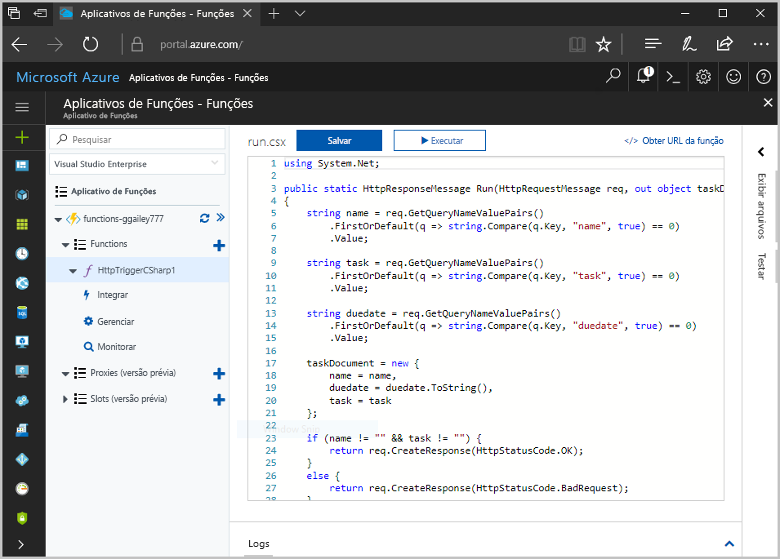
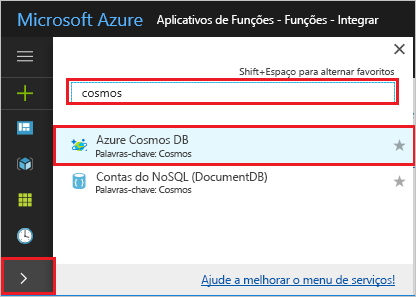

# <a name="store-unstructured-data-using-azure-functions-and-azure-cosmos-db"></a>Armazenar dados não estruturados usando o Azure Functions e o Azure Cosmos DB

O [Azure Cosmos DB](https://azure.microsoft.com/services/cosmos-db/) é uma ótima maneira de armazenar dados não estruturados e JSON. Combinado com o Azure Functions, o Cosmos DB torna o armazenamento de dados rápido e fácil com muito menos código do que o necessário para armazenar dados em um banco de dados relacional.

> [!NOTE]
> Neste momento, o gatilho, as associações de entrada e as associações de saída do Azure Cosmos DB funcionam apenas com contas da API do Graph e a API do SQL.

No Azure Functions, associações de entrada e saída fornecem uma maneira declarativa para se conectar a dados de serviço externo de sua função. Neste artigo, saiba como atualizar uma função existente a fim de adicionar uma associação de saída que armazena dados não estruturados em um documento do Azure Cosmos DB.



## <a name="prerequisites"></a>Pré-requisitos

Para concluir este tutorial:

[!INCLUDE [Previous quickstart note](../../includes/functions-quickstart-previous-topics.md)]

## <a name="create-an-azure-cosmos-db-account"></a>Criar uma conta do Azure Cosmos DB

Antes de criar a associação de saída, você precisa ter uma conta do Azure Cosmos DB que use a API de SQL.

[!INCLUDE [cosmos-db-create-dbaccount](../../includes/cosmos-db-create-dbaccount.md)]

## <a name="add-an-output-binding"></a>Adicionar uma associação de saída

1. No portal, navegue até o aplicativo de funções que você criou anteriormente e expanda o aplicativo de funções e a função.

1. Selecione **Integrar** e **+Nova Saída**, que está na parte superior direita da página. Escolha **Azure Cosmos DB** e clique em **Selecionar**.

    

1. Se você receber uma mensagem de **Extensões não instaladas**, escolha **Instalar** para instalar a extensão de associações do Azure Cosmos DB no aplicativo de funções. A instalação pode levar alguns minutos.

    

1. Use a configuração **Saída do Azure Cosmos DB** conforme especificado na tabela:

    

    | Configuração      | Valor sugerido  | DESCRIÇÃO                                |
    | ------------ | ---------------- | ------------------------------------------ |
    | **Nome do parâmetro do documento** | taskDocument | Nome que se refere ao objeto do Cosmos DB no código. |
    | **Nome do banco de dados** | taskDatabase | Nome do banco de dados para salvar os documentos. |
    | **Nome da coleção** | TaskCollection | Nome da coleção de banco de dados. |
    | **Se for true, cria o banco de dados e a coleção do Cosmos DB** | Verificado | A coleção ainda não existe, então crie uma. |
    | **Conexão de conta do Azure Cosmos DB** | Nova configuração | Selecione **Novo** e depois escolha sua **Assinatura**, a **Conta de banco de dados** criada anteriormente e **Selecionar**. Isso cria uma configuração de aplicativo para sua conexão de conta. Essa configuração é usada pela associação para conexão com o banco de dados. |
    | **Taxa de transferência de coleção** |400 RU| Se quiser reduzir a latência, você poderá escalar verticalmente a taxa de transferência mais tarde. |

1. Selecione **Salvar** para criar a associação.

## <a name="update-the-function-code"></a>Atualizar o código de função

Substitua o código existente da função pelo código a seguir na linguagem que você escolheu:

# <a name="ctabcsharp"></a>[C\#](#tab/csharp)

Substitua função de C# existente por este código:

```csharp
#r "Newtonsoft.Json"

using Microsoft.AspNetCore.Mvc;
using Microsoft.AspNetCore.Http;
using Microsoft.Extensions.Logging;

public static IActionResult Run(HttpRequest req, out object taskDocument, ILogger log)
{
    string name = req.Query["name"];
    string task = req.Query["task"];
    string duedate = req.Query["duedate"];

    // We need both name and task parameters.
    if (!string.IsNullOrEmpty(name) && !string.IsNullOrEmpty(task))
    {
        taskDocument = new
        {
            name,
            duedate,
            task
        };

        return (ActionResult)new OkResult();
    }
    else
    {
        taskDocument = null;
        return (ActionResult)new BadRequestResult();
    }
```

# <a name="javascripttabnodejs"></a>[JavaScript](#tab/nodejs)

Substitua função de JavaScript existente por este código:

```js
module.exports = async function (context, req) {

    // We need both name and task parameters.
    if (req.query.name && req.query.task) {

        // Set the output binding data from the query object.
        context.bindings.taskDocument = req.query;

        // Success.
        context.res = {
            status: 200
        };
    }
    else {
        context.res = {
            status: 400,
            body: "The query options 'name' and 'task' are required."
        };
    }
};
```
---

Esse exemplo de código lê as cadeias de consulta da Solicitação HTTP e as atribui a campos no objeto `taskDocument`. A associação `taskDocument` envia os dados do objeto desse parâmetro de associação para armazenamento no banco de dados de documento associado. O banco de dados é criado na primeira execução da função.

## <a name="test-the-function-and-database"></a>Testar a função e o banco de dados

1. Expanda a janela direita e selecione **Testar**. Em **Consulta**, clique em **+ Adicionar parâmetro** e adicione os seguintes parâmetros à cadeia de consulta:

    + `name`
    + `task`
    + `duedate`

1. Clique em **Executar** e verifique se um status 200 retorna.

    

1. No lado esquerdo do Portal do Azure, expanda a barra de ícones, digite `cosmos` no campo de pesquisa e selecione **Azure Cosmos DB**.

    

1. Escolha sua conta do Azure Cosmos DB e selecione o **Data Explorer**.

1. Expanda os nós **Coleções**, selecione o novo documento e confirme se o documento contém os valores de cadeia de consulta, juntamente com alguns metadados adicionais.

    

Você adicionou com êxito uma associação ao gatilho HTTP para armazenar dados não estruturados em um Azure Cosmos DB.

[!INCLUDE [Clean-up section](../../includes/clean-up-section-portal.md)]

## <a name="next-steps"></a>Próximas etapas

[!INCLUDE [functions-quickstart-next-steps](../../includes/functions-quickstart-next-steps.md)]

Para saber mais sobre a associação a um banco de dados Cosmos DB, veja [Associações do Azure Functions Cosmos DB](functions-bindings-cosmosdb.md).
