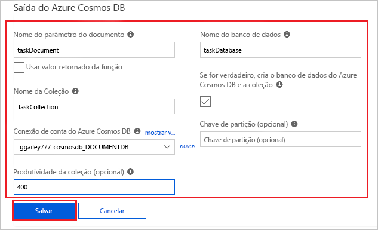
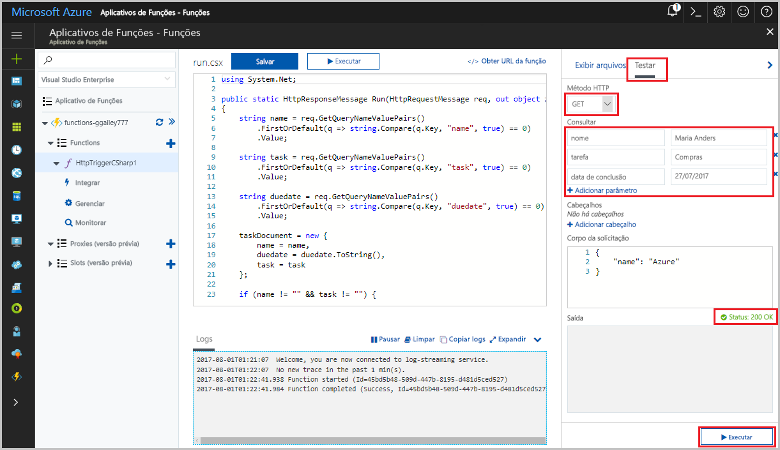
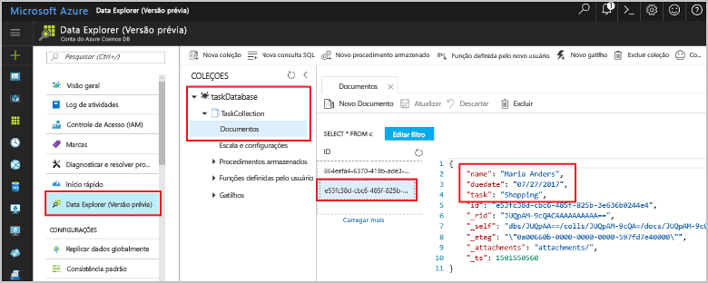

# <a name="store-unstructured-data-using-azure-functions-and-azure-cosmos-db"></a>Armazenar dados não estruturados usando o Azure Functions e o Azure Cosmos DB

O [Azure Cosmos DB](https://azure.microsoft.com/services/cosmos-db/) é uma ótima maneira de armazenar dados não estruturados e JSON. Combinado com o Azure Functions, o Cosmos DB torna o armazenamento de dados rápido e fácil com muito menos código do que o necessário para armazenar dados em um banco de dados relacional.

> [!NOTE]
> Neste momento, o gatilho, as associações de entrada e as associações de saída do Azure Cosmos DB funcionam apenas com contas da API do Graph e a API do SQL.

No Azure Functions, associações de entrada e saída fornecem uma maneira declarativa para se conectar a dados de serviço externo de sua função. Neste tópico, saiba como atualizar uma função existente em C# a fim de adicionar uma associação de saída que armazena dados não estruturados em um documento do Cosmos DB. 


## <a name="prerequisites"></a>pré-requisitos

Para concluir este tutorial:

[!INCLUDE [Previous quickstart note](../../includes/functions-quickstart-previous-topics.md)]

## <a name="add-an-output-binding"></a>Adicionar uma associação de saída

1. Expanda seu aplicativo de funções e sua função.

1. Selecione **Integrar** e **+Nova Saída**, que está na parte superior direita da página. Escolha **Azure Cosmos DB** e clique em **Selecionar**.

    

3. Use a configuração **Saída do Azure Cosmos DB** conforme especificado na tabela: 

    

    | Configuração      | Valor sugerido  | DESCRIÇÃO                                |
    | ------------ | ---------------- | ------------------------------------------ |
    | **Nome do parâmetro do documento** | taskDocument | Nome que se refere ao objeto do Cosmos DB no código. |
    | **Nome do banco de dados** | taskDatabase | Nome do banco de dados para salvar os documentos. |
    | **Nome da coleção** | TaskCollection | Nome da coleção de banco de dados. |
    | **Se for true, cria o banco de dados e a coleção do Cosmos DB** | Verificado | A coleção ainda não existe, então crie uma. |

4. Selecione **Novo** ao lado do rótulo **Conexão de documento do Azure Cosmos DB** e selecione **+ Criar novo**. 

5. Use a configuração de **Nova conta**, conforme especificado na tabela: 

    

    | Configuração      | Valor sugerido  | DESCRIÇÃO                                |
    | ------------ | ---------------- | ------------------------------------------ |
    | **ID** | Nome do banco de dados | ID exclusiva para o banco de dados do Azure Cosmos DB  |
    | **API** | SQL | Selecione a API do SQL. Neste momento, o gatilho, as associações de entrada e as associações de saída do Azure Cosmos DB funcionam apenas com contas da API do Graph e a API do SQL. |
    | **Assinatura** | Assinatura do Azure | Assinatura do Azure  |
    | **Grupo de recursos** | myResourceGroup |  Use o grupo de recursos existente que contém seu aplicativo de função. |
    | **Localidade**  | WestEurope | Selecione um local próximo ao seu aplicativo de função ou a outros aplicativos que usam os documentos armazenados.  |

6. Clique em **OK** para criar o banco de dados. A criação do banco de dados pode demorar alguns minutos. Após a criação do banco de dados, a cadeia de conexão de banco de dados é armazenada como uma configuração de aplicativo de função. O nome dessa configuração de aplicativo é inserido na **conexão da conta do Azure Cosmos DB**. 
 
8. Após definir a cadeia de conexão, selecione **Salvar** para criar a associação.

## <a name="update-the-function-code"></a>Atualizar o código de função

Substitua o código existente da função em C# pelo código a seguir:

```csharp
using System.Net;

public static HttpResponseMessage Run(HttpRequestMessage req, out object taskDocument, TraceWriter log)
{
    string name = req.GetQueryNameValuePairs()
        .FirstOrDefault(q => string.Compare(q.Key, "name", true) == 0)
        .Value;

    string task = req.GetQueryNameValuePairs()
        .FirstOrDefault(q => string.Compare(q.Key, "task", true) == 0)
        .Value;

    string duedate = req.GetQueryNameValuePairs()
        .FirstOrDefault(q => string.Compare(q.Key, "duedate", true) == 0)
        .Value;

    taskDocument = new {
        name = name,
        duedate = duedate.ToString(),
        task = task
    };

    if (name != "" && task != "") {
        return req.CreateResponse(HttpStatusCode.OK);
    }
    else {
        return req.CreateResponse(HttpStatusCode.BadRequest);
    }
}

```
Esse exemplo de código lê as cadeias de consulta da Solicitação HTTP e as atribui a campos no objeto `taskDocument`. A associação `taskDocument` envia os dados do objeto desse parâmetro de associação para armazenamento no banco de dados de documento associado. O banco de dados é criado na primeira execução da função.

## <a name="test-the-function-and-database"></a>Testar a função e o banco de dados

1. Expanda a janela direita e selecione **Testar**. Em **Consulta**, clique em **+ Adicionar parâmetro** e adicione os seguintes parâmetros à cadeia de consulta:

    + `name`
    + `task`
    + `duedate`

2. Clique em **Executar** e verifique se um status 200 retorna.

    

1. No lado esquerdo do Portal do Azure, expanda a barra de ícones, digite `cosmos` no campo de pesquisa e selecione **Azure Cosmos DB**.

    

2. Escolha sua conta do Azure Cosmos DB e selecione o **Data Explorer**. 

3. Expanda os nós **Coleções**, selecione o novo documento e confirme se o documento contém os valores de cadeia de consulta, juntamente com alguns metadados adicionais. 

    

Você adicionou com êxito uma associação ao gatilho HTTP que armazena dados não estruturados em um Azure Cosmos DB.

[!INCLUDE [Clean-up section](../../includes/clean-up-section-portal.md)]

## <a name="next-steps"></a>Próximas etapas

[!INCLUDE [functions-quickstart-next-steps](../../includes/functions-quickstart-next-steps.md)]

Para saber mais sobre a associação a um banco de dados Cosmos DB, veja [Associações do Azure Functions Cosmos DB](functions-bindings-cosmosdb.md).
