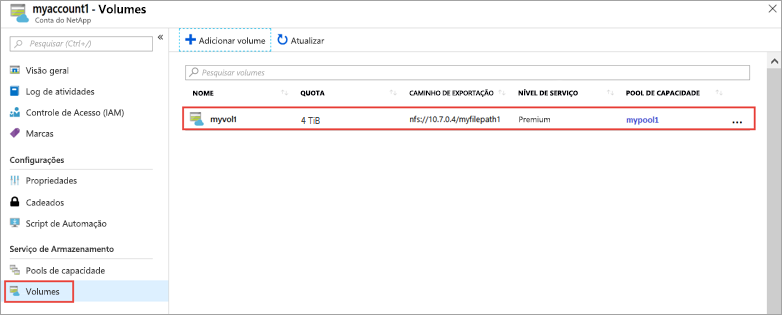

# Configurar o Azure NetApp Files e criar um volume 

Este artigo mostra como configurar os arquivos do Azure NetApp rapidamente e criar um volume. 

## Antes de começar 

É necessário fazer parte do programa de Versão Prévia Pública e estar na lista de permissões para acessar o Provedor de recursos do Microsoft.NetApp. Para obter mais detalhes sobre como ingressar no programa de Visualização Pública, confira a [Página de inscrição de versão prévia pública do Azure NetApp Files](https://aka.ms/nfspublicpreview). 

## Registre-se para os arquivos do Azure do NetApp e provedor de recursos do NetApp

1. No portal do Azure, clique no ícone do Azure Cloud Shell no canto superior direito.

      

2. Especifique a assinatura que tenha sido na lista de permissões para arquivos do NetApp do Azure:
    
        az account set --subscription <subscriptionId>

3. Registre o provedor de recursos do Azure: 
    
        az provider register --namespace Microsoft.NetApp --wait  

    O processo de registro pode levar algum tempo para ser concluído.

## Criar uma conta do NetApp

1. Na caixa de pesquisa do portal do Azure, insira **os arquivos do Azure NetApp** e, em seguida, selecione **arquivos NetApp do Azure (visualização)** da lista que aparece.

      

2. Clique em **+ Adicionar** para criar uma nova conta do NetApp.

     

3. Na janela de nova conta do NetApp, forneça as seguintes informações: 
   1. Insira **myaccount1** para o nome da conta. 
   2. Selecione sua assinatura.
   3. Selecione **criar novo** para criar novo grupo de recursos. Insira **myRG1** para o nome do grupo de recursos. Clique em **OK**. 
   4. Selecione o local da conta.  

        

      

4. Clique em **criar** para criar sua nova conta do NetApp.

## Configurar um pool de capacidade

1. Na folha de gerenciamento de arquivos do Azure NetApp, selecione sua conta do NetApp (**myaccount1**).

      

2. Na folha de gerenciamento do Azure NetApp arquivos da sua conta do NetApp, clique em **pools de capacidade**.

      

3. Clique em **+ adicionar pools**. 

      

4. Forneça informações para o pool de capacidade: 
    1. Insira **mypool1** como o nome do pool.
    2. Selecione **Premium** do nível de serviço. 
    3. Especificar **4 (TiB)** como o tamanho do pool. 

5. Clique em **OK**.

## Criar um volume para Azure NetApp Files

1. Na folha de gerenciamento do Azure NetApp arquivos da sua conta do NetApp, clique em **Volumes**.

      

2. Clique em **+ Adicionar volume**.

      

3. Criar uma janela de Volume, forneça informações para o volume: 
   1. Insira **myvol1** como o nome do volume. 
   2. Insira **myfilepath1** como o caminho do arquivo que será usado para criar o caminho de exportação para o volume.
   3. Selecione o pool de capacidade (**mypool1**).
   4. Use o valor padrão para a cota. 
   5. Em uma rede virtual, clique em **criar novo** para criar uma nova rede do Azure virtual (Vnet).  Em seguida, preencha as informações a seguir:
       * Insira **myvnet1** como o nome de rede virtual.
       * Especifique um espaço de endereço para a sua configuração, por exemplo, 10.7.0.0/16
       * Insira **myANFsubnet** como o nome da sub-rede.
       * Especifique o intervalo de endereços de sub-rede, por exemplo, 10.7.0.0/24. Observe que você não pode compartilhar a sub-rede dedicada com outros recursos.
       * Selecione **Microsoft.NetApp/volumes** para delegação de sub-rede.
       * Clique em **Okey** para criar a rede virtual.
   6. Na sub-rede, selecione a rede virtual recém-criada (**myvnet1**) como a sub-rede de delegado.

        

        

4. Clique em **Revisar + Criar**.

      

5. Examinar as informações de volume e clique em **criar**.  
    O volume criado aparece na folha de Volumes.

      

## Próximas etapas  

* [Compreender a hierarquia de armazenamento do Azure NetApp Files](azure-netapp-files-understand-storage-hierarchy.md)
* [Gerenciar volumes por meio de arquivos do Azure NetApp](azure-netapp-files-manage-volumes.md) 
