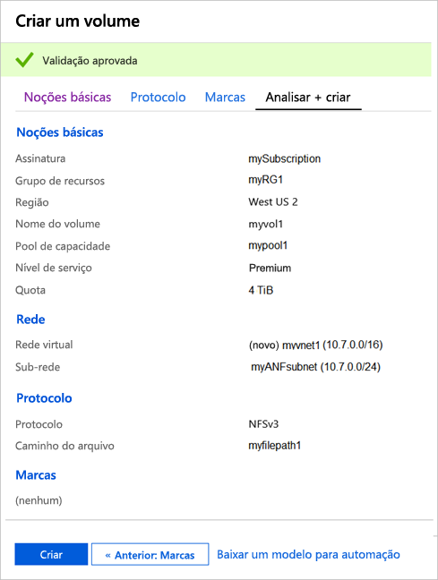

# Configurar o Azure NetApp Files e criar um volume 

Este artigo mostra como configurar rapidamente o Azure NetApp Files e criar um volume. 

## Antes de começar 

É necessário fazer parte do programa de Versão Prévia Pública e estar na lista de permissões para acessar o Provedor de recursos do Microsoft.NetApp. Para obter mais detalhes sobre como ingressar no programa de Visualização Pública, confira a [Página de inscrição de versão prévia pública do Azure NetApp Files](https://aka.ms/nfspublicpreview). 

## Registrar-se no Azure NetApp Files e no provedor de recursos do NetApp

1. No portal do Azure, clique no ícone do Azure Cloud Shell no canto superior direito.

      

2. Especifique a assinatura que foi incluída na lista de permissões para o Azure NetApp Files:
    
        az account set --subscription <subscriptionId>

3. Registre o provedor de recursos do Azure: 
    
        az provider register --namespace Microsoft.NetApp --wait  

    O processo de registro pode levar algum tempo para ser concluído.

## Criar uma conta do NetApp

1. Na caixa de pesquisa do portal do Azure, insira **Azure NetApp Files** e, em seguida, selecione **Azure NetApp Files (versão prévia)** na lista exibida.

      

2. Clique em **+ Adicionar** para criar uma nova conta do NetApp.

     

3. Na janela Nova Conta do NetApp, forneça as seguintes informações: 
   1. Insira **myaccount1** para o nome da conta. 
   2. Selecione sua assinatura.
   3. Selecione **Criar novo** para criar o grupo de recursos. Insira **myRG1** para o nome do grupo de recursos. Clique em **OK**. 
   4. Selecione a localização da conta.  

        

      

4. Clique em **Criar** para criar sua conta do NetApp.

## Configurar um pool de capacidade

1. Na folha de gerenciamento do Azure NetApp Files, selecione sua conta do NetApp (**myaccount1**).

      

2. Na folha de gerenciamento do Azure NetApp Files de sua conta do NetApp, clique em **Pools de capacidade**.

      

3. Clique em **+ Adicionar pools**. 

      

4. Forneça informações para o pool de capacidade: 
    1. Insira **mypool1** como o nome do pool.
    2. Selecione **Premium** para o nível de serviço. 
    3. Especifique **4 (TiB)** como o tamanho do pool. 

5. Clique em **OK**.

## Criar um volume para Azure NetApp Files

1. Na folha de gerenciamento do Azure NetApp Files de sua conta do NetApp, clique em **Volumes**.

      

2. Clique em **+ Adicionar volume**.

      

3. Na janela Criar um Volume, forneça informações para o volume: 
   1. Insira **myvol1** como o nome do volume. 
   2. Insira **myfilepath1** como o caminho do arquivo que será usado para criar o caminho de exportação para o volume.
   3. Selecione o pool de capacidade (**mypool1**).
   4. Use o valor padrão para a cota. 
   5. Na rede virtual, clique em **Criar nova** para criar uma VNET (rede virtual) do Azure.  Em seguida, preencha as seguintes informações:
       * Insira **myvnet1** como o nome da VNET.
       * Especifique um espaço de endereço para a configuração, por exemplo, 10.7.0.0/16
       * Insira **myANFsubnet** como o nome da sub-rede.
       * Especifique o intervalo de endereços da sub-rede, por exemplo, 10.7.0.0/24. Observe que não é possível compartilhar a sub-rede dedicada com outros recursos.
       * Selecione **Microsoft.NetApp/volumes** para a delegação da sub-rede.
       * Clique em **OK** para criar a VNET.
   6. Na sub-rede, selecione a VNET recém-criada (**myvnet1**) como a sub-rede delegada.

        

        

4. Clique em **Revisar + Criar**.

      

5. Examine as informações do volume e, em seguida, clique em **Criar**.  
    O volume criado será exibido na folha Volumes.

      

## Próximas etapas  

* [Compreender a hierarquia de armazenamento do Azure NetApp Files](azure-netapp-files-understand-storage-hierarchy.md)
* [Gerenciar volumes usando o Azure NetApp Files](azure-netapp-files-manage-volumes.md) 
