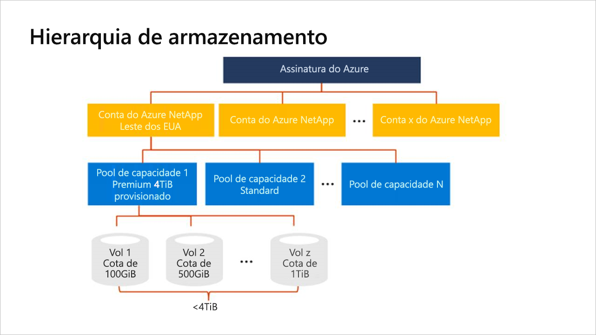

# Compreender a hierarquia de armazenamento do Azure NetApp Files

Antes de criar um volume no Azure NetApp Files, você deve adquirir e configurar um pool de capacidade provisionada.  Para configurar um pool de capacidade, é preciso ter uma conta do NetApp. Entender a hierarquia de armazenamento ajuda a configurar e gerenciar os recursos do Azure NetApp Files.

## Contas do NetApp

- Uma conta do NetApp serve como um agrupamento administrativo de pools de capacidade constituintes.  
- Uma conta da NetApp não é igual à sua conta geral de armazenamento do Azure. 
- Uma conta do NetApp é regional no escopo.   
- Você pode ter várias contas da NetApp em uma região, mas cada conta do NetApp é vinculada a apenas uma única região.

## Pools de capacidade

- Um pool de capacidade é medido pela sua capacidade provisionada.  
- A capacidade é provisionada pelos SKUs fixos comprados (por exemplo, uma capacidade de 4 TB).
- O tamanho mínimo de um pool de capacidade único é 4 TiB e o tamanho máximo é 500 TiB. 
- Um pool de capacidade só pode ter um nível de serviço.  
  Atualmente, apenas o nível de serviço Premium está disponível.
- Cada pool de capacidade pode pertencer a apenas uma conta do NetApp. No entanto, é possível ter vários pools de capacidade dentro de uma conta do NetApp.  
- Os pools de capacidade não podem ser movidos pelas contas do NetApp.   
  Por exemplo, no [Diagrama conceitual da hierarquia de armazenamento](#conceptual_diagram_of_storage_hierarchy) abaixo, o Pool de capacidade 1 não pode ser movido da conta do NetApp do Leste dos EUA para a conta do NetApp do Oeste dos EUA 2.  

## Volumes

- Um volume é medido pelo consumo da capacidade lógica e é dimensionável. O tamanho mínimo de um volume único é 100 GiB e o tamanho máximo é 92 TiB.
- O consumo de capacidade de um volume conta contra a capacidade provisionada do pool desse volume.
-   É possível ter, no máximo, 100 volumes por assinatura do Azure por região. 
- Cada volume pertence a apenas um pool, mas um pool pode conter vários volumes. 
- Dentro da mesma conta do NetApp, você pode mover um volume pelos pools.    
  Por exemplo, no [Diagrama conceitual da hierarquia de armazenamento](#conceptual_diagram_of_storage_hierarchy) abaixo, você pode mover volumes do Pool de capacidade 1 para o Pool de capacidade 2.

## Diagrama conceitual da hierarquia de armazenamento 
O exemplo a seguir mostra as relações da assinatura do Azure, contas do NetApp, pools de capacidade e volumes.   

## Próximas etapas

- [Limites de recursos do Azure NetApp Files](azure-netapp-files-resource-limits.md)
- [Registro no Azure NetApp Files](azure-netapp-files-register.md)
