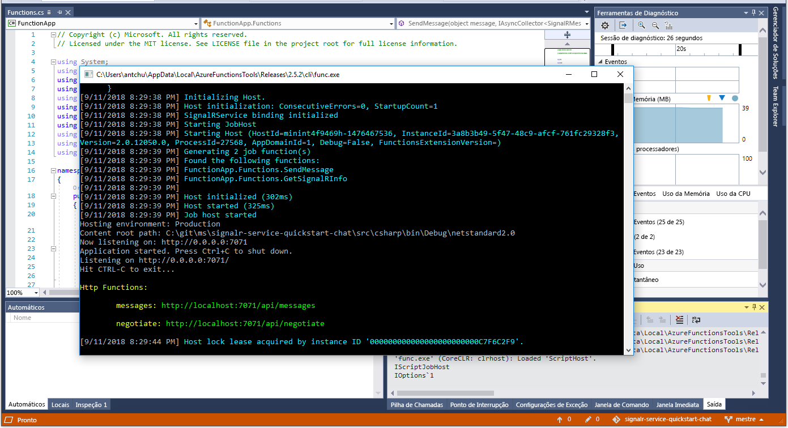

# <a name="quickstart-create-a-chat-room-with-azure-functions-and-signalr-service-using-c"></a>Início Rápido: criar uma sala de chat com o Azure Functions e o Serviço do SignalR usando C\#

O Azure SignalR Service permite adicionar facilmente a funcionalidade em tempo real ao seu aplicativo. O Azure Functions é uma plataforma sem servidor que permite executar seu código sem gerenciar qualquer infraestrutura. Neste início rápido, saiba como usar o SignalR Service e o Functions para criar um aplicativo de chat em tempo real e sem servidor.

## <a name="prerequisites"></a>Pré-requisitos

Se você ainda não tem o Visual 2017 Studio instalado, poderá baixar e usar o **Visual Studio 2017 Community Edition** [gratuito](https://www.visualstudio.com/downloads/). Verifique se você habilitou o **desenvolvimento do Azure** durante a instalação do Visual Studio.

Você também pode executar este tutorial na linha de comando (macOS, Windows ou Linux) usando as [Azure Functions Core Tools (v2)](https://github.com/Azure/azure-functions-core-tools#installing), o [SDK do .NET Core](https://dotnet.microsoft.com/download)e seu editor de código favorito.

[!INCLUDE [quickstarts-free-trial-note](../../includes/quickstarts-free-trial-note.md)]

## <a name="log-in-to-azure"></a>Fazer logon no Azure

Entre no portal do Azure em <https://portal.azure.com/> com sua conta do Azure.

[!INCLUDE [Create instance](includes/signalr-quickstart-create-instance.md)]

[!INCLUDE [Clone application](includes/signalr-quickstart-clone-application.md)]

## <a name="configure-and-run-the-azure-function-app"></a>Configurar e executar o aplicativo do Azure Functions

1. Inicie o Visual Studio (ou outro editor de códigos) e abra a solução na pasta *src/chat/csharp* do repositório clonado.

1. No navegador em que o portal do Azure é aberto, confirme se a instância do SignalR Service implantada anteriormente foi criada com êxito pesquisando pelo nome na caixa de pesquisa na parte superior do portal. Selecione a instância para abri-la.

    

1. Selecione **Chaves** para exibir as cadeias de conexão para a instância do SignalR Service.

1. Selecione e copie a cadeia de conexão primária.

1. No Visual Studio, no Gerenciador de Soluções, renomeie *local.settings.sample.json* como *local.settings.json*.

1. Em **local.settings.json**, cole a cadeia de conexão no valor da configuração **AzureSignalRConnectionString**. Salve o arquivo.

1. Abra **Functions.cs**. Há duas funções de gatilho HTTP nesse aplicativo de funções:

    - **GetSignalRInfo** – usa a associação de entrada *SignalRConnectionInfo* para gerar e retornar informações de conexão válidas.
    - **SendMessage** – recebe uma mensagem de chat no corpo da solicitação e usa a associação de saída *SignalR* para difundir a mensagem a todos os aplicativos cliente conectados.

1. Use uma das opções a seguir para iniciar o aplicativo de Funções do Azure localmente.

    - **Visual Studio**: No menu *Depurar*, selecione *Iniciar depuração* para executar o aplicativo.

        

    - **Linha de comando**: Execute o comando a seguir para iniciar o host da função.

        ```bash
        func start
        ```

[!INCLUDE [Run web application](includes/signalr-quickstart-run-web-application.md)]

[!INCLUDE [Cleanup](includes/signalr-quickstart-cleanup.md)]

## <a name="next-steps"></a>Próximas etapas

Neste início rápido, você criou e executou um aplicativo sem servidor em tempo real no Visual Studio. Em seguida, saiba mais sobre como desenvolver e implantar o Azure Functions com o Visual Studio.

> [!div class="nextstepaction"]
> [Desenvolver o Azure Functions usando o Visual Studio](../azure-functions/functions-develop-vs.md)