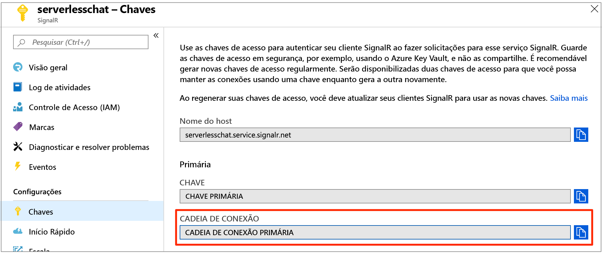

# <a name="quickstart-create-a-chat-room-with-azure-functions-and-signalr-service-using-javascript"></a>Início Rápido: Criar uma sala de chat com o Azure Functions e o Serviço do SignalR usando JavaScript

O Azure SignalR Service permite adicionar facilmente a funcionalidade em tempo real ao seu aplicativo. O Azure Functions é uma plataforma sem servidor que permite executar seu código sem gerenciar qualquer infraestrutura. Neste início rápido, saiba como usar o SignalR Service e o Functions para criar um aplicativo de chat em tempo real e sem servidor.

## <a name="prerequisites"></a>Pré-requisitos

Este início rápido pode ser executado no macOS, Windows ou Linux.

Certifique-se de ter um editor de código, como [Visual Studio Code](https://code.visualstudio.com/), instalado.

Instale o [Azure Functions Core Tools (v2)](https://github.com/Azure/azure-functions-core-tools#installing) para executar aplicativos do Azure Functions localmente.

O Azure Functions requer o [Node.js](https://nodejs.org/en/download/) versão 8 ou 10.

Para instalar extensões, o Azure Functions Core Tools atualmente exige o [SDK do .NET Core](https://www.microsoft.com/net/download) instalado. No entanto, não é necessário nenhum conhecimento do .NET para criar aplicativos do Azure Functions no JavaScript.

[!INCLUDE [quickstarts-free-trial-note](../../includes/quickstarts-free-trial-note.md)]

## <a name="log-in-to-azure"></a>Fazer logon no Azure

Entre no portal do Azure em <https://portal.azure.com/> com sua conta do Azure.

[!INCLUDE [Create instance](includes/signalr-quickstart-create-instance.md)]

[!INCLUDE [Clone application](includes/signalr-quickstart-clone-application.md)]

## <a name="configure-and-run-the-azure-function-app"></a>Configurar e executar o aplicativo do Azure Functions

1. No navegador em que o portal do Azure é aberto, confirme se a instância do SignalR Service implantada anteriormente foi criada com êxito pesquisando pelo nome na caixa de pesquisa na parte superior do portal. Selecione a instância para abri-la.

    

1. Selecione **Chaves** para exibir as cadeias de conexão para a instância do SignalR Service.

1. Selecione e copie a cadeia de conexão primária.

    

1. No editor de códigos, abra a pasta *src/chat/javascript* no repositório clonado.

1. Renomeie *local.settings.sample.json* como *local.settings.json*.

1. Em **local.settings.json**, cole a cadeia de conexão no valor da configuração **AzureSignalRConnectionString**. Salve o arquivo.

1. As funções JavaScript são organizadas em pastas. Há dois arquivos em cada pasta: *function.json* define as associações que são usadas na função, e *index.js* é o corpo da função. Há duas funções de gatilho HTTP nesse aplicativo de funções:

    - **negociar** – usa a associação de entrada *SignalRConnectionInfo* para gerar e retornar informações de conexão válidas.
    - **mensagens** – recebe uma mensagem de chat no corpo da solicitação e usa a associação de saída *SignalR* para difundir a mensagem a todos os aplicativos cliente conectados.

1. No terminal, verifique se você está na pasta *src/chat/javascript*. Use o Azure Functions Core Tools para instalar as extensões necessárias para executar o aplicativo.

    ```bash
    func extensions install
    ```

1. Execute o aplicativo de funções.

    ```bash
    func start
    ```

    

[!INCLUDE [Run web application](includes/signalr-quickstart-run-web-application.md)]

[!INCLUDE [Cleanup](includes/signalr-quickstart-cleanup.md)]

## <a name="next-steps"></a>Próximas etapas

Neste início rápido, você criou e executou um aplicativo sem servidor em tempo real no VS Code. Em seguida, saiba mais sobre como implantar o Azure Functions do VS Code.

> [!div class="nextstepaction"]
> [Implantar o Azure Functions com o VS Code](https://code.visualstudio.com/tutorials/functions-extension/getting-started)
