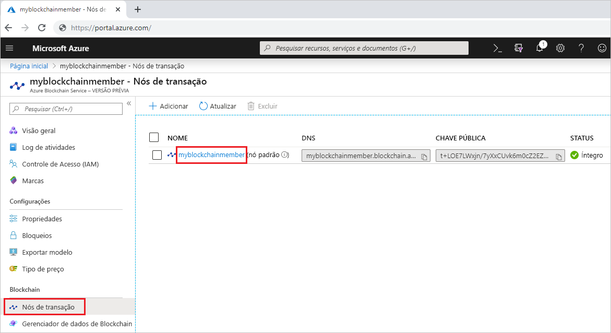
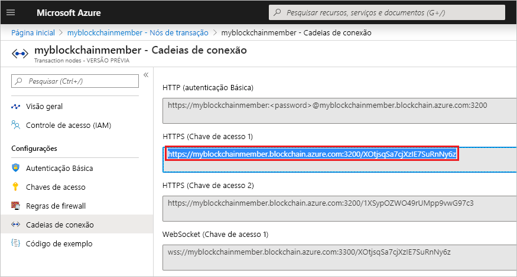
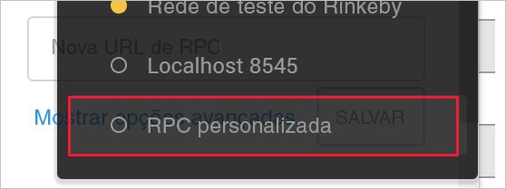
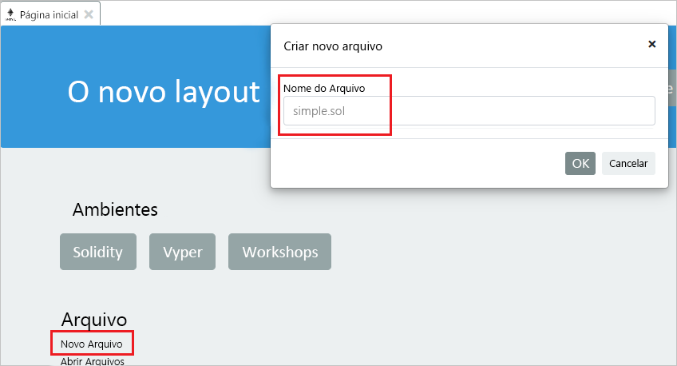
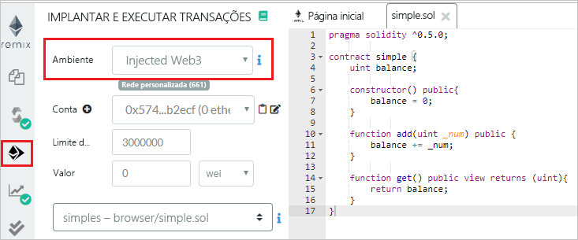

# <a name="quickstart-use-metamask-to-connect-and-deploy-a-smart-contract"></a>Início Rápido: Usar o MetaMask para se conectar e implantar um contrato inteligente

Neste Início Rápido, você usará o MetaMask para se conectar a uma rede do serviço Azure Blockchain e usará o Remix para implantar um contrato inteligente. O MetaMask é uma extensão do navegador para gerenciar uma carteira Ether e executar ações de contrato inteligente.

[!INCLUDE [quickstarts-free-trial-note](../../../includes/quickstarts-free-trial-note.md)]

## <a name="prerequisites"></a>Pré-requisitos

* Concluir [Início Rápido: Criar um membro do blockchain usando o portal do Azure](create-member.md) ou [Início Rápido: Criar um membro do blockchain do Azure Blockchain Service usando a CLI do Azure](create-member-cli.md)
* Instalar a [extensão do navegador MetaMask](https://metamask.io)
* Gerar uma [carteira](https://metamask.zendesk.com/hc/en-us/articles/360015488971-New-to-MetaMask-Learn-How-to-Setup-MetaMask-the-First-Time) do MetaMask

## <a name="get-endpoint-address"></a>Obter o endereço do ponto de extremidade

É necessário o endereço do ponto de extremidade do serviço Azure Blockchain para se conectar à rede do blockchain. Encontre o endereço do ponto de extremidade e as chaves de acesso no portal do Azure.

1. Entre no [Portal do Azure](https://portal.azure.com).
1. Navegue para o membro do serviço Azure Blockchain. Selecione **Nós de transação** e o link do nó de transação padrão.

    

1. Selecione **Cadeias de conexão > Chaves de acesso**.
1. Copie o endereço do ponto de extremidade de **HTTPS (Chave de acesso 1)** . Você precisará do endereço para a próxima seção.

    

## <a name="connect-metamask"></a>Conectar o MetaMask

1. Abra a extensão do navegador MetaMask e entre nela.
1. No menu suspenso da rede, selecione **RPC Personalizada**.

    

1. Em **Nova Rede > URL da Nova RPC**, insira o endereço do ponto de extremidade copiado da seção anterior.
1. Clique em **Salvar**.

    Se a conexão for bem-sucedida, a rede privada será exibida no menu suspenso da rede.

    

## <a name="deploy-smart-contract"></a>Implantar o contrato inteligente

O Remix é um ambiente de desenvolvimento do Solidity baseado em navegador. Usando o MetaMask e o Remix juntos, você pode implantar e executar ações em contratos inteligentes.

1. No navegador, navegue até `https://remix.ethereum.org`.
1. Selecione **Novo arquivo** na guia **Página Inicial** em **Arquivo**.

    Nomeie o novo arquivo `simple.sol`.

    

    Selecione **OK**.
1. No editor do Remix, cole o código do **contrato inteligente simples** a seguir.

    ```solidity
    pragma solidity ^0.5.0;
             
    contract simple {
        uint balance;
                 
        constructor() public{
            balance = 0;
        }
                 
        function add(uint _num) public {
            balance += _num;
        }
                 
        function get() public view returns (uint){
            return balance;
        }
    }
    ```

    O **contrato simples** declara uma variável de estado chamada **saldo**. Há duas funções definidas. A função **add** adiciona um número para obter o **saldo**. A função **get** retorna o valor do **saldo**.
1. Para compilar o contrato, primeiro selecione o painel do compilador Solidity e, em seguida, selecione **Compilar simple.sol**. 

    

1. Selecione o painel **Implantar e Executar** e defina o **Ambiente** como **Web3 Injetado** para se conectar por meio de MetaMask ao seu membro de blockchain.

    

1. Selecione o contrato **simples** e, em seguida, **Implantar**.

    


1. Uma notificação do MetaMask é exibida, alertando-o de fundos insuficientes para executar a transação.

    Para uma rede de blockchain pública, você precisará do Ether para pagar o custo de transação. Como essa é uma rede privada em um consórcio, você pode definir o preço do gás como zero.

1.  Selecione **Valor do Gás > Editar > Avançado** e defina o **Preço do Gás** como 0.

    

    Clique em **Salvar**.

1. Selecione **Confirmar** para implantar o contrato inteligente no blockchain.
1. Na seção **Contratos Implantados**, expanda o contrato **simples**.

    

    Existem duas ações **adicionar** e **obter** que são mapeadas para as funções definidas no contrato.

1. Para executar uma transação **adicionar** no blockchain, insira um número a ser adicionado e, em seguida, selecione **adicionar**. Você pode receber uma mensagem de falha na estimativa de gás do Remix. Você enviará uma transação a um blockchain privado que não requer gás. Selecione **Enviar Transação** para forçar a transação.
1. Assim como quando você implantou o contrato, uma notificação do MetaMask é exibida, alertando-o de fundos insuficientes para executar a transação.

    Como essa é uma rede privada em um consórcio, podemos definir o preço do gás como zero.

1.  Selecione **Valor do Gás > Editar > Avançado**, defina o **Preço do Gás** como 0 e selecione **Salvar**.
1. Selecione **Confirmar** para enviar a transação ao blockchain.
1. Selecione a ação **obter**. Essa é uma chamada para consultar os dados do nó. Uma transação não é necessária.
1. No painel de depuração do Remix, é possível ver detalhes sobre as transações no blockchain.

    

    Você poderá ver a criação do contrato **simples**, a transação para **simple.add** e a chamada a **simple.get**.

1. Você também poderá ver o histórico de transações no MetaMask. Abra a extensão do navegador MetaMask.
1. Na seção **Histórico**, você poderá ver um log do contrato implantado e das transações.

## <a name="next-steps"></a>Próximas etapas

Neste Início Rápido, você usou a extensão do navegador MetaMask para se conectar a um nó de transação do serviço Azure Blockchain, implantar um contrato inteligente e enviar uma transação ao blockchain. Experimente o próximo tutorial para usar o Azure Blockchain Development Kit para Ethereum e Truffle para criar, implantar e executar uma função de contrato inteligente por uma transação.

> [!div class="nextstepaction"]
> [Criar, compilar e implantar contratos inteligentes no Azure Blockchain Service](send-transaction.md)