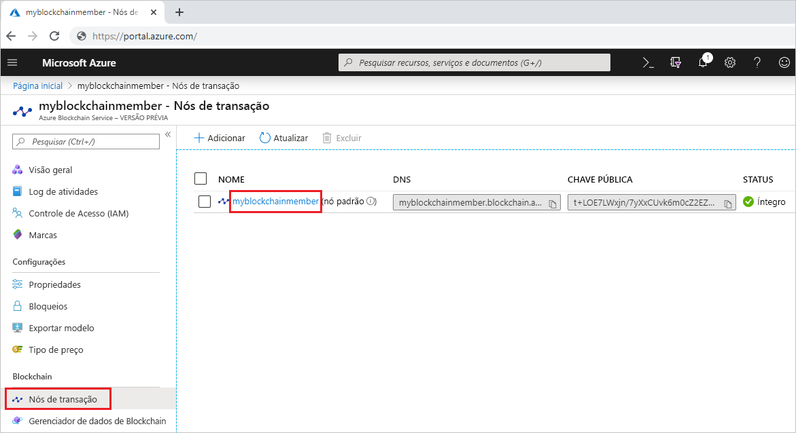
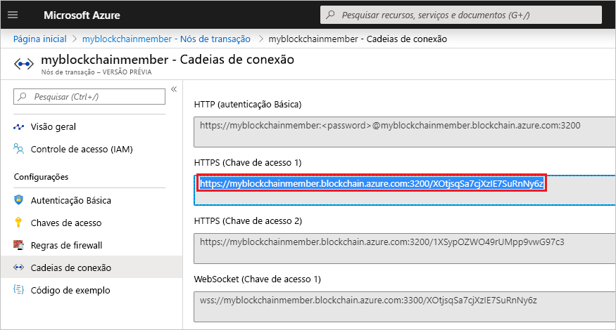

# <a name="quickstart-use-truffle-to-connect-to-azure-blockchain-service"></a>Início Rápido: Usar o Truffle para se conectar ao Azure Blockchain Service

Neste início rápido, você usa o Truffle conectar-se a um nó de transação do Azure Blockchain Service. Em seguida, você usa o console interativo do Truffle para chamar métodos **web3** para interagir com sua rede do blockchain.

[!INCLUDE [quickstarts-free-trial-note](../../../includes/quickstarts-free-trial-note.md)]

## <a name="prerequisites"></a>Pré-requisitos

* Concluir [Início Rápido: Criar um membro do blockchain usando o portal do Azure](create-member.md) ou [Início Rápido: Criar um membro do blockchain do Azure Blockchain Service usando a CLI do Azure](create-member-cli.md)
* Instale o [Truffle](https://github.com/trufflesuite/truffle). O Truffle exige a instalação de várias ferramentas, incluindo [Node.js](https://nodejs.org) e [Git](https://git-scm.com/book/en/v2/Getting-Started-Installing-Git).
* Instale o [Python 2.7.15](https://www.python.org/downloads/release/python-2715/). O Python é necessário para o Web3.

## <a name="create-truffle-project"></a>Criar um projeto do Truffle

1. Abra um prompt de comando ou o shell do Node.js.
1. Altere o diretório para o local em que deseja criar o diretório do projeto do Truffle.
1. Crie um diretório para o projeto e altere o caminho para o novo diretório. Por exemplo,

    ``` bash
    mkdir truffledemo
    cd truffledemo
    ```

1. Inicialize o projeto do Truffle.

    ``` bash
    truffle init
    ```

1. Instale o web3 da API de JavaScript do Ethereum na pasta do projeto. Atualmente, a versão do web3 1.0.0-beta.37 é obrigatória.

    ``` bash
    npm install web3@1.0.0-beta.37
    ```

    Você poderá receber avisos do npm durante a instalação.
    
## <a name="configure-truffle-project"></a>Configurar o projeto do Truffle

Para configurar o projeto do Truffle, você precisa de algumas informações sobre o nó de transação do portal do Azure.

1. Entre no [Portal do Azure](https://portal.azure.com).
1. Acesse o membro do Azure Blockchain Service. Selecione **Nós de transação** e o link do nó de transação padrão.

    

1. Selecione **Cadeias de conexão**.
1. Copie a cadeia de conexão de **HTTPS (Chave de acesso 1)** . Você precisará da cadeia de caracteres para a próxima seção.

    

### <a name="edit-configuration-file"></a>Editar o arquivo de configuração

Em seguida, você precisa atualizar o arquivo de configuração do Truffle com o ponto de extremidade do nó de transação.

1. Na pasta do projeto **truffledemo**, abra o arquivo de configuração do Truffle `truffle-config.js` em um editor.
1. Substitua o conteúdo do arquivo pelas informações de configuração a seguir. Adicione uma variável que contém o endereço do ponto de extremidade. Substitua o colchete angular pelos valores coletados da seção anterior.

    ``` javascript
    var defaultnode = "<default transaction node connection string>";   
    var Web3 = require("web3");
    
    module.exports = {
      networks: {
        defaultnode: {
          provider: new Web3.providers.HttpProvider(defaultnode),
          network_id: "*"
        }
      }
    }
    ```

1. Salve as alterações em `truffle-config.js`.

## <a name="connect-to-transaction-node"></a>Conectar-se ao nó de transação

Usaremos o *Web3* para se conectar ao nó de transação.

1. Use o console do Truffle para conectar-se ao nó de transação padrão. No shell ou prompt de comando, execute o comando a seguir:

    ``` bash
    truffle console --network defaultnode
    ```

    O Truffle conecta-se ao nó de transação padrão e oferece um console interativo.

    Você pode chamar métodos no objeto **web3** para interagir com sua rede do blockchain.

1. Chame o método **getBlockNumber** para retornar o número de bloco atual.

    ```bash
    web3.eth.getBlockNumber();
    ```

    Saída de exemplo:

    ```bash
    truffle(defaultnode)> web3.eth.getBlockNumber();
    18567
    ```
1. Saia do console do Truffle.

    ```bash
    .exit
    ```

## <a name="next-steps"></a>Próximas etapas

Neste início rápido, você usou o Truffle conectar-se a um nó de transação padrão do Azure Blockchain Service e usou o console interativo para retornar o número do bloco do blockchain atual.

Experimente o próximo tutorial para usar o Azure Blockchain Development Kit para Ethereum para criar, implantar e executar uma função de contrato inteligente por uma transação.

> [!div class="nextstepaction"]
> [Criar, compilar e implantar contratos inteligentes no Azure Blockchain Service](send-transaction.md)
