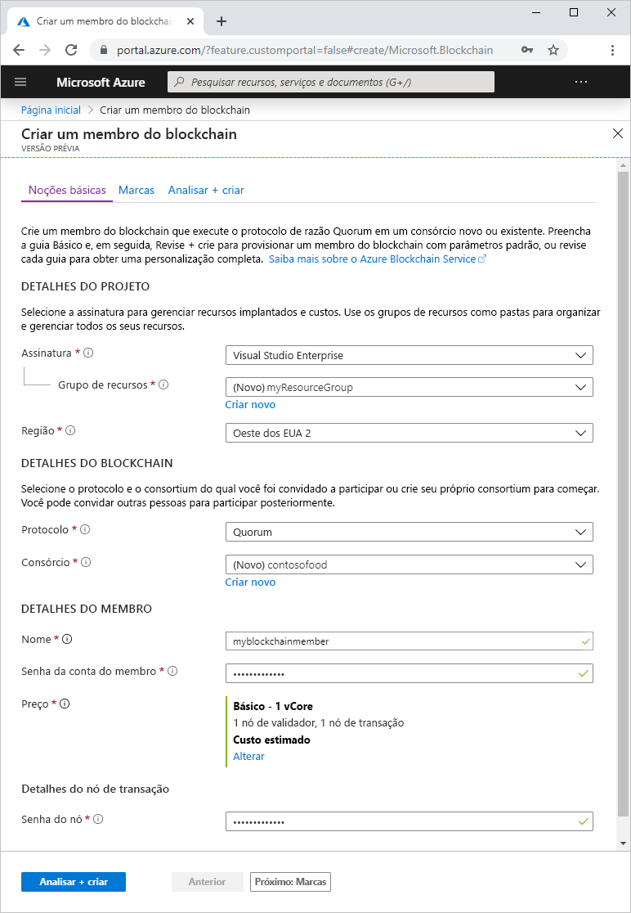
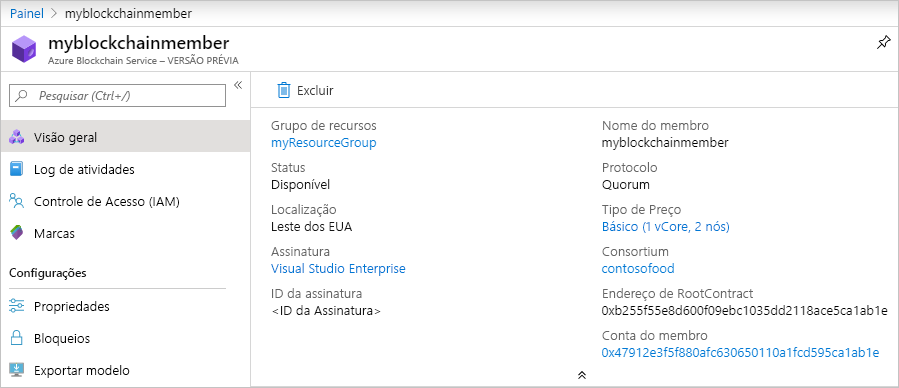

# Início Rápido: Criar um membro do blockchain do Azure Blockchain Service usando o portal do Azure

O serviço Azure Blockchain é uma plataforma de blockchain na qual você pode executar sua lógica de negócios em um contrato inteligente. Este início rápido mostra como começar a criar um membro do blockchain usando o portal do Azure.

[!INCLUDE [quickstarts-free-trial-note](../../../includes/quickstarts-free-trial-note.md)]

## Criar um membro do blockchain

Crie um membro do blockchain que executa o protocolo de razão do Quorum em um consórcio novo ou existente.

1. Entre no [Portal do Azure](https://portal.azure.com).
1. Selecione **Criar um recurso** no canto superior esquerdo do portal do Azure.
1. Selecione **Blockchain** > **Serviço Azure Blockchain**.
1. Conclua o modelo.

    

    Configuração | DESCRIÇÃO
    --------|------------
    Membro do Blockchain | Escolha um nome exclusivo que identifica o membro do blockchain do Azure Blockchain Service. O nome do membro do blockchain só pode conter letras minúsculas e números. O primeiro caractere precisa ser uma letra. O valor precisa ter entre 2 e 20 caracteres.
    Subscription | Selecione a assinatura do Azure que deseja usar para o serviço. Se você tem várias assinaturas, escolha a assinatura na qual recebe a cobrança do recurso.
    Resource group | Um novo nome do grupo de recursos ou um existente de sua assinatura.
    Região | A localização precisa ser a mesma para todos os membros do consórcio.
    Senha da conta de membro | A senha da conta do membro é usada para criptografar a chave privada para a conta do Ethereum criada para o membro. Use a conta do membro e a senha da conta do membro para o gerenciamento do consórcio.
    Nome do consórcio | Para um novo consórcio, insira um nome exclusivo. Se estiver ingressando em um consórcio por meio de um convite, o valor será o consórcio no qual você está ingressando.
    DESCRIÇÃO | Descrição do consórcio.
    Protocolo |  A versão prévia dá suporte ao protocolo do Quorum.
    Preços | A configuração de nó do novo serviço. Selecione **Padrão**. 2 nós de validador e 1 nó de transação são a configuração padrão.
    Senha do nó de transação | A senha do nó de transação padrão do membro. Use a senha para a autenticação básica ao se conectar ao ponto de extremidade público do nó de transação padrão do membro do blockchain.

1. Selecione **Criar** para provisionar o serviço. O provisionamento leva cerca de 10 minutos.
1. Selecione **Notificações** na barra de ferramentas para monitorar o processo de implantação.
1. Após a implantação, navegue para o membro do blockchain.

Selecione **Visão Geral** e exiba as informações básicas sobre seu serviço, incluindo o endereço do RootContract e a conta de membro.

## Limpar recursos

Você pode usar o membro criado para o próximo Início Rápido ou tutorial. Quando eles não forem mais necessários, você poderá excluir os recursos excluindo o grupo de recursos `myResourceGroup` criado pelo serviço Azure Blockchain.

Para excluir o grupo de recursos:

1. No portal do Azure, navegue até **Grupo de recursos** no painel de navegação esquerdo e selecione o grupo de recursos que você deseja excluir.
2. Selecione **Excluir grupo de recursos**. Verifique a exclusão digitando o nome do grupo de recursos e selecione **Excluir**.

## Próximas etapas

> [!div class="nextstepaction"]
> [Usar o MetaMask para se conectar e implantar um contrato inteligente](connect-metamask.md)