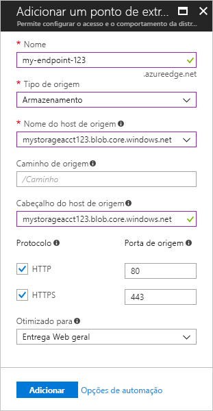
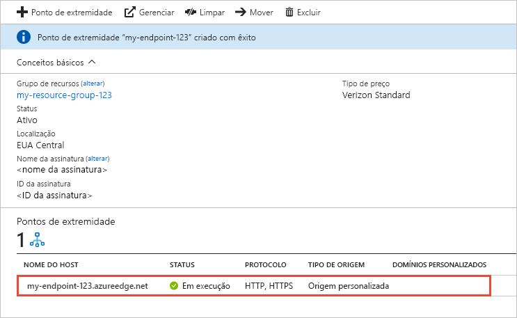

# Início Rápido: criar um ponto de extremidade e um perfil de CDN do Azure
Neste início rápido você habilita a Rede de Distribuição de Conteúdo (CDN) do Azure criando um novo ponto de extremidade e perfil de CDN. Depois de criar um perfil e um ponto de extremidade, você pode iniciar a distribuição de conteúdo para seus clientes.

[!INCLUDE [quickstarts-free-trial-note](../../includes/quickstarts-free-trial-note.md)]

## pré-requisitos
Para os fins deste início rápido, você deve ter criado uma conta de armazenamento denominada *mystorageacct123*, que você usa para o nome de host de origem. Para obter mais informações, confira [Integrar uma conta de armazenamento do Azure com a CDN do Azure](cdn-create-a-storage-account-with-cdn.md).

## Faça logon no Portal do Azure
Faça logon no [Portal do Azure](https://portal.azure.com) com sua conta do Azure.

[!INCLUDE [cdn-create-profile](../../includes/cdn-create-profile.md)]

## Criar um novo ponto de extremidade CDN

Depois de criar um perfil CDN, você pode usá-lo para criar um ponto de extremidade.

1. No portal do Azure, selecione o perfil CDN que você criou em seu painel. Se você não conseguir encontrá-lo, selecione **Todos os serviços** e, em seguida, selecione **Perfis CDN**. Na página **Perfis CDN**, selecione o perfil que você deseja usar. 
   
    A página Perfil CDN é exibida.

2. Selecione o **Ponto de extremidade**.
   
    
   
    O painel **Adicionar um ponto de extremidade** é exibido.

3. Para as configurações do ponto de extremidade, use os valores especificados na tabela a seguir:

    | Configuração | Valor |
    | ------- | ----- |
    | **Nome** | Digite *my-endpoint-123* para seu nome de host do ponto de extremidade. Esse nome deve ser globalmente exclusivo. Caso ele já esteja em uso, você pode inserir um nome diferente. Esse nome será usado para acessar os recursos armazenados em cache no domínio _&lt;nome do ponto de extremidade&gt;_.azureedge.net.|
    | **Tipo de origem** | Selecione **Armazenamento**. | 
    | **Nome do host de origem** | Digite *mystorageacct123.blob.core.windows.net* para seu nome de host. Esse nome deve ser globalmente exclusivo. Caso ele já esteja em uso, você pode inserir um nome diferente. |
    | **Caminho de origem** | Deixe em branco. |
    | **Cabeçalho de host de origem** | Deixe o valor padrão gerado. |  
    | **Protocolo** | Deixe as opções padrão **HTTP** e **HTTPS** selecionadas. |
    | **Porta de origem** | Deixe os valores de porta padrão. | 
    | **Otimizado para** | Deixe a seleção padrão: **Distribuição na Web geral**. |

    

3. Selecione **Adicionar** para criar um novo ponto de extremidade.
   
   Depois que o ponto de extremidade é criado, ele aparece na lista de pontos de extremidade do perfil.
    
   
    
   Como o registro demora um pouco para se propagar, o ponto de extremidade não fica imediatamente disponível para uso: 
   - Para perfis da **CDN Standard do Azure da Microsoft**, a propagação geralmente é concluída em dez minutos. 
   - Para perfis da **CDN Standard do Azure da Akamai**, a propagação normalmente é concluída em um minuto. 
   - Para perfis da **CDN Standard do Azure da Verizon** e **CDN Premium do Azure da Verizon**, a propagação geralmente conclui em 90 minutos. 

## Limpar recursos
Nas etapas anteriores, você criou um perfil CDN e um ponto de extremidade em um grupo de recursos. Salve esses recursos se você deseja ir para as [Próximas etapas](#next-steps) e saiba como adicionar um domínio personalizado em seu ponto de extremidade. No entanto, se você não espera usar esses recursos no futuro, poderá excluí-los ao excluir o grupo de recursos, evitando assim encargos adicionais:

1. No menu à esquerda no portal do Azure, selecione **Grupos de recursos** e, em seguida, selecione **my-resource-group-123**.

2. Na página **Grupo de recursos**, selecione **Excluir grupo de recursos**, digite *my-resource-group-123* na caixa de texto e, em seguida, selecione **Excluir**.

    Essa ação excluirá o grupo de recursos, o perfil e o ponto de extremidade que você criou neste início rápido.

## Próximas etapas
Para saber mais sobre como adicionar um domínio personalizado em seu ponto de extremidade CDN, confira o tutorial a seguir:

> [!div class="nextstepaction"]
> [Tutorial: Adicionar um domínio personalizado ao seu ponto de extremidade da CDN do Azure](cdn-map-content-to-custom-domain.md)

