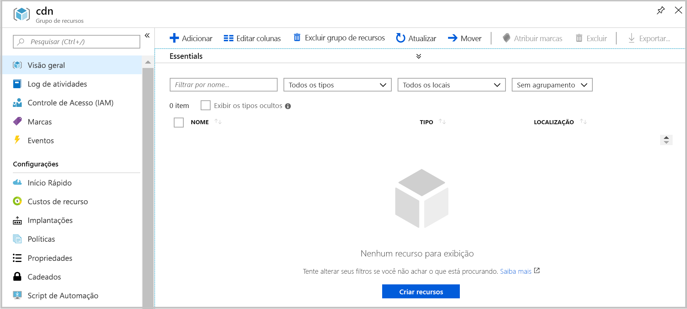

# <a name="quickstart-create-an-azure-cdn-profile-and-endpoint-using-resource-manager-template"></a>Início Rápido: Criar um ponto de extremidade e perfil de CDN do Azure usando um modelo do Resource Manager

Neste início rápido, você implanta um modelo do Azure Resource Manager usando a CLI. O modelo criado por você implanta um perfil de CDN e um ponto de extremidade de CDN para encabeçarem seu aplicativo Web.
Deve levar cerca de dez minutos para concluir essas etapas.

[!INCLUDE [quickstarts-free-trial-note](../../includes/quickstarts-free-trial-note.md)]

## <a name="prequisites"></a>Pré-requisitos

Para os fins deste início rápido, você precisa ter um aplicativo Web para usar como sua origem. O exemplo aplicativo Web de exemplo usado neste início rápido foi implantado em https://cdndemo.azurewebsites.net

Para obter mais informações, confira [Criar um aplicativo Web HTML estático no Azure](https://docs.microsoft.com/azure/app-service/app-service-web-get-started-html).

## <a name="create-a-resource-group"></a>Criar um grupo de recursos

Todos os recursos precisam ser implantados no mesmo grupo de recursos.

Crie o grupo de recursos no local selecionado. Este exemplo mostra a criação de um grupo de recursos chamado cdn na localização Leste dos EUA.

```bash
az group create --name cdn --location eastus
```



## <a name="create-the-resource-manager-template"></a>Criar o modelo do Gerenciador de Recursos

Nesta etapa, você cria um arquivo de modelo que implanta os recursos.

Embora este exemplo explique um cenário de aceleração de site geral, há muitas outras configurações que podem ser realizadas. Essas configurações estão disponíveis na referência de modelo do Azure Resource Manager. Confira as referências para [Perfil CDN](https://docs.microsoft.com/azure/templates/microsoft.cdn/2017-10-12/profiles) e [Ponto de extremidade de perfil CDN](https://docs.microsoft.com/azure/templates/microsoft.cdn/2017-10-12/profiles/endpoints).

Observe que a CDN da Microsoft não dá suporte à modificação da lista de tipo de conteúdo.

Salve o modelo como **resource-manager-cdn.json**.

```json
{
    "$schema": "https://schema.management.azure.com/schemas/2015-01-01/deploymentTemplate.json#",
    "contentVersion": "1.0.0.0",
    "parameters": {
        "cdnProfileSku": {
            "type": "string",
            "allowedValues": [
                "Standard_Microsoft",
                "Standard_Akamai",
                "Standard_Verizon",
                "Premium_Verizon"
            ]
        },
        "endpointOriginHostName": {
            "type": "string"
        }
    },
    "variables": {
        "profile": {
            "name": "[replace(toLower(parameters('cdnProfileSku')), '_', '-')]"
        },
        "endpoint": {
            "name": "[replace(toLower(parameters('endpointOriginHostName')), '.', '-')]",
            "originHostName": "[parameters('endpointOriginHostName')]"
        }
    },
    "resources": [
        {
            "type": "Microsoft.Cdn/profiles",
            "apiVersion": "2017-10-12",
            "location": "[resourceGroup().location]",
            "name": "[variables('profile').name]",
            "sku": {
                "name": "[parameters('cdnProfileSku')]"
            }
        },
        {
            "dependsOn": [
                "[resourceId('Microsoft.Cdn/profiles', variables('profile').name)]"
            ],
            "type": "Microsoft.Cdn/profiles/endpoints",
            "apiVersion": "2017-10-12",
            "location": "[resourceGroup().location]",
            "name": "[concat(variables('profile').name, '/', variables('endpoint').name)]",
            "properties": {
                "hostName": "[concat(variables('endpoint').name, '.azureedge.net')]",
                "originHostHeader": "[variables('endpoint').originHostName]",
                "isHttpAllowed": true,
                "isHttpsAllowed": true,
                "queryStringCachingBehavior": "IgnoreQueryString",
                "origins": [
                    {
                        "name": "[replace(variables('endpoint').originHostName, '.', '-')]",
                        "properties": {
                            "hostName": "[variables('endpoint').originHostName]",
                            "httpPort": 80,
                            "httpsPort": 443
                        }
                    }
                ],
                "contentTypesToCompress": [
                    "application/eot",
                    "application/font",
                    "application/font-sfnt",
                    "application/javascript",
                    "application/json",
                    "application/opentype",
                    "application/otf",
                    "application/pkcs7-mime",
                    "application/truetype",
                    "application/ttf",
                    "application/vnd.ms-fontobject",
                    "application/xhtml+xml",
                    "application/xml",
                    "application/xml+rss",
                    "application/x-font-opentype",
                    "application/x-font-truetype",
                    "application/x-font-ttf",
                    "application/x-httpd-cgi",
                    "application/x-javascript",
                    "application/x-mpegurl",
                    "application/x-opentype",
                    "application/x-otf",
                    "application/x-perl",
                    "application/x-ttf",
                    "font/eot",
                    "font/ttf",
                    "font/otf",
                    "font/opentype",
                    "image/svg+xml",
                    "text/css",
                    "text/csv",
                    "text/html",
                    "text/javascript",
                    "text/js",
                    "text/plain",
                    "text/richtext",
                    "text/tab-separated-values",
                    "text/xml",
                    "text/x-script",
                    "text/x-component",
                    "text/x-java-source"
                ],
                "isCompressionEnabled": true,
                "optimizationType": "GeneralWebDelivery"
            }
        }
    ],
    "outputs": {
        "cdnUrl": {
            "type": "string",
            "value": "[concat('https://', variables('endpoint').name, '.azureedge.net')]"
        }
    }
}
```

## <a name="create-the-resources"></a>Criar os recursos

Implante o modelo usando a CLI do Azure. Será solicitado que você forneça duas entradas:

**cdnProfileSku** – o provedor de CDN que você deseja usar. As opções são:

* Standard_Microsoft
* Standard_Akamai
* Standard_Verizon
* Premium_Verizon.

**endpointOriginHostName** – o ponto de extremidade que será atendido por meio do CDN, por exemplo, cdndemo.azurewebsites.net.

```bash
az group deployment create --resource-group cdn --template-file arm-cdn.json
```


## <a name="view-the-cdn-profile"></a>Exibir o perfil CDN

```bash
az cdn profile list --resource-group cdn -o table
```


## <a name="view-the-cdn-endpoint-for-the-profile-standard-microsoft"></a>Exibir o ponto de extremidade de CDN para o perfil padrão Microsoft

```bash
az cdn endpoint list --profile-name standard-microsoft --resource-group cdn -o table
```


Use o nome do host para exibir o conteúdo. Por exemplo, acesse https://cdndemo-azurewebsites-net.azureedge.net usando seu navegador.

## <a name="clean-up"></a>Limpar

Excluir o grupo de recursos remove automaticamente todos os recursos que foram implantados nele.

```bash
az group delete --name cdn
```


## <a name="references"></a>Referências

* Perfil CDN – [referência de modelo do Azure Resource Manager](https://docs.microsoft.com/azure/templates/microsoft.cdn/2017-10-12/profiles)
* Ponto de extremidade de CDN – [documentação da referência de modelo do Azure Resource Manager](https://docs.microsoft.com/azure/templates/microsoft.cdn/2017-10-12/profiles/endpoints)

## <a name="next-steps"></a>Próximas etapas

Para saber mais sobre como adicionar um domínio personalizado em seu ponto de extremidade CDN, confira o tutorial a seguir:

> [!div class="nextstepaction"]
> [Tutorial: Adicionar um domínio personalizado ao seu ponto de extremidade da CDN do Azure](cdn-map-content-to-custom-domain.md)
