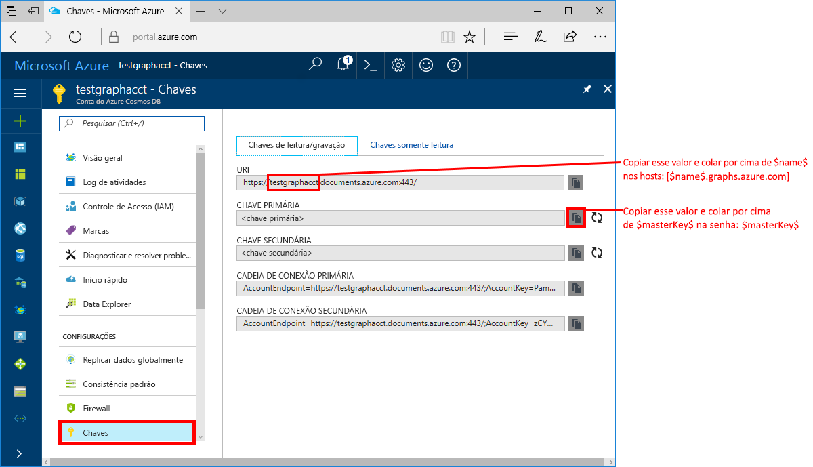
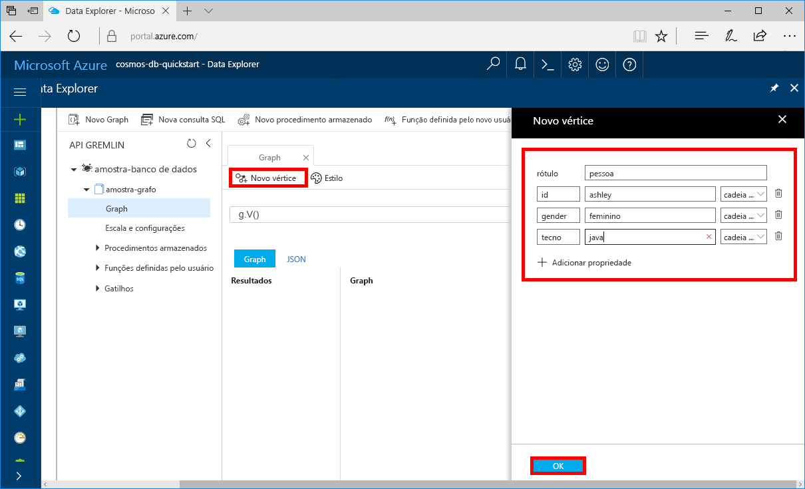
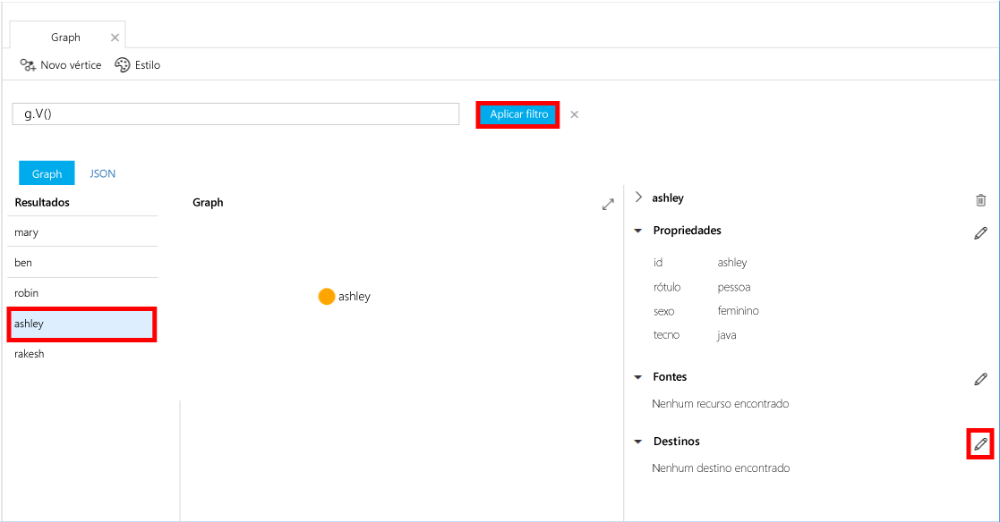

# <a name="quickstart-build-a-graph-database-with-the-java-sdk-and-the-azure-cosmos-db-table-api"></a>Início Rápido: Criar um banco de dados de grafo com o SDK do Java e a API de Tabela do Azure Cosmos DB

> [!div class="op_single_selector"]
> * [Console do Gremlin](create-graph-gremlin-console.md)
> * [.NET](create-graph-dotnet.md)
> * [Java](create-graph-java.md)
> * [Node.js](create-graph-nodejs.md)
> * [Python](create-graph-python.md)
> * [PHP](create-graph-php.md)
>  

O Azure Cosmos DB é o serviço de banco de dados multimodelo distribuído globalmente da Microsoft. Usando o Azure Cosmos DB, você pode criar e consultar rapidamente documentos, tabelas e bancos de dados de grafo gerenciados. 

Este guia de início rápido cria um banco de dados de grafos simples usando as ferramentas do Portal do Azure para o Azure Cosmos DB. Este início rápido também mostra como criar rapidamente um aplicativo de console do Java usando um banco de dados da [API do Gremlin](graph-introduction.md) com o driver [Apache TinkerPop](https://tinkerpop.apache.org/) do OSS. Estas instruções podem ser seguidas em qualquer sistema operacional compatível com Java. Este guia de início rápido familiariza você com a criação e a modificação dos grafos na interface do usuário ou programaticamente, o que for sua preferência. 

## <a name="prerequisites"></a>Pré-requisitos
[!INCLUDE [quickstarts-free-trial-note](../../includes/quickstarts-free-trial-note.md)]

Além disso:

* [Java Development Kit (JDK) versão 8](https://aka.ms/azure-jdks)
    * Defina a variável de ambiente JAVA_HOME para apontar para a pasta onde o JDK está instalado.
* [Baixar](https://maven.apache.org/download.cgi) e [instalar](https://maven.apache.org/install.html) um armazenamento binário [Maven](https://maven.apache.org/)
    * No Ubuntu, você pode executar `apt-get install maven` para instalar o Maven.
* [Git](https://www.git-scm.com/)
    * No Ubuntu, você pode executar `sudo apt-get install git` para instalar o Git.

## <a name="create-a-database-account"></a>Criar uma conta de banco de dados

Antes de criar um banco de dados de grafo, você precisa criar uma conta do banco de dados Gremlin (Graph) com o Azure Cosmos DB.

[!INCLUDE [cosmos-db-create-dbaccount-graph](../../includes/cosmos-db-create-dbaccount-graph.md)]

## <a name="add-a-graph"></a>Adicionar um grafo

[!INCLUDE [cosmos-db-create-graph](../../includes/cosmos-db-create-graph.md)]

## <a name="clone-the-sample-application"></a>Clonar o aplicativo de exemplo

Agora, vamos trabalhar com o código. Vamos clonar um aplicativo de API do Gremlin do GitHub, definir a cadeia de conexão e executá-lo. Você verá como é fácil trabalhar usando dados de forma programática.  

1. Abra um prompt de comando, crie uma nova pasta chamada exemplos de git e feche o prompt de comando.

    ```bash
    md "C:\git-samples"
    ```

2. Abra uma janela de terminal de git, como git bash, e use o comando `cd` para alterar para uma pasta para instalar o aplicativo de exemplo.  

    ```bash
    cd "C:\git-samples"
    ```

3. Execute o comando a seguir para clonar o repositório de exemplo. Este comando cria uma cópia do aplicativo de exemplo no seu computador. 

    ```bash
    git clone https://github.com/Azure-Samples/azure-cosmos-db-graph-java-getting-started.git
    ```

## <a name="review-the-code"></a>Examine o código

Esta etapa é opcional. Se você estiver interessado em aprender como os recursos de banco de dados são criados no código, poderá examinar os snippets de código a seguir. Caso contrário, você poderá pular para [Atualizar sua cadeia de conexão](#update-your-connection-information).

Os snippets de código a seguir são todos obtidos do arquivo C:\git-samples\azure-cosmos-db-graph-java-getting-started\src\GetStarted\Program.java.

* O Gremlin `Client` é inicializado nas configurações do arquivo C:\git-samples\azure-cosmos-db-graph-java-getting-started\src\remote.yaml.

    ```java
    cluster = Cluster.build(new File("src/remote.yaml")).create();
    ...
    client = cluster.connect();
    ```

* Séries de etapas do Gremlin são executadas usando o método `client.submit`.

    ```java
    ResultSet results = client.submit(gremlin);

    CompletableFuture<List<Result>> completableFutureResults = results.all();
    List<Result> resultList = completableFutureResults.get();

    for (Result result : resultList) {
        System.out.println(result.toString());
    }
    ```

## <a name="update-your-connection-information"></a>Atualizar as informações de conexão

Agora, volte ao Portal do Azure para obter as informações de conexão e copiá-las para o aplicativo. Essas configurações permitem que seu aplicativo se comunique com o banco de dados hospedado.

1. No [portal do Azure](https://portal.azure.com/), selecione **Chaves**. 

    Copie a primeira parte do valor do URI.

    
2. Abra o arquivo src/remote.yaml e cole o valor de ID exclusivo em `$name$` em `hosts: [$name$.graphs.azure.com]`.

    A linha 1 do remote.yaml agora deve ser semelhante a 

    `hosts: [test-graph.graphs.azure.com]`

3. Mude `graphs` para `gremlin.cosmosdb` no valor `endpoint`. (Se você criou sua conta de banco de dados do gráfico antes de 20 de dezembro de 2017, não faça nenhuma alteração no valor do ponto de extremidade e vá para a próxima etapa.)

    Agora, o valor de ponto de extremidade deve ter esta aparência:

    `"endpoint": "https://testgraphacct.gremlin.cosmosdb.azure.com:443/"`

4. No Portal do Azure, use o botão de copiar para copiar a CHAVE PRIMÁRIA e cole-a em `$masterKey$` em `password: $masterKey$`.

    A linha 4 do remote.yaml agora deve ser semelhante a 

    `password: 2Ggkr662ifxz2Mg==`

5. Altere a linha 3 do remote.yaml de

    `username: /dbs/$database$/colls/$collection$`

    para 

    `username: /dbs/sample-database/colls/sample-graph`

    Caso tenha usado um nome exclusivo para o banco de dados ou gráfico de exemplo, atualize os valores conforme apropriado.

6. Salve o arquivo remote.yaml.

## <a name="run-the-console-app"></a>Execute o aplicativo de console

1. Na janela do terminal git, `cd` para a pasta azure-cosmos-db-graph-java-getting-started.

    ```git
    cd "C:\git-samples\azure-cosmos-db-graph-java-getting-started"
    ```

2. Na janela do terminal git, use o seguinte comando para instalar os pacotes necessários do Java.

   ```git
   mvn package
   ```

3. Na janela do terminal git, use os comandos a seguir para iniciar o aplicativo Java.
    
    ```git
    mvn exec:java -D exec.mainClass=GetStarted.Program
    ```

    A janela do terminal exibe os vértices sendo adicionados ao grafo. 
    
    Se ocorrerem erros de tempo limite, verifique se você atualizou as informações de conexão corretamente em [Atualizar suas informações de conexão](#update-your-connection-information) e também tente executar o último comando novamente. 
    
    Depois que o programa for interrompido, selecione Enter e, em seguida, alterne novamente para o portal do Azure no navegador da Internet. 

<a id="add-sample-data"></a>
## <a name="review-and-add-sample-data"></a>Revisar e adicionar dados de exemplo

Agora, você pode voltar para o Data Explorer, ver os vértices adicionados ao grafo e acrescentar pontos de dados adicionais.

1. Selecione **Data Explorer**, expanda **sample-graph**, selecione **Grafo** e, em seguida, selecione **Aplicar Filtro**. 

   

2. Na lista **Resultados**, observe os novos usuários adicionados ao grafo. Selecione **ben** e observe que o usuário está conectado a robin. Você pode mover os vértices arrastando e soltando, ampliar e reduzir rolando o botão de rolagem do mouse e expandir o tamanho do grafo com a seta dupla. 

   

3. Vamos adicionar alguns novos usuários. Selecione **Novo Vértice** para adicionar dados ao grafo.

   

4. Na caixa de diálogo, insira *person*.

5. Selecione **Adicionar propriedade** para adicionar cada uma das propriedades a seguir. Observe que você pode criar propriedades exclusivas para cada pessoa no grafo. Somente a chave da id é necessária.

    chave|value|Observações
    ----|----|----
    ID|ashley|O identificador exclusivo do vértice. Se você não especificar uma ID, ela será gerada para você.
    gender|feminino| 
    técnico | java | 

    > [!NOTE]
    > Neste início rápido, você criou uma coleção não particionada. No entanto, se você criar uma coleção particionada especificando uma chave de partição durante a criação da coleção, então, precisará incluir a chave de partição como uma chave em cada novo vértice. 

6. Selecione **OK**. Talvez seja necessário expandir a tela para ver **OK** na parte inferior da tela.

7. Selecione **Novo Vértice** novamente e adicione um novo usuário. 

8. Digite um rótulo de *pessoa*.

9. Selecione **Adicionar propriedade** para adicionar cada uma das seguintes propriedades:

    chave|value|Observações
    ----|----|----
    ID|rakesh|O identificador exclusivo do vértice. Se você não especificar uma ID, ela será gerada para você.
    gender|masculino| 
    escola|MIT| 

10. Selecione **OK**. 

11. Selecione o botão **Aplicar Filtro** com o filtro `g.V()` padrão para exibir todos os valores no grafo. Todos os usuários agora aparecem na lista **Resultados**. 

    Conforme você adiciona mais dados, pode usar os filtros para limitar os resultados. Por padrão, o Data Explorer usa `g.V()` para recuperar todos os vértices em um grafo. Você pode alterá-lo para outra [consulta de grafo](tutorial-query-graph.md), como `g.V().count()`, para retornar uma contagem de todos os vértices no grafo no formato JSON. Se você alterou o filtro, altere o filtro novamente para `g.V()` e selecione **Aplicar Filtro** para exibir todos os resultados novamente.

12. Agora, você pode conectar rakesh e ashley. Verifique se **ashley** está selecionada na lista **Resultados** e, em seguida, selecione  ao lado de **Destinos**, no lado inferior direito. Talvez seja necessário ampliar a janela para ver o botão.

    

13. Na caixa **Destino**, insira *rakesh*. Na caixa **Rótulo de borda**, insira *knows* e, em seguida, marque a caixa de seleção.

    

14. Agora, selecione **rakesh** na lista de resultados e veja se ashley e rakesh estão conectados. 

    

    Isso conclui a parte da criação de recursos deste tutorial. Você pode continuar a adicionar vértices ao seu grafo, modificar os vértices existentes ou alterar as consultas. Agora vamos examinar as métricas que o Azure Cosmos DB fornece e, em seguida, limpar os recursos. 

## <a name="review-slas-in-the-azure-portal"></a>Examinar SLAs no Portal do Azure

[!INCLUDE [cosmosdb-tutorial-review-slas](../../includes/cosmos-db-tutorial-review-slas.md)]

## <a name="clean-up-resources"></a>Limpar recursos

[!INCLUDE [cosmosdb-delete-resource-group](../../includes/cosmos-db-delete-resource-group.md)]

## <a name="next-steps"></a>Próximas etapas

Neste início rápido, você aprendeu como criar uma conta do Azure Cosmos DB, como criar um grafo usando o Data Explorer e como executar um aplicativo. Agora, você pode criar consultas mais complexas e implementar uma lógica de passagem de grafo avançada usando o Gremlin. 

> [!div class="nextstepaction"]
> [Consultar usando o Gremlin](tutorial-query-graph.md)

