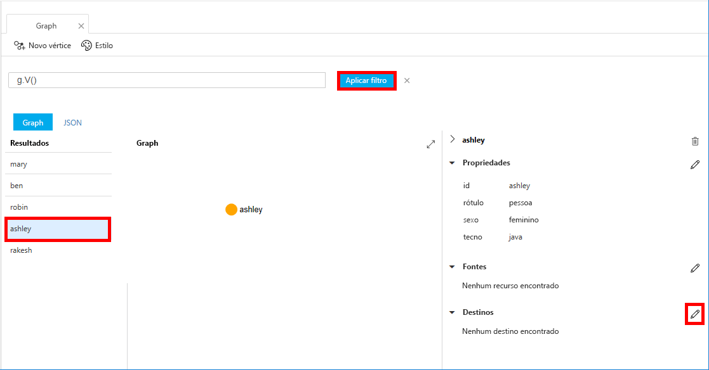
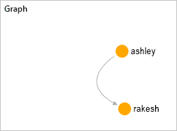

# <a name="quickstart-create-a-graph-database-in-azure-cosmos-db-using-php-and-the-azure-portal"></a>Início Rápido: Criar um banco de dados de grafo no Azure Cosmos DB usando PHP e o portal do Azure

> [!div class="op_single_selector"]
> * [Console do Gremlin](create-graph-gremlin-console.md)
> * [.NET](create-graph-dotnet.md)
> * [Java](create-graph-java.md)
> * [Node.js](create-graph-nodejs.md)
> * [Python](create-graph-python.md)
> * [PHP](create-graph-php.md)
>  

Este início rápido mostra como usar o PHP e a [API do Gremlin](graph-introduction.md) do Azure Cosmos DB para compilar um aplicativo de console clonando um exemplo do GitHub. Este guia de início rápido também mostra as etapas para a criação de uma conta do Azure Cosmos DB usando o Portal do Azure baseado na Web.   

O Azure Cosmos DB é o serviço de banco de dados multimodelo distribuído globalmente da Microsoft. É possível criar e consultar rapidamente documentos, tabelas, valores-chave e bancos de dados de gráfico, todos os quais se beneficiam de recursos de distribuição global e escala horizontal e no núcleo do Azure Cosmos DB.  

## <a name="prerequisites"></a>Pré-requisitos

[!INCLUDE [quickstarts-free-trial-note](../../includes/quickstarts-free-trial-note.md)] Como alternativa, você pode [Experimentar o Azure Cosmos DB gratuitamente](https://azure.microsoft.com/try/cosmosdb/) sem uma assinatura do Azure, sem ônus e sem compromisso.

Além disso:
* [PHP](https://php.net/) 5.6 ou mais recente
* [Compositor](https://getcomposer.org/download/)

## <a name="create-a-database-account"></a>Criar uma conta de banco de dados

Antes de criar um banco de dados de grafo, você precisa criar uma conta do banco de dados Gremlin (Graph) com o Azure Cosmos DB.

[!INCLUDE [cosmos-db-create-dbaccount-graph](../../includes/cosmos-db-create-dbaccount-graph.md)]

## <a name="add-a-graph"></a>Adicionar um grafo

[!INCLUDE [cosmos-db-create-graph](../../includes/cosmos-db-create-graph.md)]

## <a name="clone-the-sample-application"></a>Clonar o aplicativo de exemplo

Agora, vamos trabalhar com o código. Vamos clonar um aplicativo de API do Gremlin do GitHub, definir a cadeia de conexão e executá-lo. Você verá como é fácil trabalhar usando dados de forma programática.  

1. Abra um prompt de comando, crie uma nova pasta chamada exemplos de git e feche o prompt de comando.

    ```bash
    md "C:\git-samples"
    ```

2. Abra uma janela de terminal de git, como git bash, e use o comando `cd` para alterar para uma pasta para instalar o aplicativo de exemplo.  

    ```bash
    cd "C:\git-samples"
    ```

3. Execute o comando a seguir para clonar o repositório de exemplo. Este comando cria uma cópia do aplicativo de exemplo no seu computador. 

    ```bash
    git clone https://github.com/Azure-Samples/azure-cosmos-db-graph-php-getting-started.git
    ```

## <a name="review-the-code"></a>Examine o código

Esta etapa é opcional. Se você estiver interessado em aprender como os recursos de banco de dados são criados no código, poderá examinar os snippets de código a seguir. Os snippets são todos obtidos do arquivo connect.php na pasta C:\git-samples\azure-cosmos-db-graph-php-getting-started\. Caso contrário, você poderá pular para [Atualizar sua cadeia de conexão](#update-your-connection-information). 

* O Gremlin `connection` é inicializado no início do arquivo `connect.php` utilizando o objeto `$db`.

    ```php
    $db = new Connection([
        'host' => '<your_server_address>.graphs.azure.com',
        'username' => '/dbs/<db>/colls/<coll>',
        'password' => 'your_primary_key'
        ,'port' => '443'

        // Required parameter
        ,'ssl' => TRUE
    ]);
    ```

* Uma série de etapas do Gremlin são executadas usando o método `$db->send($query);`.

    ```php
    $query = "g.V().drop()";
    ...
    $result = $db->send($query);
    $errors = array_filter($result);
    }
    ```

## <a name="update-your-connection-information"></a>Atualizar as informações de conexão

Agora, volte ao Portal do Azure para obter as informações de conexão e copiá-las para o aplicativo. Essas configurações permitem que seu aplicativo se comunique com o banco de dados hospedado.

1. No [Portal do Azure](https://portal.azure.com/), clique em **Chaves**. 

    Copie a primeira parte do valor do URI.

    
2. Abra o arquivo `connect.php` e na linha 8 cole o valor do URI em `your_server_address`.

    A inicialização do objeto de conexão agora deve ser semelhante ao código a seguir:

    ```php
    $db = new Connection([
        'host' => 'testgraphacct.graphs.azure.com',
        'username' => '/dbs/<db>/colls/<coll>',
        'password' => 'your_primary_key'
        ,'port' => '443'

        // Required parameter
        ,'ssl' => TRUE
    ]);
    ```

3. Se sua conta de banco de dados do gráfico foi criada em 20 de dezembro de 20, 2017 ou depois dessa data, altere `graphs.azure.com` no nome do host para `gremlin.cosmosdb.azure.com`.

4. Altere o parâmetro `username` no objeto de Conexão com o banco de dados e o nome do gráfico. Se você utilizou os valores recomendados de `sample-database` e `sample-graph`, ele devem ser semelhantes ao código ao seguir:

    `'username' => '/dbs/sample-database/colls/sample-graph'`

    No momento, todo o objeto de Conexão deve parecer com o snippet de código a seguir:

    ```php
    $db = new Connection([
        'host' => 'testgraphacct.graphs.azure.com',
        'username' => '/dbs/sample-database/colls/sample-graph',
        'password' => 'your_primary_key',
        'port' => '443'

        // Required parameter
        ,'ssl' => TRUE
    ]);
    ```

5. No Portal do Azure, utilize o botão de cópia para copiar a CHAVE PRIMÁRIA e cole-a sobre `your_primary_key` no parâmetro de senha.

    Agora, a inicialização do objeto de Conexão deve ser semelhante ao código a seguir:

    ```php
    $db = new Connection([
        'host' => 'testgraphacct.graphs.azure.com',
        'username' => '/dbs/sample-database/colls/sample-graph',
        'password' => '2Ggkr662ifxz2Mg==',
        'port' => '443'

        // Required parameter
        ,'ssl' => TRUE
    ]);
    ```

6. Salve o arquivo `connect.php`.

## <a name="run-the-console-app"></a>Execute o aplicativo de console

1. Na janela do terminal git, `cd` na pasta azure-cosmos-db-graph-php-getting-started.

    ```git
    cd "C:\git-samples\azure-cosmos-db-graph-php-getting-started"
    ```

2. Na janela do terminal git, utilize o seguinte comando para instalar as dependências PHP necessárias.

   ```
   composer install
   ```

3. Na janela do terminal git, utilize os comandos a seguir para iniciar o aplicativo PHP.
    
    ```
    php connect.php
    ```

    A janela do terminal exibe os vértices sendo adicionados ao grafo. 
    
    Se ocorrerem erros de tempo limite, verifique se você atualizou as informações de conexão corretamente em [Atualizar suas informações de conexão](#update-your-connection-information) e também tente executar o último comando novamente. 
    
    Após o programa parar, pressione Enter e volte para o Portal do Azure no seu navegador da Internet. 

<a id="add-sample-data"></a>
## <a name="review-and-add-sample-data"></a>Revisar e adicionar dados de exemplo

Agora, você pode voltar para o Data Explorer, ver os vértices adicionados ao grafo e acrescentar pontos de dados adicionais.

1. Clique em **Data Explorer**, expanda **grafo de exemplo**, clique em **Grafo** e em **Aplicar Filtro**. 

   

2. Na lista **Resultados**, observe os novos usuários adicionados ao grafo. Selecione **ben** e observe que ele está conectado a robin. Você pode mover os vértices arrastando e soltando, ampliar e reduzir rolando o botão de rolagem do mouse e expandir o tamanho do grafo com a seta dupla. 

   

3. Vamos adicionar alguns novos usuários. Clique no botão **Novo Vértice** para adicionar dados ao grafo.

   

4. Digite um rótulo de *pessoa*.

5. Clique em **Adicionar propriedade** para adicionar cada uma das propriedades a seguir. Observe que você pode criar propriedades exclusivas para cada pessoa no grafo. Somente a chave da id é necessária.

    chave|value|Observações
    ----|----|----
    ID|ashley|O identificador exclusivo do vértice. Se você não especificar uma ID, ela será gerada para você.
    gender|feminino| 
    técnico | java | 

    > [!NOTE]
    > Neste início rápido, você criou uma coleção não particionada. No entanto, se você criar uma coleção particionada especificando uma chave de partição durante a criação da coleção, então, precisará incluir a chave de partição como uma chave em cada novo vértice. 

6. Clique em **OK**. Talvez seja necessário expandir a tela para ver **OK** na parte inferior da tela.

7. Clique em **Novo Vértice** novamente e acrescente um novo usuário. 

8. Digite um rótulo de *pessoa*.

9. Clique em **Adicionar propriedade** para adicionar cada uma das propriedades a seguir:

    chave|value|Observações
    ----|----|----
    ID|rakesh|O identificador exclusivo do vértice. Se você não especificar uma ID, ela será gerada para você.
    gender|masculino| 
    escola|MIT| 

10. Clique em **OK**. 

11. Clique no botão **Aplicar Filtro** com o filtro `g.V()` padrão para exibir todos os valores no gráfico. Todos os usuários agora aparecem na lista **Resultados**. 

    Conforme você adiciona mais dados, pode usar os filtros para limitar os resultados. Por padrão, o Data Explorer usa `g.V()` para recuperar todos os vértices em um grafo. Você pode alterá-lo para outra [consulta de grafo](tutorial-query-graph.md), como `g.V().count()`, para retornar uma contagem de todos os vértices no grafo no formato JSON. Se você tiver alterado o filtro, altere o filtro de volta para `g.V()` e clique em **Aplicar Filtro** para exibir todos os resultados novamente.

12. Agora, você pode conectar rakesh e ashley. Verifique se **ashley** está selecionada na lista **Resultados**, em seguida, clique no botão de edição ao lado de **Destinos** à direita inferior. Talvez seja necessário ampliar a janela para ver a área **Propriedades**.

    

13. Na caixa **Destino**, digite *rakesh* e na caixa **Rótulo da aresta**, digite *conhece*, em seguida, clique na marca de seleção.

    

14. Agora, selecione **rakesh** na lista de resultados e veja se ashley e rakesh estão conectados. 

    

    Isso conclui a parte da criação de recursos deste início rápido. Você pode continuar a adicionar vértices ao seu grafo, modificar os vértices existentes ou alterar as consultas. Agora vamos examinar as métricas que o Azure Cosmos DB fornece e, em seguida, limpar os recursos. 

## <a name="review-slas-in-the-azure-portal"></a>Examinar SLAs no Portal do Azure

[!INCLUDE [cosmosdb-tutorial-review-slas](../../includes/cosmos-db-tutorial-review-slas.md)]

## <a name="clean-up-resources"></a>Limpar recursos

[!INCLUDE [cosmosdb-delete-resource-group](../../includes/cosmos-db-delete-resource-group.md)]

## <a name="next-steps"></a>Próximas etapas

Neste início rápido, você aprendeu como criar uma conta do Azure Cosmos DB, como criar um grafo usando o Data Explorer e como executar um aplicativo. Agora, você pode criar consultas mais complexas e implementar uma lógica de passagem de grafo avançada usando o Gremlin. 

> [!div class="nextstepaction"]
> [Consultar usando o Gremlin](tutorial-query-graph.md)

