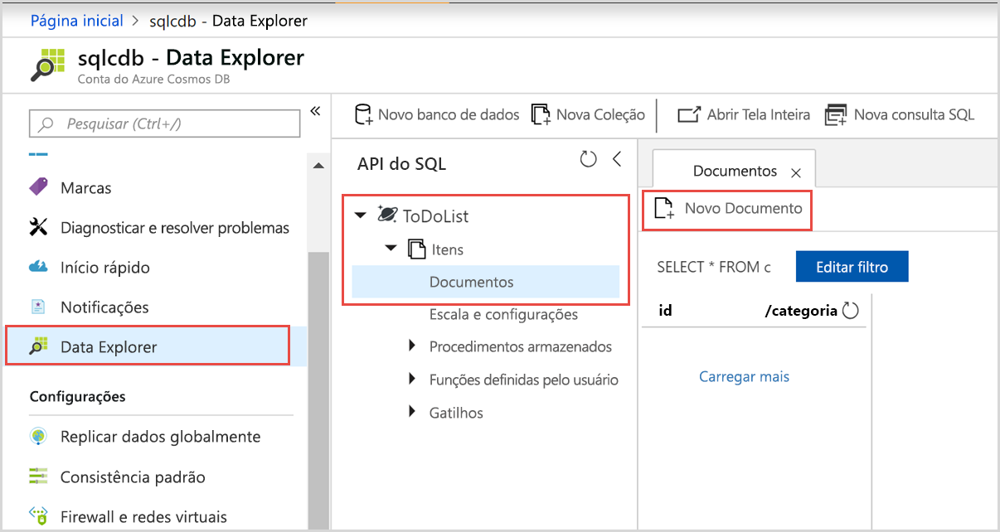
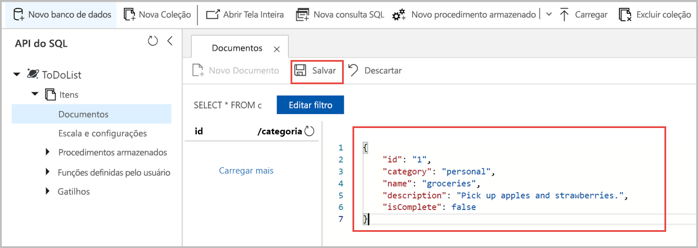

# <a name="quickstart-build-a-net-web-app-using-azure-cosmos-db-sql-api-account"></a>Início rápido: Criar um aplicativo Web do .NET usando a conta de API de SQL do Azure Cosmos DB

> [!div class="op_single_selector"]
> * [.NET](create-sql-api-dotnet.md)
> * [.NET (versão prévia)](create-sql-api-dotnet-preview.md)
> * [Java](create-sql-api-java.md)
> * [Node.js](create-sql-api-nodejs.md)
> * [Python](create-sql-api-python.md)
> * [Xamarin](create-sql-api-xamarin-dotnet.md)
>  
> 

O Azure Cosmos DB é o serviço de banco de dados multimodelo distribuído globalmente da Microsoft. É possível criar e consultar rapidamente documentos, chave/valor e bancos de dados do grafo. Todos se beneficiam de recursos de escala horizontal e distribuição global no núcleo do Azure Cosmos DB. 

Este início rápido demonstra como criar uma conta de [API de SQL](sql-api-introduction.md) do Azure Cosmos DB, um banco de dados de documentos, uma coleção e como adicionar dados de exemplo à coleção usando o portal do Azure. Em seguida, você criará e implantará um aplicativo Web de lista de tarefas pendentes criado com o [SDK do .NET do SQL](sql-api-sdk-dotnet.md) para adicionar mais dados de gerenciamento à coleção. 

## <a name="prerequisites"></a>Pré-requisitos

Se você ainda não tem o Visual 2017 Studio instalado, poderá baixar e usar o **Visual Studio 2017 Community Edition** [gratuito](https://www.visualstudio.com/downloads/). Verifique se você habilitou o **desenvolvimento do Azure** durante a instalação do Visual Studio.

[!INCLUDE [quickstarts-free-trial-note](../../includes/quickstarts-free-trial-note.md)] 
[!INCLUDE [cosmos-db-emulator-docdb-api](../../includes/cosmos-db-emulator-docdb-api.md)]  

<a id="create-account"></a>
## <a name="create-an-account"></a>Criar uma conta

[!INCLUDE [cosmos-db-create-dbaccount](../../includes/cosmos-db-create-dbaccount.md)]

<a id="create-collection-database"></a>
## <a name="add-a-database-and-a-collection"></a>Adicionar um banco de dados e uma coleção

Agora, você pode usar a ferramenta Data Explorer no Portal do Azure para criar um banco de dados e uma coleção. 

1. Clique em **Data Explorer** > **Nova Coleção**. 
    
    A área **Adicionar Coleção** é exibida à direita, talvez seja necessário rolar para a direita para vê-la.

    

2. Na página **Adicionar coleção**, insira as configurações da nova coleção.

    Configuração|Valor sugerido|DESCRIÇÃO
    ---|---|---
    **Id do banco de dados**|ToDoList|Insira *ToDoList* como o nome para o novo banco de dados. Os nomes dos banco de dados devem conter de 1 a 255 caracteres e não podem conter `/, \\, #, ?` nem um espaço à direita.
    **Id da coleção**|Itens|Insira *Itens* como o nome da nova coleção. As IDs da coleção possuem os mesmos requisitos de caractere que os nomes de bancos de dados.
    **Chave de partição**| `<your_partition_key>`| Insira uma chave de partição. O exemplo descrito neste artigo usa */category* como a chave de partição.
    **Taxa de transferência**|400 RU|Altere a taxa de transferência para 400 unidades de solicitação por segundo (RU/s). Se quiser reduzir a latência, você poderá escalar verticalmente a taxa de transferência mais tarde. 
    
    Além das configurações anteriores, você pode opcionalmente adicionar **Chaves exclusivas** à coleção. Vamos deixar o campo vazio neste exemplo. As chaves exclusivas oferecem aos desenvolvedores a capacidade de adicionar uma camada de integridade dos dados ao seu banco de dados. Ao criar uma política de chave exclusiva durante a criação de uma coleção, você garante a exclusividade de um ou mais valores por chave de partição. Para obter mais informações, consulte o artigo [Chaves exclusivas no Azure Cosmos DB](unique-keys.md).
    
    Clique em **OK**.

    O Data Explorer exibe o novo banco de dados e a coleção.

    

<a id="add-sample-data"></a>
## <a name="add-sample-data"></a>Adicionar dados de exemplo

Agora você pode adicionar dados à sua nova coleção usando o Data Explorer.

1. No Data Explorer, o novo banco de dados aparece no painel Coleções. Expanda o banco de dados **Tarefas**, expanda a coleção **Itens**, clique em **Documentos** e clique em **Novos Documentos**. 

   
  
2. Agora, adicione um documento à coleção com a seguinte estrutura.

     ```json
     {
         "id": "1",
         "category": "personal",
         "name": "groceries",
         "description": "Pick up apples and strawberries.",
         "isComplete": false
     }
     ```

3. Depois de ter adicionado o json à guia **Documentos**, clique em **Salvar**.

    

4. Crie e salve mais um documento onde você insere um valor exclusivo para a propriedade `id` e altere as outras propriedades quando achar adequado. Os novos documentos podem ter qualquer estrutura que você deseje, pois o Azure Cosmos DB não impõe nenhum esquema para seus dados.

## <a name="query-your-data"></a>Consultar seus dados

[!INCLUDE [cosmos-db-create-sql-api-query-data](../../includes/cosmos-db-create-sql-api-query-data.md)]

## <a name="clone-the-sample-application"></a>Clonar o aplicativo de exemplo

Agora, vamos trabalhar com o código. Vamos clonar um [aplicativo de API do SQL do GitHub](https://github.com/Azure-Samples/documentdb-dotnet-todo-app), definir a cadeia de conexão e executá-lo. Você verá como é fácil trabalhar usando dados de forma programática. 

1. Abra um prompt de comando, crie uma nova pasta chamada exemplos de git e feche o prompt de comando.

    ```bash
    md "C:\git-samples"
    ```

2. Abra uma janela de terminal de git, como git bash, e use o comando `cd` para alterar para a nova pasta para instalar o aplicativo de exemplo.

    ```bash
    cd "C:\git-samples"
    ```

3. Execute o comando a seguir para clonar o repositório de exemplo. Este comando cria uma cópia do aplicativo de exemplo no seu computador.

    ```bash
    git clone https://github.com/Azure-Samples/documentdb-dotnet-todo-app.git
    ```

4. Em seguida, abra o arquivo da solução todo no Visual Studio. 

## <a name="review-the-code"></a>Examine o código

Esta etapa é opcional. Se você estiver interessado em aprender como os recursos de banco de dados são criados no código, poderá examinar os snippets de código a seguir. Caso contrário, você poderá pular para [Atualizar sua cadeia de conexão](#update-your-connection-string). Neste início rápido, você cria um banco de dados e uma coleção usando o portal do Azure e adiciona dados de amostra usando o exemplo .NET. No entanto, você também pode criar o banco de dados e a coleção usando o exemplo .NET. 

Todos os snippets de código a seguir são retirados do arquivo DocumentDBRepository.cs.

* DocumentClient é inicializado conforme mostrado no código a seguir:

    ```csharp
    client = new DocumentClient(new Uri(ConfigurationManager.AppSettings["endpoint"]), ConfigurationManager.AppSettings["authKey"]);
    ```

* Um novo banco de dados é criado usando o método `CreateDatabaseAsync`, conforme mostrado no código a seguir:

    ```csharp
    await client.CreateDatabaseAsync(new Database { Id = DatabaseId });
    ```

* Uma nova coleção é criada usando o `CreateDocumentCollectionAsync`, conforme mostrado no código a seguir:

    ```csharp
    private static async Task CreateCollectionIfNotExistsAsync()
    {
        try
        {
           await client.ReadDocumentCollectionAsync(UriFactory.CreateDocumentCollectionUri(DatabaseId, CollectionId));
        }
        catch (DocumentClientException e)
        {
           if (e.StatusCode == System.Net.HttpStatusCode.NotFound)
           {
              await client.CreateDocumentCollectionAsync(
              UriFactory.CreateDatabaseUri(DatabaseId),
              new DocumentCollection
              {
                  Id = CollectionId
              },
              new RequestOptions { OfferThroughput = 400 });
           }
           else
           {
             throw;
           }
        }
    }
    ```

## <a name="update-your-connection-string"></a>Atualizar sua cadeia de conexão

Agora, volte ao portal do Azure para obter informações sobre a cadeia de conexão e copiá-las para o aplicativo.

1. No [portal do Azure](https://portal.azure.com/), na sua conta do Azure Cosmos DB, no painel de navegação esquerdo, selecione **Chaves** e, em seguida, selecione **Chaves de leitura/gravação**. Você usará os botões de cópia no lado direito da tela para copiar o URI e a Chave Primária para o arquivo web.config na próxima etapa.

    

2. No Visual Studio 2017, abra o arquivo web.config. 

3. Copie o valor do URI do portal (usando o botão de cópia) e transforme-o no valor da chave do ponto de extremidade em web.config. 

    `<add key="endpoint" value="FILLME" />`

4. Em seguida, copie o valor da CHAVE PRIMÁRIA do portal e transforme-o no valor de authKey em web.config. 

    `<add key="authKey" value="FILLME" />`
    
5. Em seguida, atualize os valores do banco de dados e da coleção para corresponder ao nome do banco de dados que você criou anteriormente. Agora, você atualizou o aplicativo com todas as informações necessárias para se comunicar com o Azure Cosmos DB. 

   ```csharp
   <add key="database" value="ToDoList"/>
   <add key="collection" value="Items"/>
   ```
 
## <a name="run-the-web-app"></a>Executar o aplicativo Web
1. No Visual Studio, clique com o botão direito do mouse no projeto no **Gerenciador de Soluções** e selecione **Gerenciar Pacotes NuGet**. 

2. Na caixa **Procurar** do NuGet, digite *DocumentDB*.

3. Com base nos resultados, instale a biblioteca **Microsoft.Azure.DocumentDB**. Isso instala o pacote Microsoft.Azure.DocumentDB, bem como todas as dependências.

4. Selecione CTRL + F5 para executar o aplicativo. Seu aplicativo é exibido no navegador. 

5. Selecione **Criar Novo** no navegador e crie algumas novas tarefas em seu aplicativo de tarefas pendentes.

   

Agora, é possível voltar ao Data Explorer e ver a consulta, modificar e trabalhar com esses novos dados. 

## <a name="review-slas-in-the-azure-portal"></a>Examinar SLAs no Portal do Azure

[!INCLUDE [cosmosdb-tutorial-review-slas](../../includes/cosmos-db-tutorial-review-slas.md)]

## <a name="clean-up-resources"></a>Limpar recursos

[!INCLUDE [cosmosdb-delete-resource-group](../../includes/cosmos-db-delete-resource-group.md)]

## <a name="next-steps"></a>Próximas etapas

Neste início rápido, você aprendeu como criar uma conta do Azure Cosmos DB, como criar uma coleção usando o Data Explorer e como executar um aplicativo Web. Agora, é possível importar outros dados para sua conta do Cosmos DB. 

> [!div class="nextstepaction"]
> [Importar dados no Azure Cosmos DB](import-data.md)


