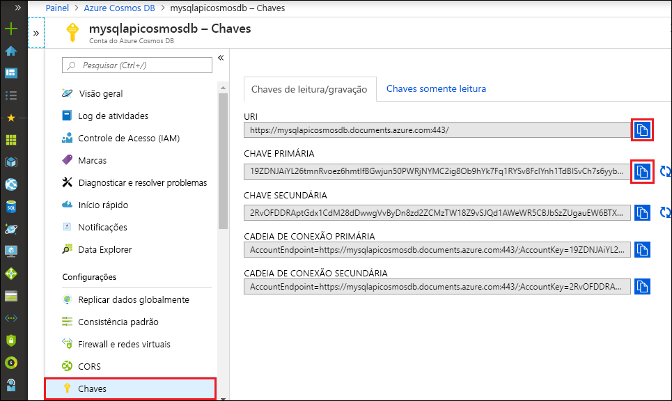

# <a name="quickstart-use-nodejs-to-connect-and-query-data-from-azure-cosmos-db-sql-api-account"></a>Início Rápido: Usar o Node.js para se conectar e consultar dados de uma conta da API SQL do Azure Cosmos DB

> [!div class="op_single_selector"]
> * [.NET V3](create-sql-api-dotnet.md)
> * [.NET V4](create-sql-api-dotnet-V4.md)
> * [Java](create-sql-api-java.md)
> * [Node.js](create-sql-api-nodejs.md)
> * [Python](create-sql-api-python.md)
> * [Xamarin](create-sql-api-xamarin-dotnet.md)

Este guia de início rápido demonstra como usar um aplicativo Node.js para se conectar à conta da [API SQL](sql-api-introduction.md) no Azure Cosmos DB. Você pode usar consultas SQL do Azure Cosmos DB para consultar e gerenciar dados. O aplicativo Node.js que você cria neste artigo usa o [SDK SQL do JavaScript](sql-api-sdk-node.md). Este início rápido usa a versão 2.0 do [SDK do JavaScript](https://www.npmjs.com/package/@azure/cosmos).

## <a name="prerequisites"></a>Pré-requisitos

[!INCLUDE [quickstarts-free-trial-note](../../includes/quickstarts-free-trial-note.md)] 
[!INCLUDE [cosmos-db-emulator-docdb-api](../../includes/cosmos-db-emulator-docdb-api.md)]

* Além disso:
    * [Node.js](https://nodejs.org/en/) versão v6.0.0 ou superior
    * [Git](https://git-scm.com/)

## <a name="create-a-database"></a>Criar um banco de dados 

[!INCLUDE [cosmos-db-create-dbaccount](../../includes/cosmos-db-create-dbaccount.md)]

## <a name="add-a-container"></a>Adicionar um contêiner

[!INCLUDE [cosmos-db-create-collection](../../includes/cosmos-db-create-collection.md)]

## <a name="add-sample-data"></a>Adicionar dados de exemplo

[!INCLUDE [cosmos-db-create-sql-api-add-sample-data](../../includes/cosmos-db-create-sql-api-add-sample-data.md)]

## <a name="query-your-data"></a>Consultar seus dados

[!INCLUDE [cosmos-db-create-sql-api-query-data](../../includes/cosmos-db-create-sql-api-query-data.md)]

## <a name="clone-the-sample-application"></a>Clonar o aplicativo de exemplo

Agora, vamos clonar um aplicativo Node.js do GitHub, definir a cadeia de conexão e executá-lo.

1. Abra um prompt de comando, crie uma nova pasta chamada exemplos de git e feche o prompt de comando.

    ```bash
    md "C:\git-samples"
    ```

2. Abra uma janela de terminal de git, como git bash, e use o comando `cd` para alterar para a nova pasta para instalar o aplicativo de exemplo.

    ```bash
    cd "C:\git-samples"
    ```

3. Execute o comando a seguir para clonar o repositório de exemplo. Este comando cria uma cópia do aplicativo de exemplo no seu computador.

    ```bash
    git clone https://github.com/Azure-Samples/azure-cosmos-db-sql-api-nodejs-getting-started.git
    ```

## <a name="review-the-code"></a>Examine o código

Esta etapa é opcional. Se você estiver interessado em aprender como os recursos de banco de dados do Azure Cosmos são criados no código, poderá examinar os snippets de código a seguir. Caso contrário, você poderá pular para [Atualizar sua cadeia de conexão](#update-your-connection-string). 

Observe que se você estiver familiarizado com a versão anterior do SDK do JavaScript, poderá estar acostumado a ver os termos 'coleção' e 'documento'. Como o Azure Cosmos DB dá suporte a [vários modelos de API](https://docs.microsoft.com/azure/cosmos-db/introduction), a versão 2.0 ou superior do SDK do JavaScript usa o termos genéricos 'contêiner', que pode ser uma coleção, um gráfico ou uma tabela, e 'item' para descrever o conteúdo do contêiner.

Todos os snippets de código a seguir são retirados do arquivo **app.js**.

* O objeto `CosmosClient` é inicializado.

    ```javascript
    const client = new CosmosClient({ endpoint, key });
    ```

* Criar um novo banco de dados do Azure Cosmos.

    ```javascript
    const { database } = await client.databases.createIfNotExists({ id: databaseId });
    ```

* É criado um novo contêiner (coleção) dentro do banco de dados.

    ```javascript
    const { container } = await client.database(databaseId).containers.createIfNotExists({ id: containerId });
    ```

* Um item (documento) é criado.

    ```javascript
    const { item } = await client.database(databaseId).container(containerId).items.create(itemBody);
    ```

* Uma consulta SQL sobre JSON é executada no banco de dados da família. A consulta retorna todos os filhos da família "Anderson". 

    ```javascript
      const querySpec = {
        query: 'SELECT VALUE r.children FROM root r WHERE r.lastName = @lastName',
        parameters: [
          {
            name: '@lastName',
            value: 'Andersen'
          }
        ]
      }

      const { resources: results } = await client
        .database(databaseId)
        .container(containerId)
        .items.query(querySpec)
        .fetchAll()
      for (var queryResult of results) {
        let resultString = JSON.stringify(queryResult)
        console.log(`\tQuery returned ${resultString}\n`)
      }
    ```    

## <a name="update-your-connection-string"></a>Atualizar sua cadeia de conexão

Agora, volte para a portal do Azure para obter os detalhes da cadeia de conexão de sua conta do Azure Cosmos. Copie a cadeia de conexão no aplicativo para que ele possa se conectar ao banco de dados.

1. No [portal do Azure](https://portal.azure.com/), em sua conta do Azure Cosmos, no painel de navegação à esquerda, clique em **Chaves** e, em seguida, clique em **Chaves de leitura/gravação**. Você usará os botões de cópia no lado direito da tela para copiar o URI e a Chave Primária para o arquivo `config.js` na próxima etapa.

    

2. Abra o arquivo `config.js`. 

3. Copie o valor do URI do portal (usando o botão de cópia) e transforme-o no valor da chave do ponto de extremidade em `config.js`. 

    `config.endpoint = "https://FILLME.documents.azure.com"`

4. Em seguida, copie o valor da CHAVE PRIMÁRIA do portal e transforme-o no valor de `config.key` em `config.js`. Agora, você atualizou o aplicativo com todas as informações necessárias para se comunicar com o Azure Cosmos DB. 

    `config.key = "FILLME"`
    
## <a name="run-the-app"></a>Execute o aplicativo

1. Executar `npm install` em um terminal para instalar os módulos npm necessários

2. Execute `node app.js` em um terminal para iniciar o aplicativo de nó.

Agora, é possível voltar ao Data Explorer, modificar e trabalhar com esses novos dados.

## <a name="review-slas-in-the-azure-portal"></a>Examinar SLAs no Portal do Azure

[!INCLUDE [cosmosdb-tutorial-review-slas](../../includes/cosmos-db-tutorial-review-slas.md)]

## <a name="clean-up-resources"></a>Limpar recursos

[!INCLUDE [cosmosdb-delete-resource-group](../../includes/cosmos-db-delete-resource-group.md)]

## <a name="next-steps"></a>Próximas etapas

Neste início rápido, você aprendeu a criar uma conta do Azure Cosmos, criar um contêiner usando o Data Explorer e executar um aplicativo. Agora, você pode importar dados adicionais para seu banco de dados do Azure Cosmos. 

> [!div class="nextstepaction"]
> [Importar dados no Azure Cosmos DB](import-data.md)


